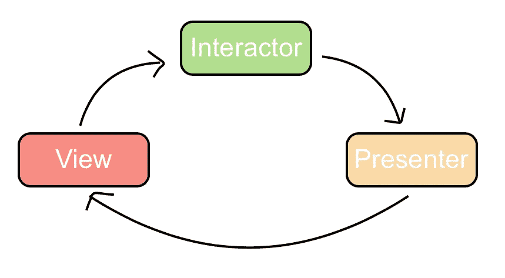

# 干净的建筑

> 原文：<https://medium.com/geekculture/clean-architecture-7e52c33e3cd1?source=collection_archive---------7----------------------->

干净架构(VIP)是一种架构模式，它将对象分为三种不同的类型，主要由视图、交互器和呈现器组成

在 VIP 中，责任被平均分配，其中

*   查看将用户交互委托给交互者。
*   Interactor 包含业务逻辑，并将响应发送给 Presenter。
*   演示者解析…