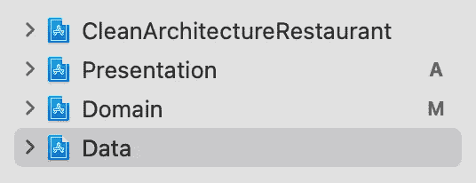

# 干净的建筑和烹饪的艺术

> 原文：<https://medium.com/geekculture/clean-architecture-in-ios-the-art-of-cooking-flavourful-code-4e3fb4c005e0?source=collection_archive---------2----------------------->

编写好的软件有时很难，但是维护它更难。

你是否曾经以一个简单的想法开始一个项目，但是随着它开始变得越来越大，你最终得到了一个混乱的非常令人困惑的知识库，甚至对于你这个写它的人来说也是如此？

我想我们在职业生涯中都至少经历过一次。这是我们学习项目结构和最佳实践以使代码更干净的主要原因之一。通过抽象我们的代码，它变得更加易读和易于维护。

例如，考虑面向对象的编程范例。曾经有一段时间，程序员以 100%过程化的形式编写代码。如果你想向别人解释你的代码，这肯定是一项艰巨的任务。但是随着 OOP 范式的引入，事情变得简单多了，程序员现在有了一种用现实生活中的例子来描述他们的代码的方法。通过创建一种方法，使用与我们日常生活更相关的例子来建模我们的代码，我们的项目变得更容易迭代。

考虑到这一点，我决定写这篇文章，我将使用一个非常高级的/ ludic 样本，来描述我认为如何编写项目的最佳方式，以便我们可以最终获得一个干净而坚实的基础，即:更容易理解、维护和解释。

也就是说，项目就是项目，不管是编码项目还是业务项目，所以与其在这里简单地创建一个代码项目，不如让我们通过创建其他东西来描述我们的结构:一个餐馆。

# **餐馆案**

想象一下，你即将开始一项新的餐饮业务。首先，你需要决定是什么类型的餐馆:是意大利餐馆还是日本餐馆，等等？接下来，你需要定义你的餐厅将如何运营，谁将是你的供应商，你的工人，他们应该如何执行他们的任务，等等。在开始我们的业务之前，这里要做的第一件事当然是定义它的结构。

做一个软件项目或个人生意一个普遍的真理是:“没有银弹”，换句话说，我们永远不会找到解决所有问题的最佳方案。但是，即使不存在神奇的解决方案，也有已经被证实的方法来构建一个好的项目结构。我最喜欢的是鲍勃叔叔创作的[清洁建筑](https://blog.cleancoder.com/uncle-bob/2012/08/13/the-clean-architecture.html)。

*注意:在整篇文章中，我将使用 Swift 语言提供一些代码示例。然而，这里描述的所有内容都适用于您喜欢的任何其他语言。*

# **干净的建筑**

Image from [Martin Fowler’s site](https://martinfowler.com/bliki/PresentationDomainDataLayering.html)

上面的图片是一个非常简单的方式来描述清洁架构的基础。虽然如何实现它有几种变化，但核心始终是相同的:我们将把我们的系统分成 3 层:**域**、**数据、**和**表示** *(你可以在这里阅读更多关于* [*表示域数据层*](https://martinfowler.com/bliki/PresentationDomainDataLayering.html) *)* 。表示只和领域对话，领域描述数据应该做什么。有了这个简单的概念，我们现在已经有了一个定义良好的结构，可以用来开发我们的整个项目。

现在，让我们考虑一下与我们在这里经营的餐馆的类比。如果我们要使用 Clean 架构来开始我们的餐馆，那么**域层**将是我们的管理区域，作为餐馆所有者，我们将在这里描述**我们的餐馆将做什么**，即业务逻辑。我们的餐厅将提供什么类型的食物，我们将使用哪些原料(我们在代码世界中的模型)。此外，当我们的工人从餐厅收到订单时，他们必须做什么，他们应该从哪里得到东西等等。

然而，作为餐厅经理，我们不想成为做饭、接受客户要求或洗碗的人。所以我们打算雇人来做这件事。领域是描述我们的业务做什么的模块，而**数据层**是描述**如何**完成的地方。

最后，为了与我们的客户互动，向他展示他的桌子，并记录他的订单，我们将有**表示层** : 餐厅。

如果我们将这些想法转换成一个代码项目，您将拥有的结构将是这样的(成为我们的应用程序和域、数据和表示框架的干净的体系结构):

*注意:如果你使用这个概念来构建一个 iOS 项目，我强烈建议你使用带有不同. project 文件的框架来创建项目模块。如果你想了解更多这样做的好处，我建议你阅读* [*莱安德罗·佩雷斯*](https://medium.com/u/826a8f040c3e?source=post_page-----4e3fb4c005e0--------------------------------) 写的这篇伟大的文章

# **上菜**

为了更好地说明我们刚刚谈到的结构，让我们编写一个餐馆执行的最基本的任务:上菜。在这个例子中，我将描述我们的餐厅将如何准备和提供我最喜欢的一道菜:意大利面条。

现在，让我们指定我们刚刚谈到的每个模块的角色，这样我们就可以以一种非常简洁的方式完成提到的任务。

## 领域层

如前所述，领域层是你将指定你的餐馆是什么，在我们业务的每一部分将执行什么——业务逻辑——但不是它将如何执行。Bob 叔叔将领域层描述为“一个项目的蓝图”，这是人们可以看到并容易理解业务是什么的地方。如果有人只看我们的领域层，它会尖叫:餐馆(这就是鲍勃叔叔所说的[尖叫架构](https://blog.cleancoder.com/uncle-bob/2011/09/30/Screaming-Architecture.html))。

领域层必须尽可能与框架无关。这里不应该包含任何框架依赖。记住:领域描述的是“是什么”而不是“如何”。

所以在我们的领域中，我们基本上有:(1)用例；(2)模型；(3)我们的用例及模型所使用的协议。在我们的例子中，让我们从定义 Carbonara 的模型以及所需的协议开始，这样我们就可以稍后将这些信息传递给一个炊具:

然后，我们需要指定当餐厅要求 Carbonara 时厨房应该做什么，即厨房用例:

在确定了厨房的用途后，现在我们需要一个知道如何使用这些东西的人。在我们的`KitchenUseCase`中，我们指定我们需要一个知道如何从本地商店获得商品的人——一个`localDataSource`——一个知道如何从外面获得商品的人——一个`remoteDataSource`——最后，一个知道如何烹饪菜单的人——一个`cooker`。这些将在我们的数据层中定义。

## 数据层

现在，我们定义了我们期望我们的员工如何完成他们的工作，也就是说，他们将如何实现域中描述的用例。

让我们从仓库实现开始——我们的厨师助手，他们将收集厨房所需的配料:

下一步是定义我们的炊具之一:

我们的炊具在领域层被定义为 CookerProtocol，这让我们可以根据自己的需要在数据层实现不同的炊具类型。我们可以有一些意大利料理、一些巴西料理、日本料理等等。那就是所谓的 [*依赖倒置原则*](https://en.wikipedia.org/wiki/Dependency_inversion_principle) *五个* [*之一的坚实原则*](https://en.wikipedia.org/wiki/SOLID) *用在干净的架构上。*

我不会在这里指定网络管理器或存储管理器，如 CoreDataStorage、UserDefaultsStorage 等，但请记住一点:所有这些类只能在数据层内部访问，表示层永远不能直接访问或修改这些实体中的某些内容。请记住:您的表示层只与您的领域层对话，数据层的实现必须对应用程序的其余部分隐藏。另一种说法是:“你的顾客永远不应该直接向在厨房工作的人(来自数据层的对象)索要食物，相反，他应该只向服务员(ViewModel)或在餐厅工作的其他人(协调员、助手等)索要食物。

## 表示层

最后，在我们的表示层，或者更好地说，在我们的餐厅餐厅，唯一需要的信息是那些与我们的客户可能需要在我们的餐厅提出请求、享用晚餐和获得良好体验相关的信息:

*   他要坐的桌子(视图/视图控制器)
*   有人引导他到他的桌子(协调员和/或路由器)
*   服务员将成为餐厅和厨房之间的桥梁(ViewModel)。

我不会在这里进一步描述 PresentationLayer 中的代码应该如何，因为这不是本文的目的。你可以选择使用 InterfaceBuilder、编程视图、SwiftUI 等等，也可以选择使用 MVC、MVVM、MVP 等等。这里唯一要记住的是:你的表示层应该只关心与表示层相关的事情。

你永远不应该做这样的事情:

*   从表示层中的网络层或持久层请求或设置数据。
*   实现与项目演示无关的业务逻辑或具体操作。

## 依赖注入容器

在我们结束之前，还有最后一件事要考虑。一开始，我们谈到表示层只与领域层对话。但是为了让事情正常工作，我们需要从数据层实例化对象。做到这一点的方法是使用依赖注入容器——来自我们的应用层的对象，将数据从一个层注入到另一个层。

在我们的应用程序模块(CleanArchitectureRestaurant)中，我们将导入我们创建的所有模块:域、数据和表示。接下来，我们创建我们的双容器，并实例化和注入我们需要的一切，以使我们的模块按预期工作:

# 结论

现在，我们所有的流程都已定义，我们的餐厅已经准备好开门营业，为我们的用户/客户以及与我们一起工作的人提供令人惊叹的体验。

通过在头脑中用真实业务的简单类比来很好地定义我们的项目结构，我们现在有了一个非常强大的工具来理解我们所有的系统，并且每当我们计划开始在其上添加新功能时，也使它们更加稳固。我们可以知道如何替换类似“我应该把这段代码放在这里吗？”通过“我的服务员应该在厨房里做这道菜吗？”。

希望能帮助你写一些更干净的代码；)

如果你对本文有任何问题或建议，欢迎通过下面的评论环节或通过 [Twitter](https://twitter.com/ch0Rx) 联系我。

*非常感谢* [*GuilhE*](https://medium.com/u/6631c16153d0?source=post_page-----4e3fb4c005e0--------------------------------) *帮我审阅这篇文章的人。*