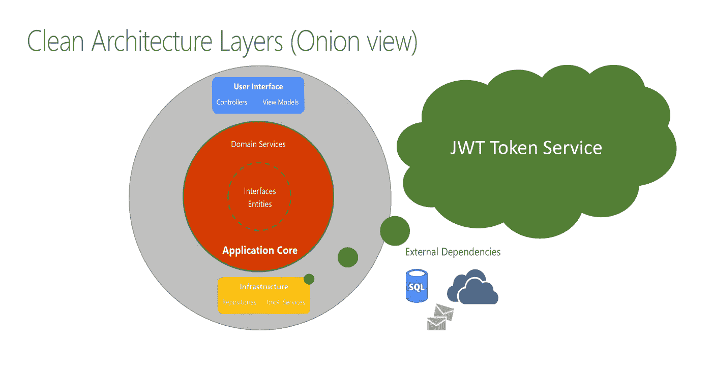

# 干净的架构 REST API 中使用 ASP.NET 核心身份的 JWT 令牌认证

> 原文：<https://medium.com/geekculture/clean-architecture-jwt-token-authentication-in-rest-api-using-asp-net-core-identity-639e4a8f3900?source=collection_archive---------0----------------------->

## 讨论如何在干净架构中使用 ASP.NET 核心身份实现特定于应用程序的 JWT 令牌服务提供者。

## 背景