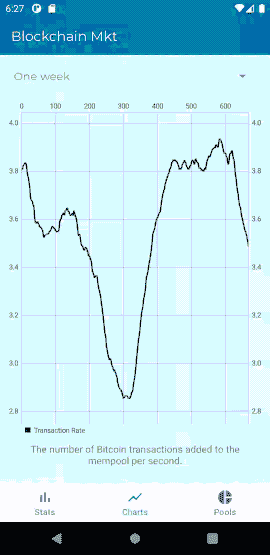

# Android——简洁的架构，带有动态特性和刀柄/匕首 2(第二部分)

> 原文：<https://medium.com/geekculture/clean-architecture-with-dynamic-features-and-hilt-dagger2-pt-2-af801f162b0d?source=collection_archive---------7----------------------->


Bologna — Italy (2019)

# 介绍

在我们之前的文章中，我们设置了 Gradle 文件，现在我们将开始导航工作。如果您还没有检查，请看一下这个系列的第一部分。

*   第一部分。

[](https://github.com/PedroOkawa/app-blockchain-mkt) [## 佩德鲁卡瓦/app-区块链-市场

### 该应用程序侧重于使用动态功能以及 Hilt / Dagger2 来请求区块链数据。

github.com](https://github.com/PedroOkawa/app-blockchain-mkt) 

# 航行

我们的导航文件将包括我们的动态特性，这里我们必须关注一些细节，否则，你将面临一些问题(相信我，我有很多问题)。

nav_home

如您所见，通过添加动态导航库，我们可以访问“include-dynamic”对象，这需要一些参数来使其工作，您可以在[谷歌的文档页面](https://developer.android.com/guide/navigation/navigation-dynamic)上查看这些参数，但是给您一个很好的提示是，您可以使用“${applicationId}”来避免错误键入路径，否则，您必须将其定义为:

```
app:graphPackage="com.okawa.blockchain.mkt.stats"
```

nav_pools

在我们的功能模块中，我们必须定义我们的导航文件，这里有一个最重要的细节，在我们的“nav_pools”上定义的 id 必须与在“nav_home”上创建的 id 相同。换句话说，**不要**在这里加加号:

```
<navigation xmlns:android="http://schemas.android.com/apk/res/android"
    xmlns:app="http://schemas.android.com/apk/res-auto"
 **android:id="@id/nav_pools" <--- DO NOT ADD PLUS SIGN HERE**
    app:startDestination="@id/fragment_pools">
```

如果您在这里添加加号，您将为导航文件声明一个新的 id，它不会匹配，结果是这样的:

```
2021-03-04 18:21:27.913 22314-22314/com.okawa.blockchain.mkt E/AndroidRuntime: FATAL EXCEPTION: main
    Process: com.okawa.blockchain.mkt, PID: 22314
    java.lang.IllegalStateException: The included <navigation>'s id com.okawa.blockchain.mkt.pools:id/nav_pools is different from the destination id com.okawa.blockchain.mkt:id/nav_pools. Either remove the <navigation> id or make them match.
```

现在，我们必须连接我们的功能，为此，我们将使用底部导航视图，首先定义将要使用的菜单。

menu_bottom_home

id 在这里也必须匹配，如果不匹配，应用程序不会崩溃，但导航不会采取任何行动，正如你在下一个动画中看到的。



Non-matching ids error

现在我们将菜单添加到活动文件中，并使用 **setupWithNavController** 函数以编程方式设置底部导航菜单。

activity_home

HomeActivity

瞧啊。！🎉
我们现在已经有了动态导航功能，这篇文章到此为止。在我们的下一篇文章中，我们将设置刀柄和匕首来使用依赖注入。

任何想法或建议，请添加一些评论。