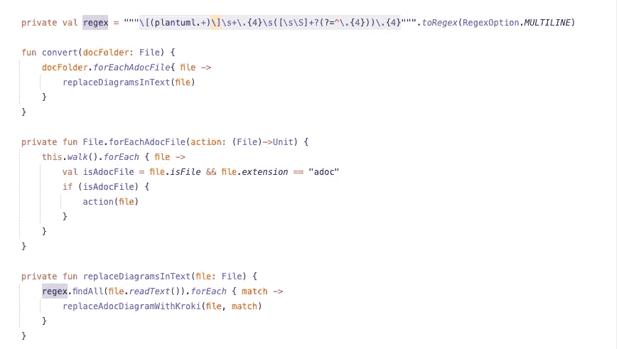

# 干净代码开发|集成操作分离原则

> 原文：<https://medium.com/geekculture/clean-code-development-integration-operation-separation-principle-ec85a0e47bcb?source=collection_archive---------0----------------------->

本周，我不得不为一个项目添加一个新功能，这个项目是我一年前开始的，已经很久没碰过了。当我第一次看我的代码时，我认为它非常干净，我很震惊，它是如此的不一致和无组织。我不得不投入大量时间，仅仅是为了清楚地理解我的代码做了什么。

因为我不能总是投入那么多时间，只是为了理解，我想用我的代码表达什么，我看了看一些干净的代码策略。其中，我发现最重要的是整合操作隔离原则(IOSP)。

# 什么是集成操作隔离

IOSP(Integration Operation Segregation Principle)是一种干净的代码策略，它允许我们清楚地区分集成代码和操作代码。它允许我们系统化地将大型方法的复杂性简化成更简单的方法。

**集成方法**只组成其他单元(包括其他集成方法)但不包含任何逻辑。

**操作方法**只包含逻辑，从不集成任何其他功能方法。它们应该非常小，可组合，易于阅读。

# 如何应用这一原则

如果您有大的方法或者只是一般意义上的混乱方法，您可以通过几个简单的步骤来应用这个模式。

1.  找到同时完成操作和集成任务的大方法
2.  把它们分成更小的方法
3.  将你的方法分为**集成方法**或**操作方法**

如果你不确定，如果一个方法是集成的还是可操作的，那么这个方法就需要更多的分解。如果你做对了，你现在应该有一个真正易读的集成方法，它实现了其他的方法。

## 例子

这里我有一个小的示例类，里面只有一个大的、无用的方法。乍一看，你真的看不出这个功能是怎么回事。你可以看到它的标题，但它实际上在里面做什么，真的很难讲。

第一步，我们可以从第 14 行提取一个新函数。这个函数可以被称为`generateKrokiImage()`，因为它调用了 krokiAdapter 的`generateImage()`函数。

接下来，我们可以从第 11 行到第 16 行提取一个新函数，并将其命名为类似于`replaceAdocDiagramWithKroki()`的东西。这个函数用我们的`generateKrokiImage()`函数生成的新值替换正则表达式找到的旧值。

我们可以提取的下一个函数位于第 8 到 10 行。它遍历整个文件树并检查每一项，如果它确实是一个 asciidoc 文件并与给定的正则表达式匹配。我们可以称这个函数为`forEachAdocFile()`。

最后，我们有一个非常容易理解的函数，它结构良好，易于维护。它可能看起来像这样:

可以清楚地看到，convert 函数是这个类中唯一的集成方法，也是从外部调用的方法。所有其他私有方法都是可操作的。

# 反射

## 什么进展顺利

由于 IntelliJ IDEA 的重构方法，该原则的实际实现非常好，非常简单。

## 什么需要改进

首先，我没有真正理解这种模式的目的，因为最后，代码比以前更长了(因为不同方法之间的空白)。我对此有点困惑，不得不问我的导师。经过短暂的讨论，他澄清了一些事情，我很清楚，通过这种方式，你可以一眼就看到整个类或方法做了什么。