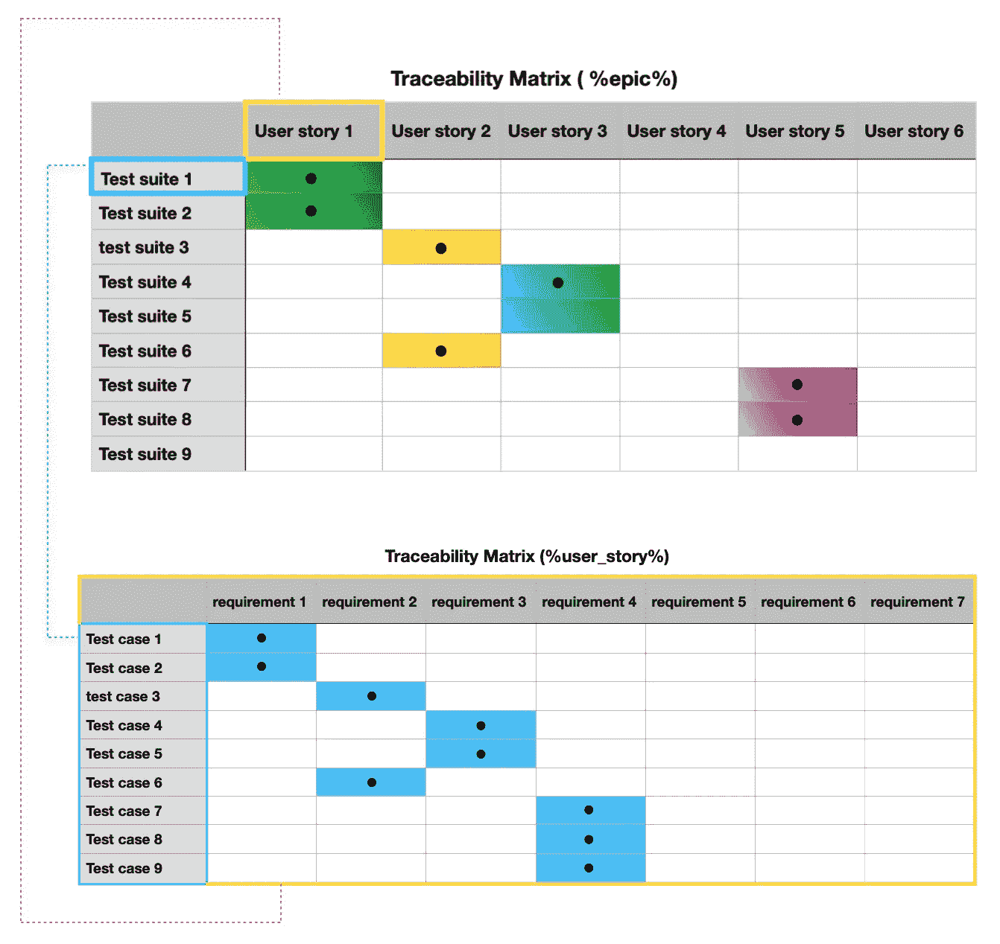

# 用户故事中缺乏明确的需求:缺乏时间还是懒惰？

> 原文：<https://medium.com/geekculture/clear-requirements-absence-in-user-story-lack-of-time-or-laziness-b3767e08d603?source=collection_archive---------42----------------------->

Photo by [Joanna Kosinska](https://unsplash.com/@joannakosinska?utm_source=medium&utm_medium=referral) on [Unsplash](https://unsplash.com?utm_source=medium&utm_medium=referral)

在我工作过的五个团队中，只有一个恰当地编写了带有需求列表的用户故事。

其余的用户故事在文档中只有简单的文本，没有很好的描述。

根据你所从事的项目类型，可以应用其中一种方法。就启动交付速度而言，简短描述是一种更方便的方式。当产品变大时，最好有详细的文档。不是详尽的，因为我们都知道维护文档并使其保持最新是很难的。

项目经理在非常高的层次上描述几个史诗/用户故事的另一种情况是当它需要一个业务价值的一般表示时。为了有更精确的产品交付估计，开发和 QA 团队应该得到他们可能有的问题的答案。

用清晰的需求创造简洁而有信息的用户故事是纯粹的艺术。为什么拥有它如此重要，为什么这条规则经常被忽视，我们将在这篇文章中讨论。

# 正确的要求列出了好处

拥有需求列表的好处之一是避免团队成员对用户描述的不清晰。对于 QA 工程师来说，当涉及到测试设计分析和实现测试用例时，这是非常有用的。它可以是:

*   **项目符号列表格式；**
*   **given-when-then 格式；**
*   **其他格式。**

无论你选择什么样的格式，它都应该有预期的结果。这样，QA 工程师将在他们的测试用例中获得完整的需求覆盖。为了获得一个全面的视图，在每个敏捷结构层次上都有一个链接机制是很好的。

对于“史诗”级别，将用户故事加入到测试套件中。

对于“用户故事”级别，在测试用例中加入一个需求。

追溯矩阵是表示这些级别的方法之一。

第一个表中的用户场景 4 和 6 没有自己的测试套件要覆盖。其余的用户故事已经被测试套件覆盖。

第二个表格中的需求 5–7 还没有自己的测试用例。其余的需求已经被测试用例覆盖。

# 糟糕的用户故事描述

如果我们在开发过程之前不明确需求，会发生什么？

**忽视明确要求的后果**:

*   愚蠢的缺陷；
*   不明确的要求；
*   在冲刺的中途变更请求；
*   变通办法；
*   积压的工作被我们可以避免的额外任务填满。

而**作为结果**我们得到:

*   延期发布；
*   科技债；
*   开发和测试成本增加；
*   等等。

与 PM、开发人员和其他 QA 工程师的预排会议有助于我们在一开始就避免这些问题。它不会带走所有的问题，但它会显著减少，因为我们通过使用沟通和测试分析发现了隐含的情况(这不能通过其他方式揭示)。这种预防减轻了 SDLC 和 STLC 后期可能出现的严重风险。

# 摘要

将用户故事需求**一起传递**是一个很好的实践，这样每个人(PM、设计师、QA 工程师和开发人员)都清楚地了解特性应该如何工作。然后才开始开发过程。

我知道，在现实中，我们有一个完全不同的画面。没有人在平静的气氛中吃早餐，每个人都匆匆忙忙地吃着三明治。你一开始付出的努力是有回报的。至少当我能够应用测试设计技术并与开发人员进行可靠的对话时，它对我有效。双赢！在我测试这个特性的时候，只有一个 bug 被遗漏了。这就是高效沟通和测试设计的力量。

QA 工程师可以和所有感兴趣的团队成员一起评审测试用例。即使我们在一个文档的评论中有一些问题，或者你在你的项目上有任何交流的来源，强烈推荐你有一个地方可以找到所有的需求(真实的单一来源)。

Photo by [Mitchell Luo](https://unsplash.com/@mitchel3uo?utm_source=medium&utm_medium=referral) on [Unsplash](https://unsplash.com?utm_source=medium&utm_medium=referral)

从我的经验来看，我们不能到处回避所有的小问题或改进。但是，修复通常需要花费大量时间，并且可能会在受影响的区域引起问题。因为我们有最后期限，所以这都是关于优先权的。因此，我们被迫对次要问题睁一只眼闭一只眼。

团队中的早期沟通可以消除一些问题或未发现的场景和未揭示的需求。开发人员有机会以更有效的方式编写代码。QA 工程师在验证过程中更少头疼。

即使经理没有时间，QA 工程师也可以帮助把所有的需求放到一个地方。

让我知道，你描述用户故事有多详细？您使用什么工具来管理从不同来源获得的信息？在将需求与测试用例联系起来以及保持测试文档最新方面有什么困难吗？