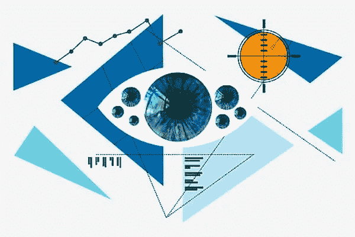
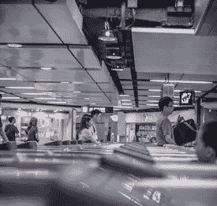

# CLEAR Secure 旨在重塑全球旅游业

> 原文：<https://medium.com/geekculture/clear-secure-aims-to-reshape-global-travel-industry-3dd1c6f347cb?source=collection_archive---------16----------------------->

Image credit: [Piqsels](https://www.piqsels.com/en/public-domain-photo-zbhxu)

CLEAR Secure 是一家生物识别筛查公司，在国际机场保持可见的存在。该公司希望创造一种更加无缝的旅行体验。在 2021 年夏天进行 45 亿美元的首次公开募股后，该公司更接近其“无摩擦”未来的目标。

联合创始人兼首席执行官 [Caryn Seidman-Becker](https://www.forbes.com/profile/caryn-seidman-becker/?sh=64af042f3156) 评论道:“我认为人们已经真正开始了解安全身份平台的力量，无论是在旅行还是其他领域。

## **让旅行体验更高效**

CLEAR Secure 成立于 2010 年，目标是建立一个更安全的世界。它始于航空业，但它的长期愿景是将公司的技术扩展到其他领域。联合创始人塞德曼-贝克尔和肯尼斯·科尼克(Kenneth Cornick)今天仍然领导 CLEAR Secure，分别担任首席执行官和首席财务官。

CLEAR Secure 最初关注航空旅行行业是为了在 9/11 事件后增加安全措施后使旅行体验更加顺畅。旅客们越来越感到沮丧，因为等待时间的增加和安全协议的加强给机场的物流带来了麻烦。

“我们从最难的地方开始:航空。塞德曼-贝克尔说:“如果这足以让你登上身份和安全至上的飞机，那么很明显——这不是一句双关语——这足以让你在医生办公室登记。”。

Photo by [Arron Choi](https://unsplash.com/@arronchoi?utm_source=unsplash&utm_medium=referral&utm_content=creditCopyText) on [Unsplash](https://unsplash.com/collections/8427689/airport-security?utm_source=unsplash&utm_medium=referral&utm_content=creditCopyText)

CLEAR Secure 提供的快速、无接触的入口很快在常旅客中流行起来。该公司的消费者航空订阅服务 CLEAR Plus 提供每年 179 美元的订阅服务。CLEAR Plus 会员可以以优惠价格向其帐户添加最多 3 名成年家庭成员。生物识别安全服务有助于减少通过机场、体育场和其他体育和娱乐场所的等待时间。

## 明确安全**扩大关注点**

该公司的身份平台拥有超过 560 万名成员，使用眼睛、面部或指纹扫描将用户与钱包中的卡联系起来，并提供无缝登录。该公司在北美拥有 100 多个独特的地点和合作伙伴。

在冠状病毒疫情期间，CLEAR Securethe 公司推出了健康通行证。它为上传疫苗接种证明卡、新冠肺炎阴性检测结果和其他健康数据提供了一个无缝平台。体育、娱乐和工作场所都在使用健康通行证。

“为了重新开放我们的实体经济，恢复使纽约成为世界上最具活力和最具连通性的城市的个人互动，我们需要清晰的健康通行证，”纽约市合作伙伴关系的总裁兼首席执行官凯瑟琳·怀尔德说。“这就是为什么我们鼓励企业采用 CLEAR 模式，这样他们就可以更快地让人们回到办公室，并确保我们的商店、餐厅、剧院和娱乐场所的安全。”

[美国国土安全部](https://www.dhs.gov/)授予 CLEAR Secure 信息安全平台最高认证等级。该公司的数据安全框架旨在保护敏感信息。

该公司在其核心航空业务之外的扩张重点可能有助于 CLEAR 的强劲财务表现。收入为 2.308 亿美元，比去年增长了 20%。净亏损从去年的 5420 万美元收窄至 930 万美元。

## **明确安全首次公开募股**

2021 年 7 月，CLEAR Secure 首次公开募股，筹集了 45 亿美元。高盛、摩根大通、艾伦公司和富国银行是首次公开募股的主承销商。CLEAR 的股票在纽约证券交易所上市，股票代码为“YOU”在 IPO 之前，CLEAR Secure 于 2021 年 2 月完成了一轮 1 亿美元的融资。

利用新筹集的 IPO 资金，CLEAR Secure 计划扩大其用户群，提高其技术水平，并投资于战略发展机会。该公司正在向核心航空业务以外的领域扩张。然而，该公司最初的基本使命坚持了下来。“自 2010 年以来，CLEAR 的愿景一直保持不变:为我们的会员提供无摩擦的旅程，让他们轻松体验他们最喜欢做的事情，”塞德曼-贝克尔说。

## **女性创办的上市公司**

通过收购 CLEAR Secure public，塞德曼-贝克尔将自己加入了一个由女性创立的美国上市公司的小名单。截至 2021 年初，在纽约证券交易所(NYSE)上市的公司中，大约有 20 家是由女性创立和领导的。

尽管一些著名的女性创办的公司在 2021 年首次公开募股，但它们仍然很少见。Bumble 创始人兼首席执行官 Whitney Wolfe Herd 于 2021 年 2 月将她的约会应用程序上市。2021 年 6 月，安妮·沃西基通过特殊目的收购公司将她的 DNA 检测公司 23andMe 上市。

塞德曼-贝克尔从职业生涯的早期就一直是一位开拓性的女性领导者。29 岁时，塞德曼-贝克尔筹集了 5000 万美元成立了对冲基金 Ariance Capital。更值得注意的是，她创建对冲基金时已经怀孕了。她已经做好了安全逃跑的准备。

除了作为女性榜样，塞德曼-贝克尔还为能够利用自己的地位创造一个更安全、更有保障的世界而感到自豪。“我想保证我的家人和我们团队的安全，我想成为解决方案的一部分，”她说。“我觉得这是我在这个世界上的机会:让它变得更好。”