# 气候变化:维基百科引用网络

> 原文：<https://medium.com/geekculture/climate-change-wikipedia-citation-network-e3e72d4227bf?source=collection_archive---------47----------------------->

## 使用 Python 和 Gephi 进行复杂网络分析和图形可视化

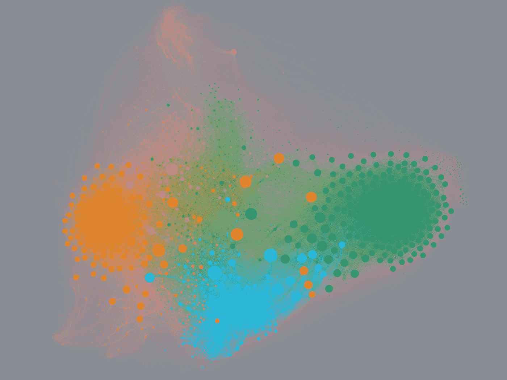

Wikipedia citation network based on Climate Change page

众所周知，维基百科是一个伟大的免费信息中心，通过开放的合作过程编写，提高了内容生产的频率，这有助于建立这个如此常用的网站。更准确地说，该平台仅上个月就有超过 220 亿次点击。

假设多次修订，维基百科的内容可以表达，至少在令人满意的水平上，真实的现实，使频道成为多元化主题的来源。

举例来说，以某个维基百科页面为例，可以假定它的内容体链接到其他页面表示这些主题之间的具体关系。因此，将这个场景带到复杂网络分析的范围，可以将 T2 页面视为节点，将页面之间的链接视为边。因此，让我们通过应用此行为来创建一个图表，以分析特定主题及其与其他主题的关系。

# 气候变化网络

最近，联合国政府间气候变化专门委员会(IPCC)发表了一份令人担忧的[报告](https://www.ipcc.ch/report/ar6/wg1/),关于人类活动对气候变暖过程的影响，这种影响可能会持续几个世纪不可逆转。

假设维基百科是一个内容来源，那么将 [**气候变化**页面](https://en.wikipedia.org/wiki/Climate_change)作为构建相关主题网络的种子是有效的。

通过抓取该页面及其一级链接主题，可以达到大约 10 万页。一个非常大的数字。然而，通过浏览这些节点，可以注意到存在重复的页面(相同的名称，但有复数形式)或者只是非常普通的页面。针对这个问题，我们保留了 96912 页。

假设更有意义的节点连接得更多，我们可以检查它们的程度(链接的数量)来忽略那些不相关的页面。在这种情况下，超过 14k 的节点只有一个连接，更多的节点只有不到 10 个链接。

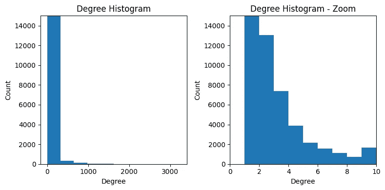

Degree Histogram and Degree Histogram zoomed in

既然有这么多节点，让我们从有 **10 个或更多连接的页面开始。**这大大降低了图中的节点数量，只有 3994 个。这个过程的结果是一个**气候变化维基百科引用网络**。

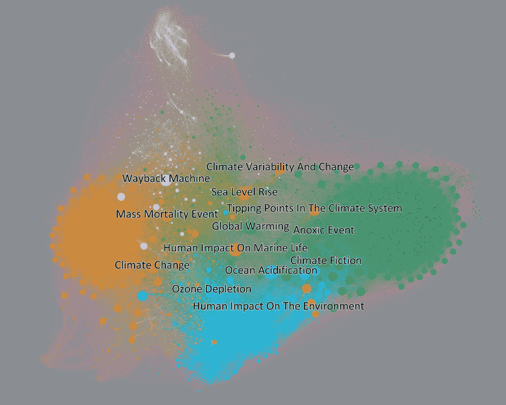

Climate Change Wikipedia Citation Network. Only labels for more quoted nodes

## 这是什么形象？

每个点都是一个维基百科页面。线条表示页面内容正文到其他页面链接。标签只显示在被引用较多的节点上，每个节点的大小与链接数量成正比。同时，颜色表示整个网络的聚类模式。

一种可视化每个聚类(颜色)含义的方法是查看页面标题中更频繁出现的单词。例如，下面的**文字云**代表网络图像左下方的粉色节点。很明显，这些页面与**自然资源**的概念有些关联。

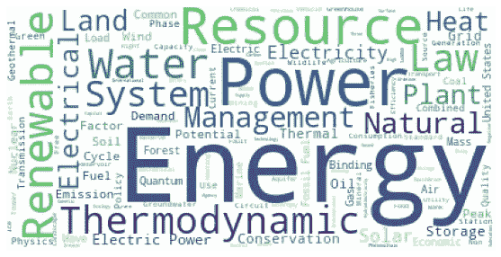

Wordcloud generated by pink page titles

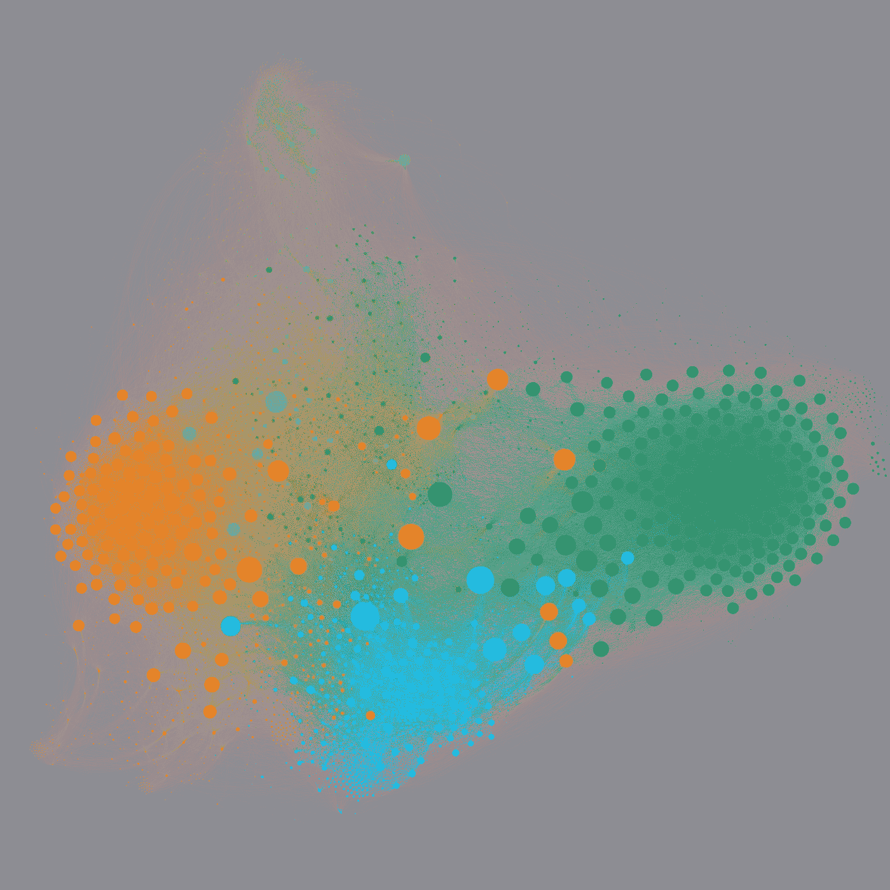

Wikipedia Climate Change Citation Network

应用这种技术，这些是每个分类的有意义的标签:

*   **粉色**(左下):自然资源
*   **紫色**(上):地质专题
*   **橙色**(左):气候变化
*   **深绿色**(右):信仰
*   **青色**(下):环境影响
*   **浅绿色**(中):科学与生态

# 簇

下图仅显示了每个集群中引用次数较多的节点的标签。用图的术语来说，指具有较高度中心性的节点。尽管概念简单，试着画出你自己对子图结构和主题相关性的理解。

## 气候变化

这个集群包含气候变化节点本身。尽管该页面被用作构建整个网络的种子，但该组仅包含整个图形结构的 16%左右。正如所料，该集群中的节点是与气候变化更直接相关的主题。原因实例(温室气体)、结果(海平面上升或人类对海洋生物的影响)以及可能的一般解决方案，如重新造林。

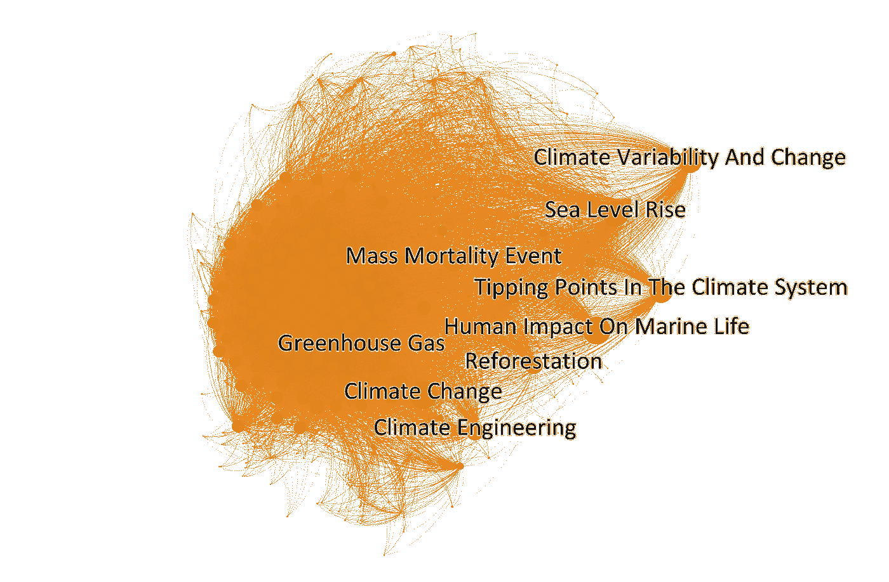

Climate Change subgraph

## 自然资源

关于可再生能源和自然资源的讨论确实与气候变化有关。但是，这个集群只包含网络的 3.65%的节点。可能是因为已知资源的数量有限。

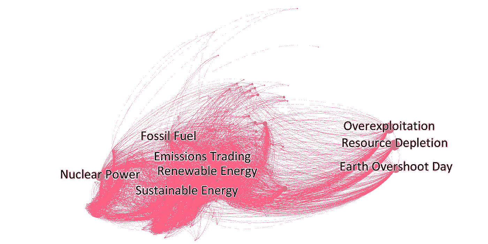

Natural Resources subgraph

有趣的是有两个小组。左边是自然资源和良好的管理行为，右边是令人担忧的概念，除了它们没有联系之外，它们似乎是有联系的。此外，与化石燃料和核能不同，没有强调可再生能源实例。

## 环境冲击

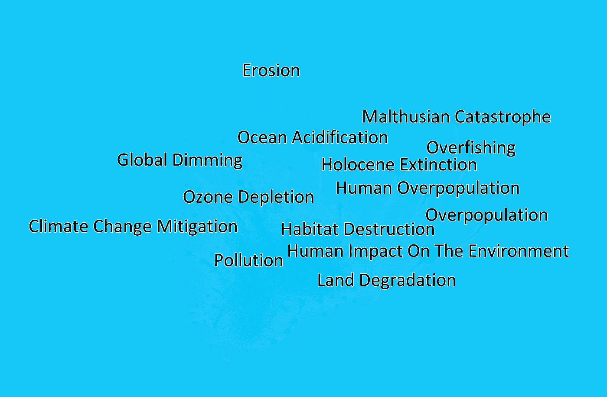

Environmental Impact subgraph

这不是随机的，与前一个集群相邻的是由滥用自然资源的后果组成的群体。这一组中的所有主题似乎都是环境中人类指纹的关键指标，对后果的关注以及可能逆转它的良好管理过程。

Environmental Impact cluster worcloud

## 科学与生态

在中心，有一个浅绿色的星团。浏览它的节点，可以验证关于地球本身及其生态位的科学领域网页和主题的模式。这个集群涵盖了从历史到生物；几乎所有的生态系统和环境方面，如温度、气候和生物多样性。该小组的地位可能与其代表与气候变化密切相关的环境生态位的知识领域网页和节点的多样性有关。

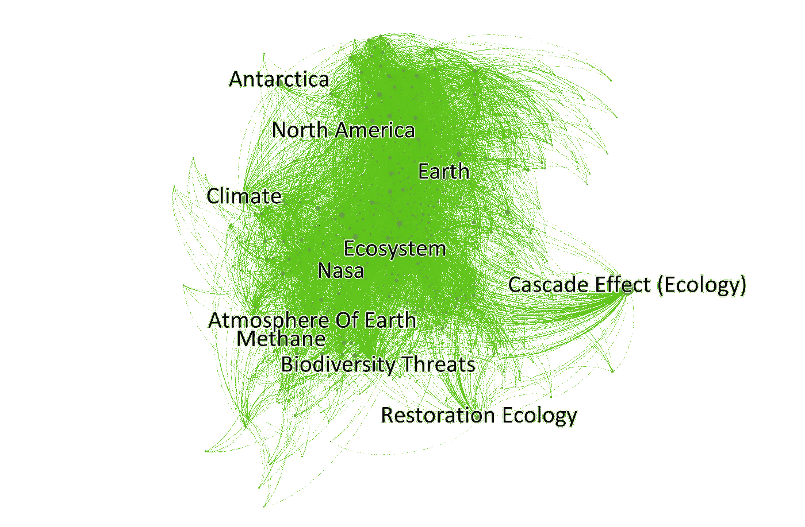

## 地质话题与政治状态

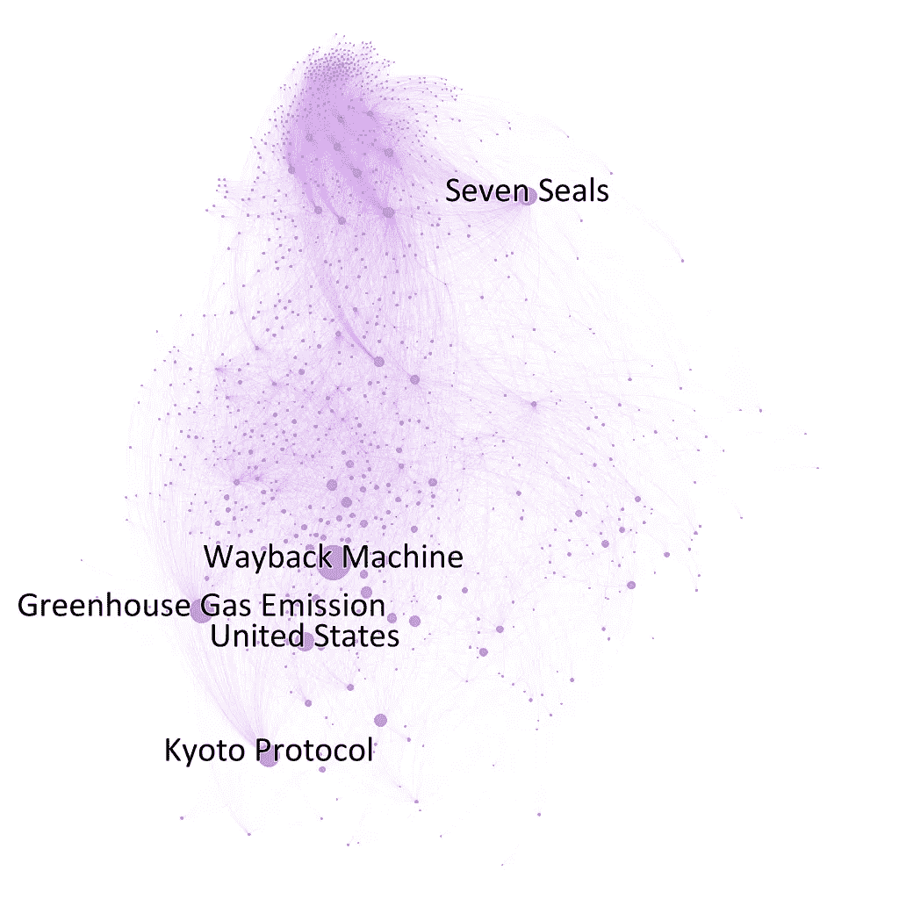

所有的政治州、国家、城市和几乎所有的地区都集中在这个集群中。因此，这是节点数量最多的分区:超过整个网络的 25%。尽管它只有不到 8%的图连接。

请注意，突出显示的唯一国家是美国。这可能是由几个原因造成的。因为每个节点都是维基百科的一个主题，第一个显而易见的原因是因为美国页面被引用的次数比其他国家多。此外，网络指出了另一个可能的原因。在突出显示的节点中，美国最近的邻居是温室气体排放和京都议定书。事实上，美国占了温室气体排放的一个相关部分，并且自 2001 年以来不再遵守京都议定书。由于各方面的原因，这个国家对气候有真正的影响。

其他节点呢？Wayback Machine 是一个存储网页的服务，和项目主题一点关系都没有。它只是一个非常普通的节点，看起来并不相关。同时,《七印》是关于圣经故事的一页。纵观整个网络，这个节点显然是紫色和深绿色星团之间的重要桥梁。

## 信仰、恐惧和理论神话

尽管这个集群只有 12.42%的节点来自网络，但它覆盖了最大数量的边:大约 25%。它最常被引用的节点是全球变暖，与森林砍伐和缺氧事件一起，代表现实世界的现象。但是，另一个高度关联的节点是气候小说(一种基于彻底气候变化猜想的视听作品)，这是一个人类抽象的概念。

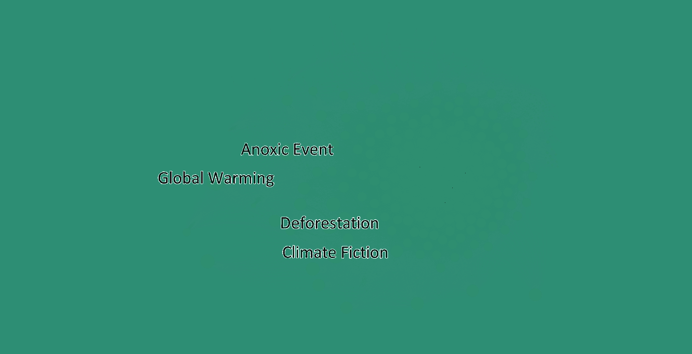

Belief, Fears and Theoretical Myths Subgraph

在分析之后，可以注意到一个非常密集的环形节点生态位。在这个聚合中，所有节点的大小都是相似的，表明引用的数量是相等的。为了获得更多关于这个子群的信息，我们制作了一张新的图表，只标出了处于小生境中的节点。探究这些标签，很明显有大量的
宗教信仰概念，人类信仰和恐惧的实例，与神秘原因或自然灾害引起的世界末日事件直接相关。

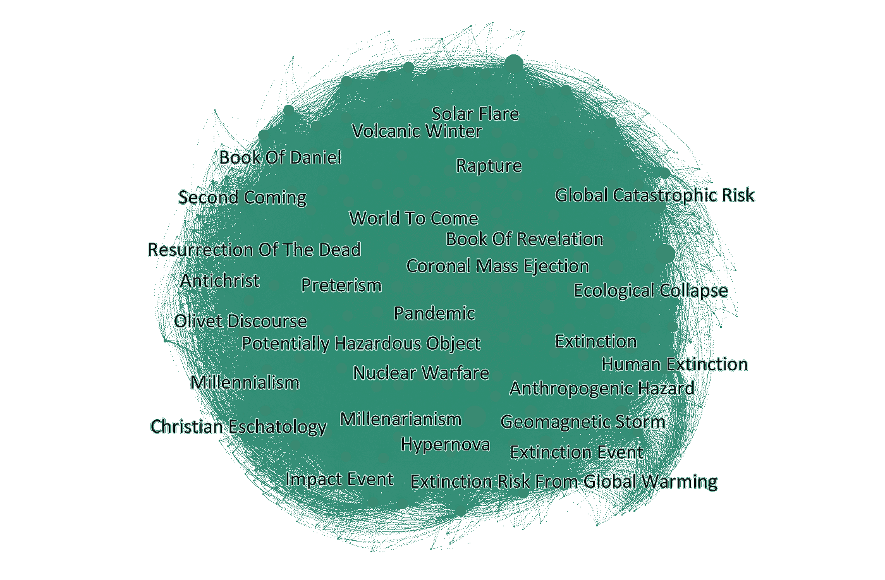

为了揭示这一点，下面的文字云是由页面标题中更常见的单词组成的。

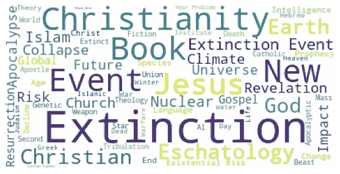

大量的单词或多或少与宗教信仰或现实生活中常见的神秘主题有关。

# 自己探索网络！

尽管深入网络找出一些关键指标或获取见解很有趣，但也需要了解结构的全貌。这也是为什么 GitHub 上有一个全网的 [**互动版**](https://mmartiniano.github.io/climate-change-wikipedia-network/view/) 的原因。准备在浏览器上访问。看看吧！

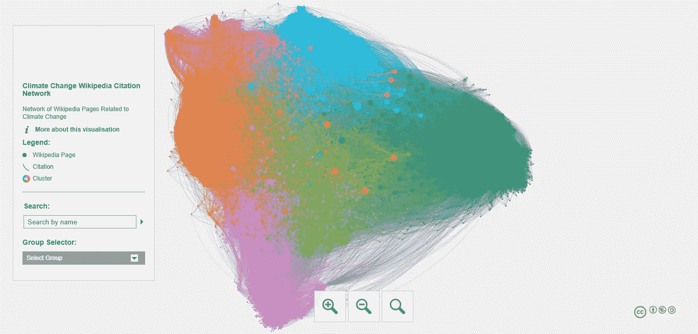

Screenshot of the [interactive network](https://mmartiniano.github.io/climate-change-wikipedia-network/view/)

# 编码和开发过程

本研究案例中使用的所有数据都是使用 **Python** 编程语言从维基百科中提取的。以及整个治疗过程和 worcloud 可视化。同时，使用开源网络分析软件 **Gephi** 生成图表和指标。要了解更多细节，请查看这个 [**资源库**](https://github.com/mmartiniano/climate-change-wikipedia-network) ，它包含了复制这项研究所需的所有资产、所需文件和整个编码过程。随意克隆和尝试。

这个项目是北里奥格兰德联邦大学网络分析课程的一部分。由 [**André Habib**](/@andrehabib2000) 共同撰写。