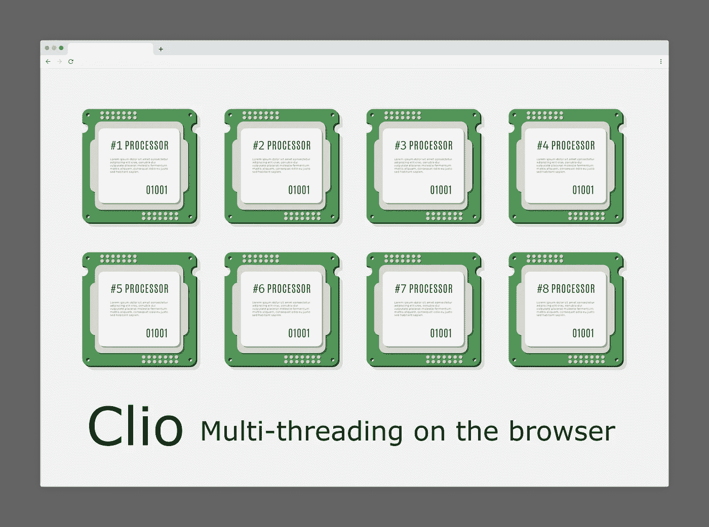
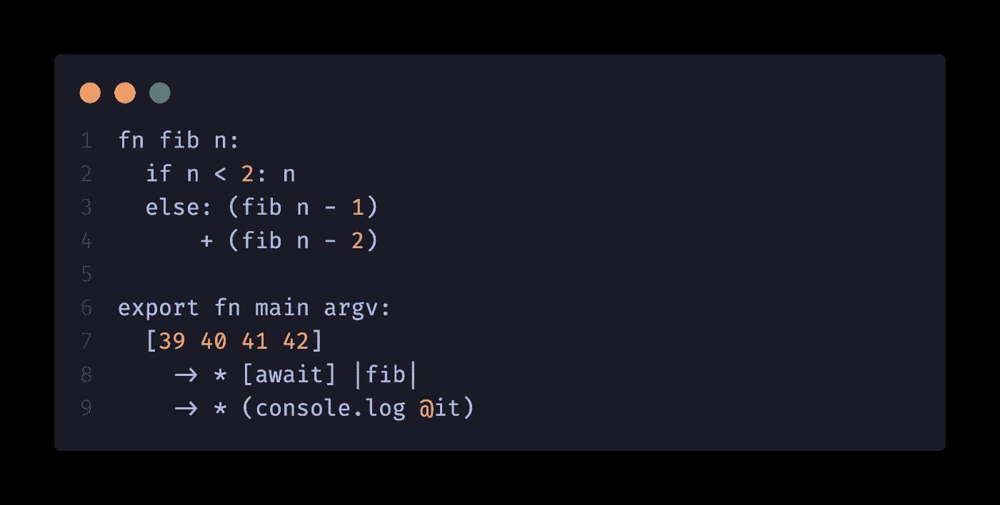
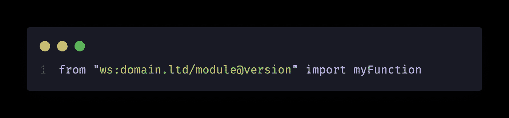

# Clio:浏览器上速度极快的多线程代码

> 原文：<https://medium.com/geekculture/clio-extremely-fast-multi-threaded-code-on-the-browser-e78b4ad77220?source=collection_archive---------1----------------------->

Clio lets you run multi-threaded code on the browser

Clio 是一种编译成 JavaScript 的函数式编程语言。它既可以在 Node.js 上运行，也可以在浏览器中运行，并且是多线程的。Clio 使并行或分布式编程变得非常容易，您可以轻松地使用本地设备上的 CPU 内核，或者使用网络上另一台设备上的资源。Clio 可以无限扩展。它有一个清晰的语法，速度非常快。您可以在 medium 上阅读 Clio [的介绍，访问我们的](https://pouyae.medium.com/re-introducing-the-clio-programming-language-cfdb3ce9fc49) [GitHub](https://github.com/clio-lang/clio) 资源库或[网站](https://clio-lang.org/)，或者您可以直接前往我们的[游乐场](https://playground.clio-lang.org/)查看并尝试几个示例。

但是，让我向您展示一个 Clio 的快速演示，以及如何使用它来实现多线程。要在浏览器或 Node.js 上执行多线程，您需要做的就是定义您的函数，并使用`|sandwich|`语法调用它们，Clio 会处理剩下的事情:

Fib function written in Clio

如果你愿意，可以直接在[操场](https://playground.clio-lang.org/)上运行这个例子。

在这个例子中，有几个小细节需要解释。在上面示例代码的第 8 行，您可以看到 Clio 三明治语法`|fib|`的演示，它在一个单独的线程中运行 fib 函数。在同一行中，您可以看到`-> *`用于将数据映射到`|fib|`函数。在第 9 行，`(console.log @it)`是一个匿名函数，它接受`it`作为它的第一个参数。

使用 Clio，还可以通过网络导入函数，并像使用任何其他常规函数一样使用它们。有了 Clio，你不用制作和实现 API 端点，只需托管你的函数并把它们导入到别处，Clio 免费为你提供 [FaaS](https://en.wikipedia.org/wiki/Function_as_a_service) 和微服务架构，没有任何额外的麻烦。例如

是有效的 Clio 代码。要查看远程函数的演示，您可以在这里查看我们的 todo 示例。

最近发布的 Clio v0.11.0 版本带来了一些重要的变化。这些变化主要是与性能相关的:它们提高了 Clio 代码的执行速度，也提高了整体 RPC 和多线程性能。在本文中，我将向您展示 Clio 有多快，我们将一起了解这些新的增强功能。先说性能吧！

# Clio 有多快？

既然 Clio 编译成 JavaScript，大家的第一个假设就是 Clio 比较慢，或者和 JavaScript 一样慢。对于像 [TypeScript](https://benchmarksgame-team.pages.debian.net/benchmarksgame/fastest/node-typescript.html) 这样的语言来说，这可能是真的，但是 Clio 实际上比 JavaScript 更快，并且在某些情况下，它比 JavaScript 快得多。我将在本文后面解释 Clio 如何实现这样的性能。但是现在，让我们看看我们所说的速度有多快。

Clio performance vs other languages

上图显示了在不同编程语言中计算第 1000 个斐波那契数的执行时间。正如您所看到的，Clio 几乎和 C 一样快。当然，我不期望 Clio 总是或在任何其他情况下都这么快，我也不声称 Clio 和 C 一样快，我所声称的是 Clio 超级快，并且已经做了很多工作来使它更快。那么如果编译成 JavaScript 怎么会这么快呢？

首先，我应该提一下，与普遍的看法相反，JavaScript 实际上是一种[非常快的](https://benchmarksgame-team.pages.debian.net/benchmarksgame/fastest/node-gpp.html)编程语言。由于 Clio *将*编译成 JavaScript，编译器可以对生成的 JavaScript 应用编译时优化。在上面的例子中，[尾调用](https://en.wikipedia.org/wiki/Tail_call)优化被应用于 Fibonacci 函数。您可以在这里找到基准[的源代码。](https://github.com/clio-lang/benchmark)

Clio 比 JavaScript 运行得更快的另一个原因是 Clio 代码的编写方式:使用管道，可以避免创建中间常量或变量。函数调用的输出可以直接通过管道传递给另一个函数，并从那里传递给另一个函数。当然，也可以在 JavaScript 中嵌套函数调用，避免使用中间变量，但是，Clio 语法经过精心设计，在保持可读性的同时允许这样做。例如，下面的 JavaScript 代码:

在 Clio 中变成这样:

在上面的 JavaScript 示例中，函数的执行顺序是从内到外，但是在 Clio 代码中，它是从左到右执行的，与您读取和编写代码的顺序完全相同。如果你仔细想想，这就更有道理了！

为了保持 Clio 的速度，我们花费了大量的时间和精力，为此，我们不得不牺牲掉相当多的特性。举个例子，我们不得不放弃懒惰，因为我们运行的 V8 引擎本身并不支持它。然而，我们确保 Clio compatible 与 JavaScript 保持兼容。

因此，您现在可以将任何 JavaScript 库导入 Clio 并使用它，而不会遇到任何问题。因此，您甚至可以从 Clio 的多线程特性中获益，使您的 JavaScript 库运行得更快:

在上面的图表中，您可以看到使用 Clio 并行化任务是如何提高性能的！作为一个例子，Jimp，一个纯 JavaScript 图像操作库，被用来对一个充满图像的目录应用灰度效果。使用 Clio，您可以在单独的线程中将效果应用到每个图像，这大大提高了性能。在 Clio v 0 . 11 . 0 版本中，做了大量的工作来使并行性比以前更快、更有效、更好！

# Clio 中的并行

Clio 有一个基于网络的并行模型。你可以称之为分布式计算模型。在启动时，Clio 会创建一个中央集线器或消息代理，称为调度程序，并根据项目的配置监听不同协议上的连接。然后，它产生工作程序，并等待它们连接到调度程序。调度程序只是一个消息中心或代理，在主线程和工作线程之间传递消息。工作线程和主线程之间没有共享内存，因此 Clio 必须序列化每一条消息。

在 v0.11.0 版本之前，Clio 使用 JSON 进行序列化。JSON 随处可见，而且速度相当快，所以一开始，使用 JSON 听起来是个好主意。不幸的是，一旦我们开始用 JSON 序列化定制类型，它的性能就会下降到不再高效的地步。为了解决这个问题，我为 JavaScript 创建了一个名为 [Sia](https://github.com/pouya-eghbali/sia) 的序列化库，并将其序列化性能提升到一个新的水平，我还设计了一个新的文本编码，我称之为 [utfz](https://github.com/pouya-eghbali/utfz) 。我花了一年多的时间来优化这两个库，结果，成功地使 Sia 如此之快，以至于它的纯 JavaScript 版本甚至胜过了 Node.js 可用的本机序列化库的性能！

Sia 是二进制序列化格式，从上图可以看出，Sia 速度极快！要查看更多基准测试，或者了解更多关于 Sia 以及它是如何快速发展的，您可以参考[这篇中型文章](https://pouyae.medium.com/sia-an-ultra-fast-serializer-in-pure-javascript-394a5c2166b8)。使用 Sia 作为序列化库，Clio 在多线程、远程函数调用和 RPC 协议方面获得了巨大的性能提升。

上图显示了在我切换到 Sia 之后 Clio 的性能增益。不仅序列化数据更快，现在传输数据也更快。使用 Sia，序列化的数据比 JSON 小得多，并且已经是二进制格式了！在浏览器上，性能也大大提高。为了快速演示，您可以查看下面的视频，与 JSON 相比，Clio Mandelbrot 示例在 Sia 上的渲染速度有多快:

Clio Mandelbrot example

该视频展示了用 Clio 编写的多线程 Mandelbrot 示例的渲染时间。你可以在动作[这里](https://clio-mandelbrot.vercel.app/)查看，也可以在 [GitHub](https://github.com/clio-lang/examples/tree/master/mandelbrot) 上查看源代码。正如您所看到的，Sia 版本比 JSON 版本快得多，完成时间几乎是 JSON 版本的一半！

有了 Clio，在一个线程中运行函数变得超级简单，不需要自己设置任何东西，不需要处理 web workers 或 worker 线程，不需要实现通信协议或同步，一切都已经搞定了，只需运行`clio new`来搭建一个新项目，编写代码，然后运行`clio run`命令，你就可以在几秒钟内启动并运行你的应用程序。您可以在 Clio 示例库[上查看示例。](https://github.com/clio-lang/examples)

Clio 仍然是一个非常年轻的语言，它还有很长的路要走，它还没有准备好投入生产，我也不急于推出一个稳定的版本。我想保持它的最小化，我想仔细地选择语言中应该包含或不包含的内容。它的设计考虑到了云和微服务，这也是主要的关注点。对于 Clio，我的目标是开发一种通用语言，既可以在网上使用，也可以在网外使用，这种语言既适合制作网站，也适合处理数字和科学数据。

如果你有任何问题，请在本文下留言评论，在 GitHub 上发帖，如果你想聊聊，欢迎加入我们在 [Telegram](https://t.me/clio_lang) 上的公共聊天！