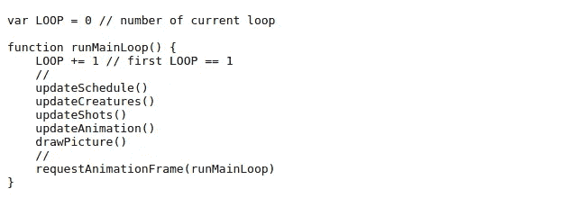
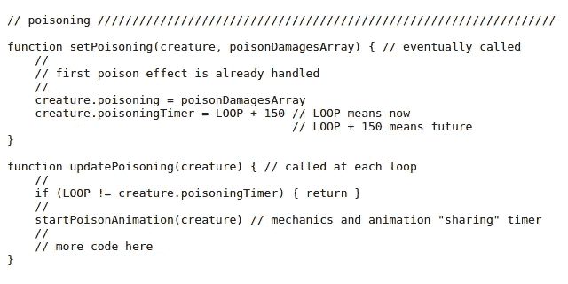
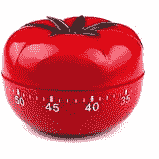
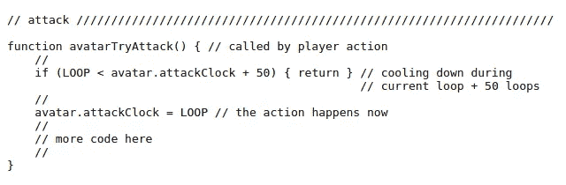
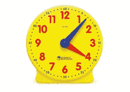
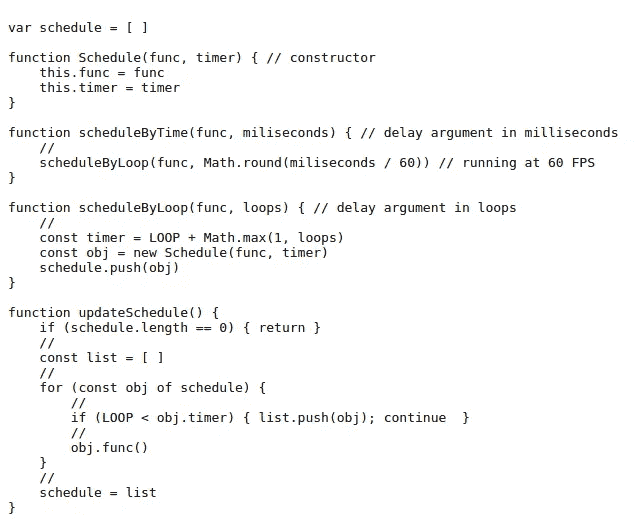

# 时钟，时间，计时器，延迟，持续时间，时刻，开始，开始，结束，时间表？

> 原文：<https://medium.com/geekculture/clock-time-timer-delay-duration-moment-start-begin-end-schedule-e780d8e4fe49?source=collection_archive---------21----------------------->

## 时序逻辑和动画

像电子游戏这样的程序有复杂的逻辑(力学)和动画。在这篇文章中，我们将研究一些关于时间的原则。这个题目并不难，但是如果我们不遵循一些基本的规则，可能会非常棘手。

本文适用于任何编程语言，但有几个部分是特定于 JavaScript 的。

Photo by [Andrik Langfield](https://unsplash.com/@andriklangfield?utm_source=medium&utm_medium=referral) on [Unsplash](https://unsplash.com?utm_source=medium&utm_medium=referral)

## 小型会议

本文中的“**力学**一词指的是游戏逻辑；例如，化身有多少生命。而**动画**一词仅指视觉方面；绘制在游戏画布上的精灵。动画应该与机械相匹配。

# 主循环(计时的基石)

The main loop

像视频游戏这样的程序有一个主要的功能，它以固定的、非常小的时间间隔运行。程序的所有功能都包含在这个主函数中。

在上面的代码中，***requestAnimationFrame****(浏览器中的 JavaScript)*负责让 main 函数另一次运行。那下次吧。然后另一次…**

*****requestAnimationFrame****尝试每隔 16.666 毫秒触发一次主循环执行，使游戏以 60 FPS(每秒帧数)运行。***

***对于主循环的控制，****setTimeout****为**废弃**。它的替换是***requestAnimationFrame****(你可以在别处读到重要原因)。******

***最重要的是，**永远不要**使用***setInterval***(JavaScript)，因为你可能会在当前循环完成之前触发一个新的主循环，**会严重膨胀**程序的执行。***

> **我们有一个主循环(只有一个)和一个(只有一个)机制让它按顺序运行**。****

****注意，我们并不依赖于传统的循环语句，如 ***而*** 或 ***for*** 来构造主循环。****

# ****最简单的计时机制****

****最简单的计时机制就是每次主循环运行时执行一些东西；不需要检查主循环计数器。****

****例如: *runMainLoop* 调用*updated creatures，*每移动一个向左移动的生物，X 坐标减一。当程序以每秒 60 帧的速度运行时，一秒钟后，一个生物将向左移动 60 个像素。****

****在我的代码中，对游戏循环执行进行计数的全局变量的名称是“loop”(清晰、简短、粗体)，打破了大写名称为常量保留的惯例，因为它如此重要且无处不在。对于其他非常重要的全球旗帜，我也遵循这种命名方式。****

# ****主循环计数器为王****

****每一个比上面显示的最简单的计时机制要求更多的计时功能将**直接或间接依赖于主循环计数器，除此之外别无其他**。我们将逐案研究。****

## ****忘记 setTimeout 和 setInterval****

****虽然依靠主循环计数器是一个清晰、健壮、足够的策略，但有时，在游戏开发的后期，我们可能会忍不住用 ***setTimeout*** *处理一个简短的、附带的动画。*因为非常容易，所以我们不需要思考(或者改编)整个动画逻辑。千万别这么做。它可能看起来像一个小的、无害的、离散的过程，但是它是一个使你的程序变得混乱的变通方法:它很可能会与程序使用的数十个其他计时器发生冲突。在使用 ***setInterval*** 的情况下，解决方法要糟糕得多。****

*******setTimeout*** 和****setInterval***打破了**通过**循环**处理游戏机制和动画的模式**。*****

****这些功能对于传统的网页来说非常好。句号。****

> ****拥有并行/并发的计时系统是很麻烦的。****

# ****毫秒计时****

****我们编写代码计数循环的事实并不意味着我们不用秒来思考。一个简单的数学将毫秒转换成循环。例如，应该每秒运行四次的函数被调整为在十五个循环的间隔内触发。****

# ****使用主循环计数器的基本方式****

****为每种样式选择一个(**小**和**明显**)后缀，并保留它，这是一个很好的做法。否则一个有几十种计时机制的程序将很难理解和维护。我用“时钟”和“计时器”。****

## ****计时器样式****

*****如果当前循环号* ***等于*** *的存储值，我们执行一些功能。*****

********

****Using timer****

****上面的代码是迷失在迷宫中的浏览器游戏[的简化版代码。](https://www.lostinmaze.com/)****

****使用计时器就像在现实生活中使用计时器一样:我们现在就设定未来某件事应该发生的时刻。****

****我认为后缀“计时器”是最适合这种情况的，比“时钟”或“开始”更清晰和精确。“开始”是动词；它更适合作为启动某事的函数的后缀(例如 *startPoisonAnimation* )。我认为“开始”和“结束”是一样的。****

*****updatePoisoning* 是一个关于力学的函数，它触发一个动画函数: *startPoisonAnimation* (它有自己的计时机制，也是基于循环的)。****

****这个计时器使用起来非常简单。一旦设定好了，就没什么好讲道理的了。这是控制中毒的完美方法，即使在第一次中毒结束前一个生物再次中毒。只是覆写*生物.中毒*和*生物.中毒计时器*(在施加第二次中毒的初始伤害后)。****

********

****Timer****

## ****时钟样式****

*****我们***如果当前循环次数是******等于*** *给一个记忆值加上某个常数就不执行某个功能。********

********

****Using clock****

****上面我们看到了另一个简化版的迷宫游戏的代码。****

****现在计时器不好用了。我们没有设定未来的时刻。我们正在**记录**当前时刻，以便将来评估。后缀“clock”适用于过去的某个时刻(就像我们将来会理解的那样)。“时刻”可以，但有点长。“开始”和“开始”是动词。我认为“计时器”和“时钟”是很好的一对。****

****你可能会说我们不需要时钟风格，我们可以用定时器风格做任何事情，反之亦然。在这种情况下，我不得不反对:****

1.  ****语义对于可读和可维护的代码非常重要。因此，创造一个*攻击计时器*(意味着生物冷却的时间)而不是*攻击时钟*是违反直觉的。也许把后缀改成 *attackDelayer* …反正不会比 *attackClock* 好。****

****2.有时候，在一个程序中，我们不能只覆盖定时器值。为了执行一些评估，我们需要知道过去的值(时钟)。****

********

****Clock****

## ****更多关于名称:时间，延迟，持续时间，循环****

****“时间”、“延迟”、“持续时间”和“循环”是指代没有以“定时器”或“时钟”为后缀的事物的好名字。****

****我一直在介绍我个人对时间命名的习惯。当然，你可能会随心所欲地改编，甚至根本不用。****

# ****时间表****

****还记得关于使用 ***setTimeout*** 制作一个小的侧面动画的部分吗？我们现在做的是:****

********

****The schedule****

****函数 *scheduleByTime* 是我们自己的 ***setTimeout*** 函数，完全在我们的控制之下，完全基于循环。****

****函数 *updateSchedule* 由函数 *runMainLoop* 调用，它运行每个循环。****

# ****“计时”结束****

****就是这样。****

****我希望你喜欢！****