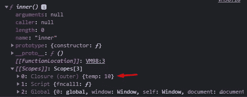

# JavaScript 中的闭包

> 原文：<https://medium.com/geekculture/closure-in-javascript-fd8e4753d3f1?source=collection_archive---------39----------------------->

Photo by [Joshua Reddekopp](https://unsplash.com/@joshuaryanphoto?utm_source=medium&utm_medium=referral) on [Unsplash](https://unsplash.com?utm_source=medium&utm_medium=referral)

# 介绍

最近，我开始阅读《雄辩的 JavaScript》这本书，在这本书里，我发现了一个叫做闭包的概念。我不得不说 JavaScript 的这个特性给我留下了深刻的印象。

在本文中，我们将通过几个例子了解 JavaScript 中闭包的概念。我们还将进行代码演练。

也许你也会学到一些关于函数的东西。

最后，我希望你对 JavaScript 中的闭包有一个清晰的心理模型。

让我们开始吧。

# 关于 JS 中函数的要点

在进入结束语之前，我希望您理解 JavaScript 中关于函数的两件事。

**我想让你记住的第一点是，函数每次被调用时都会重新创建它的局部变量。**

参见下面的例子，

函数`*handleTrophies*` **每次被调用时都会重新创建*奖杯*变量的**值。这就是为什么无论我们调用`*handleTrophies*` 函数多少次，控制台都会记录相同的值。永远不会超过一个。

让我们继续讨论第二点。

## 第二点是，在 JavaScript 中，函数不仅是语法，还有值。它们可以被赋给变量。

我们可以看到，`fncall`持有的是一个函数的值。

如果我们将它写成`fncall()`，它将作为一个函数工作。

# 关闭的概念

上面这两点带来了一个有趣的问题，当创建局部值的函数不再活动时，局部值会发生什么变化？

[https://gist . github . com/man mode sanket/2 fbbce 9d 7405d 0 Abd afce 43 B4 f 0 dcb 4 f](https://gist.github.com/manmodesanket/2fbbce9d7405d0abdafce43b4f0dcb4f)

在上面的例子中，`fncall`将名为`inner`的函数保存为由名为`outer`的函数返回的值。功能`outer`现在不再激活。

上述代码片段的输出如下。

我们可以看到闭包已经保存了`temp` ***的值。***

这种能够在封闭范围内引用局部变量的特定实例的特性被称为闭包。

简单来说就是`inner`函数可以借助闭包访问 ***外部*** 函数的变量。

所以闭包的主要特征是它允许记忆完全不同范围的值。用更花哨的方式说，**封闭让价值观保持活力**。

让我们看另一个例子来更好地理解闭包。

代码演练:

1.  `call_one`以`handleLike`函数体为其值。
2.  `call_two` 也同样拥有`handleLike`功能体作为其价值。
3.  但是存储在`call_one`和`call_two` 中的这些值并不相同。因为，对`updateLike`的函数调用是单独进行的，它每次都返回一个全新的`handleLike` 函数作为值。
4.  当我们执行`call_one()`时，我们正在执行`call_one` 的值中包含的函数。在点 1，在执行语句之前，存储在`call_one` 闭包中的`like`的值为 5。
5.  在点 1 执行语句时，`like`的值从 5 增加到 6，并作为闭包存储在`call_one`的范围内。
6.  类似地，它将在点 3 更新为 7。
7.  现在在点 2，在执行语句之前，`call_two` 闭包中`like`的值是 5 而不是 6。然后会更新到 6。
8.  类似地，它将在点 4 更新为 7。

我希望这个例子能给你一个好的思维模式。

## 关于结束要记住的几点。

1.  闭包是 JavaScript 函数独有属性。
2.  当被调用时，函数体(在我们的例子中是`handleLike`)看到的是它被创建的环境，而不是它被调用的环境。
3.  内部函数(在我们的例子中是`handleLike` 或`inner`)可以访问内部变量、外部函数变量和全局变量。
4.  *在 JavaScript 中，每次创建函数时都会创建闭包，* ***在函数创建时。***

这是我对 JavaScript 闭包的看法。我希望我带着对这个主题的良好理解离开你。