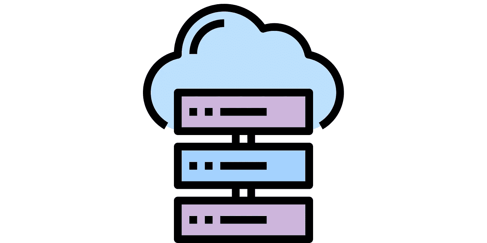
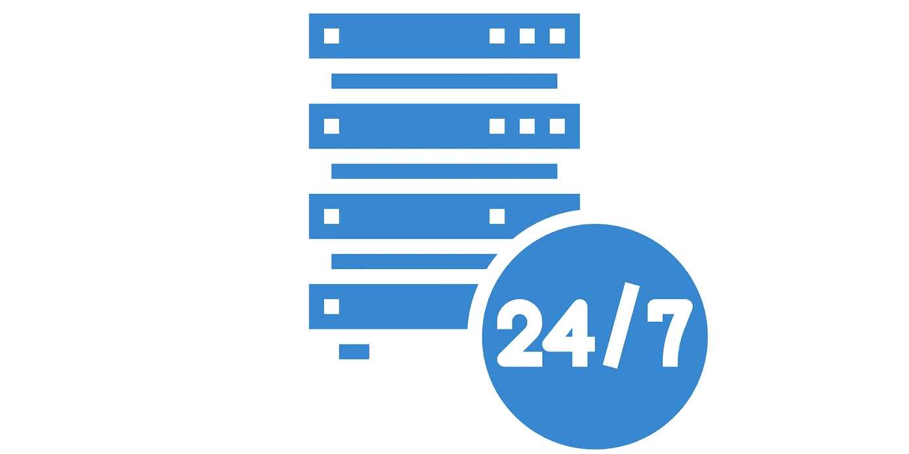
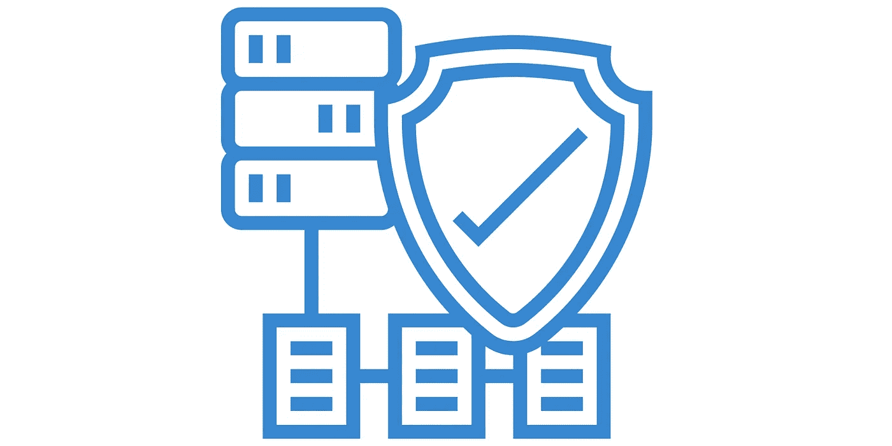
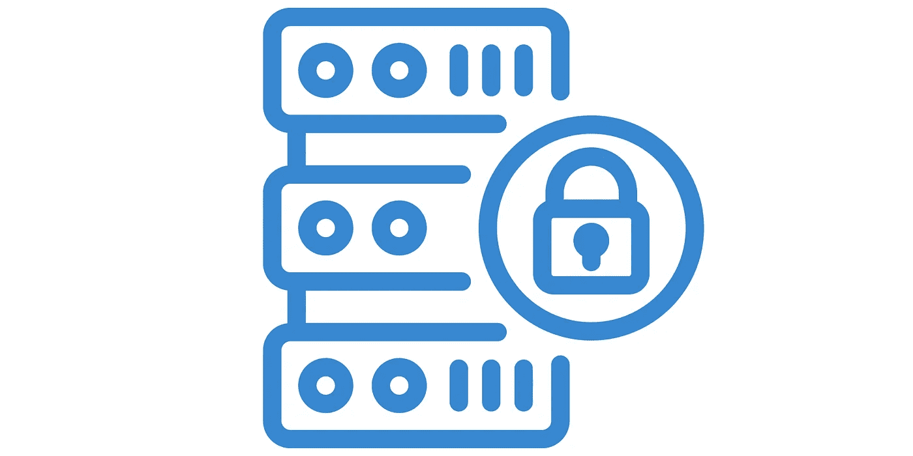

# 云计算与内部部署

> 原文：<https://medium.com/geekculture/cloud-computing-vs-on-premises-5647aa36fa69?source=collection_archive---------13----------------------->

本文解释了云计算和内部模型之间的差异，以及为什么云成为首选。一旦你明白了这一点，你就能更好地决定什么对你更好。

# 1.成本:

Cost

## **内部:**

如果你是一家初创公司，那么你需要购买昂贵的服务器来启动和支持你的业务。你将不得不支付购买服务器的前期费用。

如果您是一个成熟的组织，那么就需要不断升级基础架构来支持业务运营。所有这些都要花很多钱，而且你要提前支付这笔费用。

## 云:

有了云，你要么不需要支付任何前期成本，要么只需要支付非常有限的前期成本就可以获得基于云的服务器和其他资源。你可以开始使用这些资源，然后按使用量付费给云服务提供商。在某种程度上，如果你不再需要这些设备，你不需要担心该怎么办，只要停止使用它。云节省了大量前期成本。

# 2.可扩展性:

Infrastructure Scalability

可伸缩性是指增加或减少基础设施资源以应对软件和服务不断变化的需求的能力。

## 内部:

在传统的内部托管中，您无法快速扩展基础架构。如果您在一天中的特定时间对软件和服务有更多的需求，而您当前的基础架构无法处理这些需求，那么您必须购买更多的服务器和相关设备。采购设备、安装、组装和运行都需要时间。最重要的是，这些设备在高峰时段会很有帮助。当峰值过后，设备将会闲置，这不是对资源的有效利用。你已经把钱花在购买设备上了。

## 云:

在云中，如果您的基础架构需求增长，您可以快速实现。您不需要等待基础架构采购，也不需要为此花费前期成本。您可以在几分钟内启动新服务器，扩展现有基础架构，如内存/CPU/存储等，而无需花费前期成本。你只需要为你使用的资源付费。当不是高峰时间时，您可以安排它们自动缩减，这样可以节省您的成本。因此，云带来了可扩展性、快速实施和有效的成本管理。

# 3.可用性:

Availability

可用性意味着您的软件和服务可供您的用户不间断地使用。

## 内部:

在传统的内部托管中，为高可用性系统提供可靠的故障转移需要付出大量的努力和成本。如果您想让您的系统高度可用，并且想要可靠的故障转移，那么您需要至少两个地理上分离的位置来托管您的基础设施。因此，您必须花费前期成本进行采购设置，然后管理两个独立的位置。

## 云:

在云中，所有主要的云服务提供商在世界各地的不同地理位置都有大量的数据中心，称为区域和可用性区域(AZ)。因此，您可以轻松地使用多个可用性区域，并在那里托管您的基础架构。您的团队可以随时轻松地远程访问和管理这些地理上分散的 AZ。

# 4.可靠性:

Reliability

您设备的组件故障频率是多少？您的系统是否可靠并在需要时可用？这是个大问题。

## 内部:

在内部模型中，您很难确保基础架构的所有不同组件都正常工作并且不会出现故障。如果发现性能受到影响，您必须进行持续监控并主动更换组件。这需要时间，需要团队的努力，也要花费你的钱。

## 云:

在云中，云服务提供商拥有大量资源和高技能团队，他们不断监控和增强他们的系统，确保实现可靠性。云提供商提供服务水平协议，保证您的基础设施的可靠性。因此，您可以轻松实现云中服务的可靠性，而无需支付任何额外成本。

# 5.安全性:

Security

安全性意味着保护您的基础架构、应用程序和相关数据免受网络威胁。有两种类型的安全性适用于内部和云模型。

## a.基础设施安全:

基础设施安全意味着保护基础设施，使设备不能被未经授权的人员接触到。

它还包括设备和网络的正确配置和及时修补。

## b.应用安全性:

应用程序安全性意味着管理应用程序用户、他们的访问级别、应用程序数据加密和任何法规要求(合规性)。

## 内部模式:

在内部部署模式中，基础架构安全和应用程序安全都是您的责任。您需要训练有素的团队、资源、合适的软件和他们的许可来处理这种级别的安全性。

## 云模型:

在云模型中，安全是一项*“共同责任”。*云服务提供商负责运行计算实例和存储的物理主机的基础架构安全性。作为客户，您有责任保护应用程序的安全。

我希望您对内部部署和云计算的区别有一个基本的了解。你可以更好地决定哪一个最适合你。