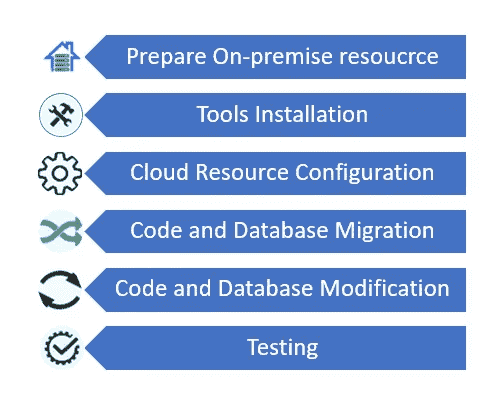

# 云迁移流程–将应用从内部迁移到云

> 原文：<https://medium.com/geekculture/cloud-migration-process-migrating-apps-from-on-premise-to-cloud-acacf27af0fb?source=collection_archive---------15----------------------->

随着云平台和技术的发明，人们对环境的偏好发生了重大转变，从内部部署转向云。在本文中，我将讨论将应用程序从本地服务器/环境转移到云环境的过程。

**准备内部资源**

该流程从准备内部资源开始。这是一个宽泛的术语，因为准备工作取决于您想要迁移的资源—服务器、数据库、虚拟机等。在此阶段，将选择需要迁移的数据，并进行必要的备份，如 SQL 备份、虚拟机映像文件等。通常，云中可能不需要很少的文件/数据，因此可以避免迁移。这些必须在此阶段确定。

**工具安装**

在开始任何迁移之前，必须在内部和云中设置必要的工具。这可以防止托管后的云中出现任何冲突。云资源可能需要任何外部平台特定的库，以便应用程序与云中的服务进行通信。这些必须手动设置。

**云资源配置**

云资源配置可以从多个方面进行观察——网络、资源、可访问性和权限等。在安装工具之前或之后，必须根据要求配置这些参数。

**代码和数据库迁移**

代码和数据库的物理迁移发生在此阶段–代码库被迁移到服务器/虚拟机，本地数据库备份可用于初始化云托管数据库。CI/CD 管道可以设置并链接到 Git 或任何存储库，以便自动编译和部署。

**代码和数据库修改**

当将应用程序从内部迁移到云时，需要修改代码库和数据库以与云兼容。示例:本地服务器可能使用内置库与数据库通信，而云托管代码应该使用特定于云平台的库与任何云服务通信。一旦设置好所有资源，就必须相应地修改代码。

**测试**

必须进行常规测试，以确保应用程序的正常运行，尤其是与服务、数据流(如果已设置任何管道)的正确连接，以及网络连接和可访问性。

感谢您的阅读！

## **有用链接:**

在 LinkedIn 上找到我:https://www.linkedin.com/in/vishnuu0399

更多地了解我:https://bit.ly/vishnu-u