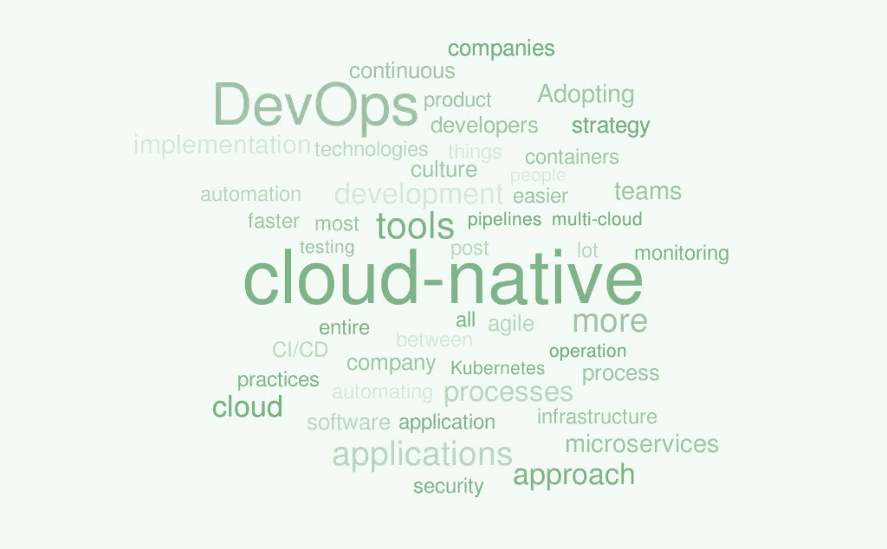
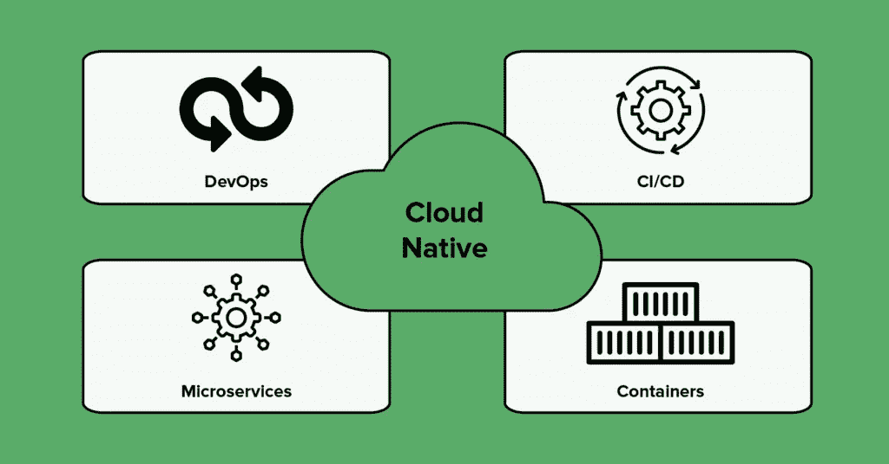

# 云原生 DevOps —全面介绍

> 原文：<https://medium.com/geekculture/cloud-native-devops-a-comprehensive-introduction-d551c7f80ac7?source=collection_archive---------0----------------------->

DevOps，即**自动化开发和运营**之间流程的方法，是成功实施云原生方法的重要因素之一。由于云原生的目的是**缩短上市时间并为公司带来更高的效率**，因此开发运维简化了个人、工具和系统，为企业的整体成功做出了贡献。这使得云原生开发运维成为提高工作效率的合理步骤。

云原生和 DevOps 运动都在上升。[报告和数据](https://www.reportsanddata.com/report-detail/devops-market#:~:text=The%20global%20DevOps%20Market%20is,USD%2017.27%20Billion%20in%202027.)预测*全球 DevOps 市场将从 2019 年的 44.9 亿美元增长到 2027 年的 172.7 亿美元*。

此外，[新冠肺炎疫情对云的采用产生了重大影响](https://microtica.com/devops-covid-19-pandemic/?utm_source=medium&utm_medium=referral_link&utm_campaign=faun&utm_content=cloud-native)。[预测](https://www.techrepublic.com/article/idc-worldwide-it-predictions-for-2021-that-cios-need-to-know/#:~:text=There%20will%20be%20a%20dramatic,affect%20the%20enterprise%20by%202023.)称，到 2021 年底， **80%的公司将加倍采用以云为中心的基础设施和应用**。这主要是由于向远程优先劳动力的转变。

云原生 DevOps 方法通过持续部署最大限度地提高了灵活性。此外，它可以扩展系统和应用程序，而无需进行剧烈的更改。

*让我们深入了解一下这种方法的真正含义。*

# 什么是软件开发的云原生方法？

采用云原生方法意味着采用许多利用创新的新选项。*云原生团队使用的主要工具由云提供，而不是本地基础设施。*

云原生应用程序**敏捷、适应性强、健壮且易于监控。这意味着团队通过频繁快速的部署和迭代来构建它们。他们没有阻止失败，而是欣然接受失败，并拥有实时改进的能力**。

此外，在监控方面，他们不依赖外部因素。相反，可以从内部控制应用程序。

云原生起源于大约十年前，当时一群技术领导者向公众介绍了它。Weaveworks 技术产品战略副总裁 Paul Fremantle 的这篇博客文章是第一批相关文章之一。在帖子中，他声称应该为云编写应用程序，以便在云上运行良好。

然后，在 2015 年，摩根大通的执行董事 Matt Stine 在他的书 [*迁移到云原生应用架构*](https://www.oreilly.com/library/view/migrating-to-cloud-native/9781492047605/) *中明确了云原生的概念。*

现在，**云原生伞涵盖了很多工具和方法，包括微服务、容器、CI/CD、多云**等。[CNCF 云原生交互环境](https://landscape.cncf.io/)提供了云原生方法中使用的大多数工具的概述。为了帮助并为开发社区提供构建云原生应用程序的良好选择，CNCF 开发了这种开源工具。

# 什么是云原生 DevOps？

如果我们将这两个定义结合起来，云原生 DevOps 就变成了**一套由持续开发、自动化操作和跨职能团队组成的实践，**从而改善最终用户的整体体验。云原生 DevOps 旨在让您的公司更加灵活。您可以通过 Kubernetes 和 containers 等技术来实现这一点，这些技术可以实现流程自动化，并使应用程序更具可伸缩性。

所有这些实践几乎适用于公司的每个方面。这意味着改变整个文化，包括工具、人员和流程。当涉及到**文化的时候，**你需要[采用一种面向发展的方法](https://microtica.com/want-to-move-from-ops-to-devops-here-is-what-you-should-know/?utm_source=medium&utm_medium=referral_link&utm_campaign=faun&utm_content=cloud-native)。这将促进人和工具之间更好的结合。

你必须激励你的员工更有效地合作，鼓励更快的反馈循环。更快的反馈将实现快速迭代和实时改进。

你也必须做一些技术上的改变。这是指采用处于云原生开发运维中心的技术，如容器化和微服务。

*The main technologies in Cloud-Native DevOps*

# 云原生 DevOps 如何入门？

以下是开始云原生战略的选项:

1.  通过选择云提供商而不是内部云提供商来实施云优先战略
2.  如果能够更好地满足业务需求，则采用多云策略
3.  拥抱 DevOps，这显然是我们在这篇文章中要进一步关注的。

当公司意识到敏捷开发需要自动化和文化转换来更快地生产高质量的应用程序时，DevOps 就成了优先考虑的事情。处理多种混合环境或简化基础架构会变得非常复杂。这就是将云原生和 DevOps 流程结合起来的工具迅速流行的原因。

为了使云原生开发运维的实施更加容易，您应该注意以下几点:

*   容器化能够创建与环境无关的软件。也消除了开发人员和运营部门之间的实现冲突，使开发人员和测试人员更容易沟通。
*   [**从整块业务到微服务**](https://microtica.com/why-transition-from-monolith-to-microservices/?utm_source=medium&utm_medium=referral_link&utm_campaign=faun&utm_content=cloud-native) 也让公司更加敏捷。这为开发和运营团队建立了一套工具、术语和流程。借助微服务，您可以实现复杂的流程自动化，并更轻松地过渡到敏捷产品开发，这正是持续交付所需要的。
*   **使用容器编排平台**。最受欢迎的是 Kubernetes，因为它解决了与底层计算、存储和网络相关的挑战。
*   **自动化 CI/CD 管道**以降低复杂性和出错几率。这种自动化可以为开发人员省去很多麻烦。此外，它允许他们专注于实际的产品，而不是解决问题。
*   根据 12 个因素 写代码 [**也让事情更透明。**](https://12factor.net/)

# 采用云原生开发运维的最常见错误

# 使用太多工具

一旦您切换到云原生 DevOps，您将尝试尽可能多地自动化流程。然而，仅仅通过添加和添加工具并不能做到这一点。您必须选择正确的工具，并针对您的应用做出最佳组合。过度使用工具也会耗费你大量的时间和金钱。

这里的另一个错误是开发人员经常过于依赖某个工具。然而，DevOps 的本质在于团队精神和正确实践的实施，这有助于提高生产力和改进流程。

# 避免连续监控

虽然在实现管道内部进行测试使事情变得更加简单和流畅，但这也使它们变得有限和不完整。另一方面，持续监控可以通过强调即使在测试后发生的每个故障来优化整个过程。

# 对安全不够重视

安全检查可能非常耗时且昂贵。团队通常认为安全检查功能是在 CI/CD 工作流中使用的。对于 DevOps 来说，实现一个独立的工具来处理安全性是一个关键的举措，可以扭转和避免流程中的任何漏洞。

# 过渡得太快

采用云原生 DevOps 应该是一个缓慢的过程，需要大量的学习。期望一家一直使用本地应用的公司立即将其所有结构和平台整合到一个单一的云原生架构中是根本不可能的。也许您可以快速开发新的云原生应用，但过渡现有应用需要一段时间。

最好的解决办法是一步一步来。从将应用迁移到云开始，继续从整体服务过渡到微服务。然后，您可以设置容器和容器编排平台。然而，所有这些都不会成功，除非你经历了我们经常谈论的文化转变。

# 把东西包起来

云原生 DevOps 的有效实施有助于企业更快地推广新技术，加速数字化转型。通过削减巨大的云成本和提高效率和性能，云原生方法已经成为软件产品公司的福音。完全依靠云原生 DevOps 的潜力，释放按需、无限的软件开发能力。

*原载于 2020 年 12 月 7 日*[*【https://microtica.com】*](https://microtica.com/blog/a-comprehensive-introduction-to-cloud-native-devops/)*。*