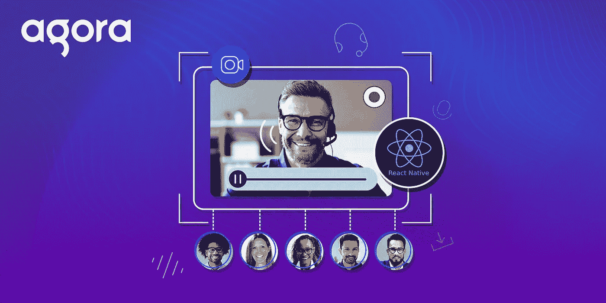
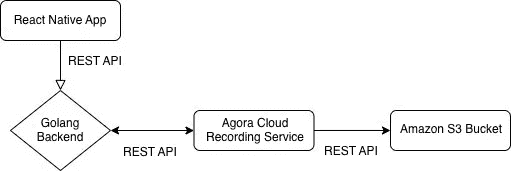

# 使用 Agora 的 React 本地视频聊天的云记录

> 原文：<https://medium.com/geekculture/cloud-recording-for-react-native-video-chat-using-agora-d7669201e50f?source=collection_archive---------17----------------------->



Agora Cloud Recording 使开发人员可以轻松地记录和存储他们的实时互动应用程序中的视频。我们将了解如何向 React 原生视频聊天应用程序添加云录制。本教程结束时，您将能够从您的应用程序中录制视频通话，并将其保存到亚马逊 S3 存储桶中，供以后访问。

# 先决条件

*   一个 [Agora 开发者账户](https://sso.agora.io/en/signup?utm_source=medium&utm_medium=blog&utm_campaign=cloud-recording-for-react-native-video-chat-using-agora)
*   AWS 帐户
*   Heroku 帐户或其他服务来部署后端

# 体系结构



我们将部署一个 Golang 服务器，使用 REST API 处理来自 React 本地应用程序的请求。Golang 服务器将在内部调用 Agora 云记录服务，该服务将结果存储在亚马逊 S3 桶中。

如果您之前没有部署过后端服务或使用过 Golang，请不要担心。我们将一起完成整个过程。

# 集市设置

1.  **创建项目**:一旦你有了 Agora 账号，点击控制台中的[项目管理标签](https://console.agora.io/projects)。单击创建按钮。输入项目的名称。创建项目时选择安全模式。
2.  **启用云记录**:点击查看使用情况按钮，选择启用云记录的选项。
3.  **获取 app 凭证**:将同一页面的 App ID 和 App 证书复制到一个文本文件中。我们以后会用到这些。
4.  **获取客户凭证**:访问 [RESTful API 页面](https://console.agora.io/restfulApi)，点击 Add Secret 按钮。将客户 ID 和客户机密复制到文本文件中。

# AWS 设置

一旦你创建了一个 AWS 帐户，我们需要创建一个亚马逊 S3 桶来存储我们的视频记录和一个 IAM 用户来访问我们的桶。如果您已经有了这个设置，请随意跳过这一部分。

1.  转到您的 [AWS IAM 控制台](https://console.aws.amazon.com/iam/home#/users)并创建一个用户。添加带有编程访问的`AmazonS3FullAccess`策略。
2.  将 AWS 访问密钥和秘密密钥复制到文本文件中。
3.  创建一个亚马逊 [S3 桶](https://s3.console.aws.amazon.com/s3/home)，并将桶名复制到文本文件中。要查找您的地区号(针对您的 AWS 地区)，请转到[表](https://docs.agora.io/en/cloud-recording/cloud_recording_api_rest?platform=RESTful#a-namestorageconfigacloud-storage-configuration)，然后点击亚马逊 S3 选项卡。例如，如果您正在使用`US_EAST_1`区域，那么您的存储桶编号是 0。

# 部署我们的后端

在部署我们的后端之前，我们需要以下变量。(是时候使用我们的文本文件了。)我们将使用 [Heroku](https://www.heroku.com/) 一键式部署，让我们的后端启动和运行变得超级简单。您也可以使用任何其他服务:

```
APP_ID=
APP_CERTIFICATE=
RECORDING_VENDOR=
RECORDING_REGION=
BUCKET_NAME=
BUCKET_ACCESS_KEY=
BUCKET_ACCESS_SECRET=
CUSTOMER_ID=
CUSTOMER_CERTIFICATE=
```

> *注意:*对于 AWS，RECORDING_VENDOR=1。请访问此[链接](https://docs.agora.io/en/cloud-recording/cloud_recording_api_rest?platform=RESTful#a-namestorageconfigacloud-storage-configuration)了解更多信息。

1.  如果您还没有在 [Heroku](https://www.heroku.com/) 上创建帐户，请创建一个。
2.  点击[此链接](https://dashboard.heroku.com/new?template=https://github.com/AgoraIO-Community/Cloud-Recording-Golang/tree/main)使用 Heroku 一键式部署。
3.  输入您的变量，然后单击页面底部的部署应用程序按钮。
4.  等几分钟。部署完成后，将您的后端 URL 保存在文本文件中，我们将在应用程序中使用该文件。

# 构建我们的应用

我们将使用这个[博客](https://www.agora.io/en/blog/how-to-build-a-react-native-video-calling-app-using-agora/)中的[示例应用](https://github.com/EkaanshArora/Agora-RN-Quickstart)。如果你是 Agora 平台的新手，我建议你阅读博客，了解如何构建视频聊天应用。我们将以此为基础，讨论如何在其中添加云录制。

如果只是想要最后的 app，可以去这个[回购](https://github.com/EkaanshArora/Agora-RN-Recording/blob/main/App.tsx)。

## 获取样板文件

确保您已经满足了创建和构建 React 本机应用程序的先决条件。Git 克隆或者从[主分支](https://github.com/EkaanshArora/Agora-RN-Quickstart)下载 ZIP 文件。在项目目录中，执行 npm install。如果你正在为 iOS 构建，也执行 cd ios & & pod install。

## 添加凭据

打开`App.tsx`并输入你的后端 URL、Agora 应用 ID 和我们应用状态的频道名称(你现在可以忽略打字错误)。频道名称可以是任何字母数字字符串(例如:`'test'`):

我们还将添加三个新的状态变量，用于记录`rid`、`sid`和`recUid`。

## 加入我们的频道

让我们编辑 join channel 方法，以使用来自后端的令牌:

我们使用 Fetch API 从服务器获取令牌，然后使用它加入通道。

## 开始录音

我们将创建一个函数来开始记录:

我们将再次使用 Fetch API 向后端的`/api/start/call` 路由发送 POST 请求。我们将在请求正文中发送频道名称。一旦我们得到响应，我们将用响应中的`rid`、`sid`和`recUid`更新我们的状态。

## 停止录制

为了停止记录，我们向后端的`/api/stop/call`路径发送一个`POST`请求，请求体中有`channel`、`rid`、`sid`和`recUid`:

## 获取状态

让我们创建一个函数来检查记录的状态，并将其记录到控制台:

## 添加按钮

让我们添加一些按钮来执行我们的录制功能:

现在，您可以执行`npm run android`或`npm run ios`在您的设备上启动应用程序，一旦您单击开始录制按钮，几秒钟后您应该可以在您的 S3 桶中看到您的视频片段。

# 结论

就这样，现在你有了一个使用 Agora 云录制来存储视频的应用程序。你可以在这里找到如何合并产生的视频片段[。你可以在这里](https://docs.agora.io/en/cloud-recording/cloud_recording_merge_files?platform=RESTful)找到更多关于云录制[的信息。](https://docs.agora.io/en/cloud-recording/landing-page?platform=RESTful)