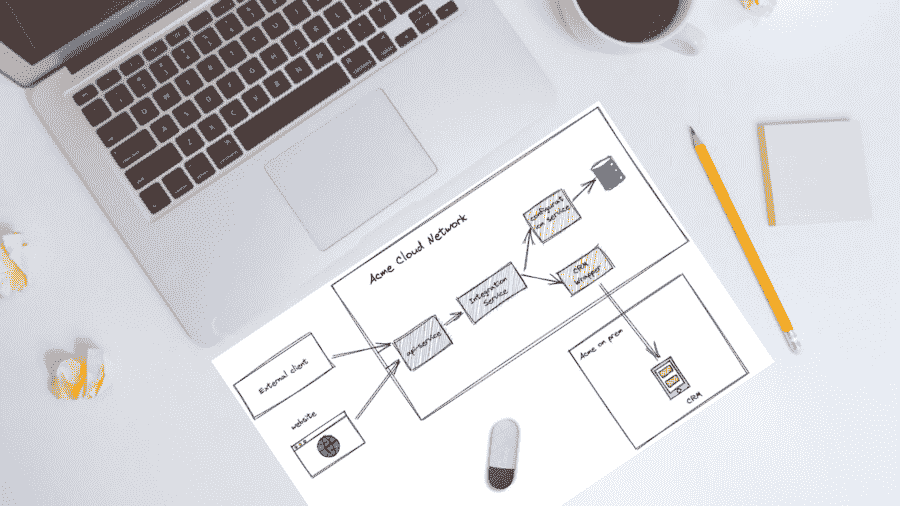
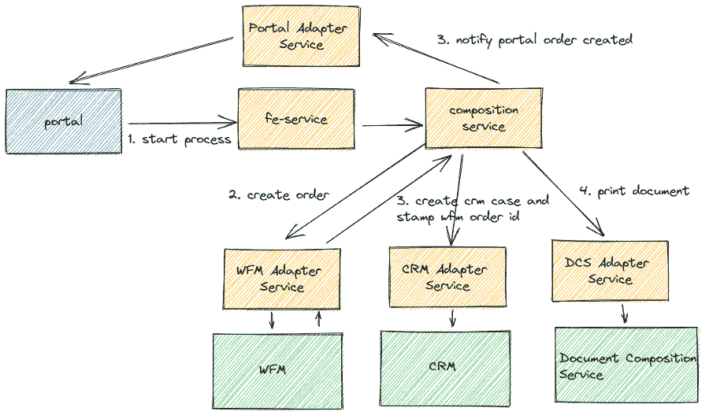
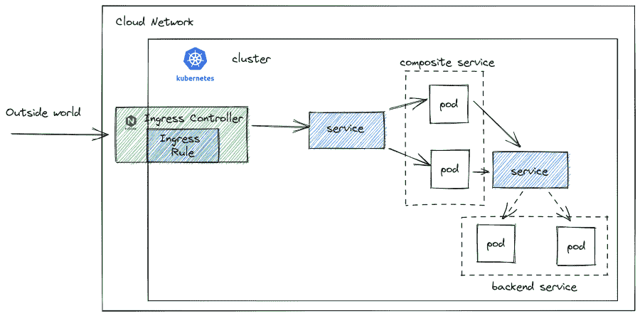
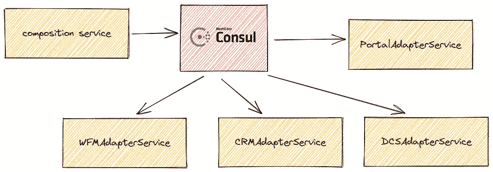
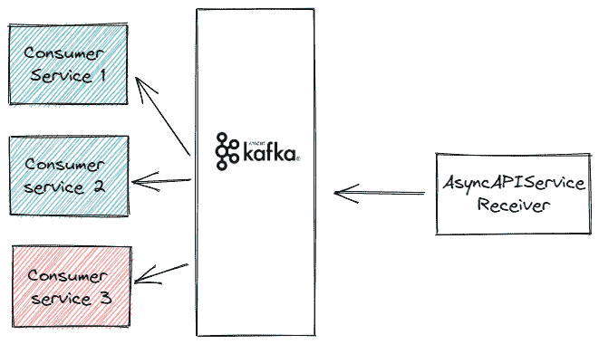
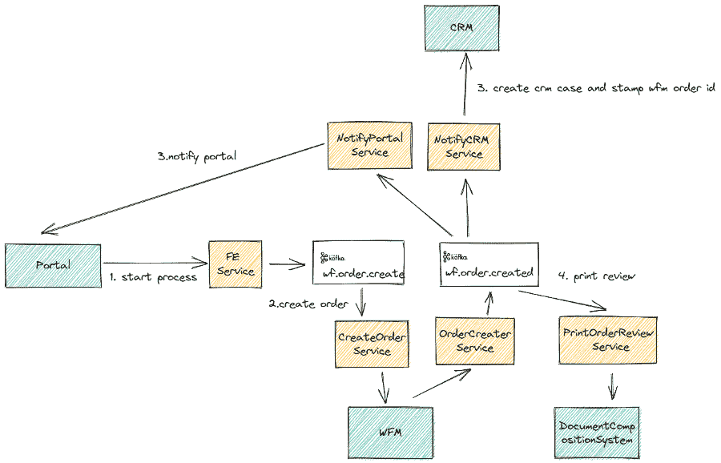
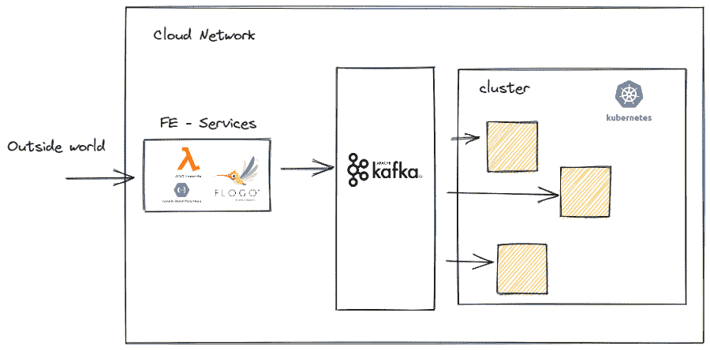
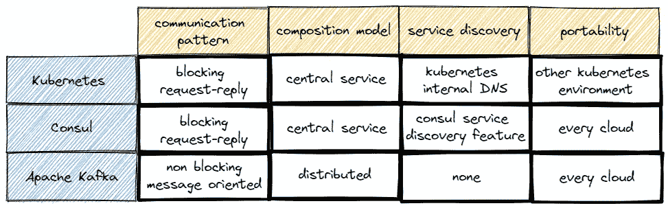

# 云服务组合

> 原文：<https://medium.com/geekculture/cloud-service-composition-6e2ac0dba47e?source=collection_archive---------6----------------------->

## 三种不同的方法

# 介绍

作为一名解决方案架构师，您最常用的模式之一是*服务组合*。服务组合模式诞生于亲爱的旧 EAI 世界。它包括将你的应用程序分割成几个组件或服务，这些组件或服务作为自主独立的应用程序。两千多年后，分而治之的策略(或其原拉丁文为 [*divide et impera*](https://en.wikipedia.org/wiki/Divide_and_rule) )仍在使用……尤利乌斯·凯撒规则！

在这个场景中，一些组件结合了其他组件的行为。我们称之为**复合服务**。

微服务架构以服务组合为基础。我将描述如何在基于云的环境中编排微服务:开始时只使用 Kubernetes，然后引入 once Consul 和 once Apache Kafka。

为了简化故事，我将在正文中使用一个愚蠢的例子:我们的客户是一家公用事业或移动电话公司。开始时，我们的流程必须在 WorkflowManagement 系统上创建一个订单，在我们的 CRM 中创建一个案例，并打印订单的副本。

# Kubernetes 服务和入口

在这一段中，我主要关注一个场景，其中所有服务都作为 **pods** 部署到 Kubernetes 集群中。选择的通信模式是请求-应答模式:所有服务都公开一个 Rest/restful 接口来相互通信。下图显示了我希望实现我们示例的方式:

一个服务负责业务逻辑，并调用其他服务来实现它。我称这个为复合服务，而其他的为后端服务。这些服务通过公开 Rest API 进行通信。他们实现了请求-应答通信模式。

我提出了一个执行所有业务逻辑的中央组合服务、*组合服务*，以及一系列将包装第三方系统的微服务。

组合服务可以通过 BPM 工具(即 TIBCO BPM、Appian、RH Process Automation 或任何其他云原生工具)来实现。实现一个有状态的流程可以让你更好地管理异步回调。

让我们看下面的图片来了解部署我们的项目的方式。

Kubernetes 服务对象向集群公开了*复合服务*和*后端* *服务*。我明确地选择了 **ClusterIp** 服务类型，因为它充当内部负载平衡器，并且不向外部公开服务。

入口控制器公开*复合服务。*这个允许从集群外部调用。

*CompositeService* 应用程序可以使用 Kubernetes 服务**名称标签、** 而不是 IP 地址或节点名称连接到*主服务。*

由于内部群集 DNS，您不知道流量路由。它会为你干脏活。它将应用程序运行实例与其机器 IP 解耦。

如果您的一个服务副本失败，群集将负责创建另一个副本。新的复本会自动附加到服务地图，并且会立即开始为请求提供服务。复合服务应用程序不知道是否有故障发生。

让我们回顾一下:Kubernetes 集群解耦了*复合服务*和*后端服务*。 *CompositeService* 必须只知道后端服务注册名。完全寻址已被授权给基础设施。看:对于外部服务来说，这是不正确的。您必须继续使用 IP/端口地址表示法。

看一看:使用**config map**,*composite service*在运行时解析服务的名称。

另一方面，这个解决方案吸引你去 Kubernetes。如果您需要将它转移到另一个容器管理器，比如 Amazon ECS，那么您需要做一些额外的工作来重新定义新环境中的网络配置。

# 咨询服务发现

根据哈希公司的文件:

> Consul 是一个多网络工具，提供功能全面的服务网格解决方案，解决运营微服务和云基础设施的网络和安全挑战。Consul 提供了一种软件驱动的路由和分段方法。它还带来了其他好处，如故障处理、重试和网络可观察性。

Consul 是一个服务网格组件。您可以在您的 Kubernetes 集群中使用它，也可以作为一个单独的服务使用它。

使用 consul 的第一步是注册您的服务。回想一下我们的例子，你注册了 *CRMAdapterService* 。您的应用程序会自己完成这项工作。如果你使用 SpringBoot 作为你的 BE 服务语言，你将在你的 YAML 文件中使用少量的配置。TIBCO BWCE 使您的应用程序能够使用 *HTTPConnector* 面板进行注册。你用一个易记的名字注册你的服务。

另一方面，想要使用 *CRMAdapterService* 的客户端可以简单地使用助记名称来调用服务。TIBCO BWCE 允许您简单地配置服务名，而使用 SpringBoot，您必须编写更多的代码。

请看下图:我在我们的例子中引入了 Consul。

所采用的通信模型不变。服务仍然公开 REST 接口，并且仍然使用请求-回复通信模式。我们认可一个协调所有第三方系统的中央组合服务。

客户机服务不负责知道服务器服务的分布:Consul 也充当服务注册中心和负载平衡器。它还可以检测服务故障，并应用断路模式。

另一方面，在这个模型中，您可以将您的模型部署到 Kubernetes 集群中或者以另一种方式部署。您的部署模型不依赖于您的运行时环境。这不仅允许您将部署从一个云提供商转移到另一个云提供商，还可以转移到不同的容器管理器或非容器化环境中。

另一个优点是，您可以使用 Consul 在混合部署环境中注册服务:本地服务可以注册自己，也可以注册 Kubernetes 的服务。

# 阿帕奇·卡夫卡的信息

Apache Kafka 是一个消息代理平台。它是云环境中使用最多的代理，因为您可以将多个实例联合成一个集群。这些实例可以部署在多区域云环境中，实现高可用性和健壮性。

在这个故事中，我将按照 EAI 使用 MOM 的方式使用 Apache Kafka，就像 TIBCO EMS、Rabbit MQ 等等。

卡夫卡的基本结构是*主题*。您可以像使用旧的 JMS 队列一样使用它，或者作为一个主题。

使用 [MOM](https://en.wikipedia.org/wiki/Message-oriented_middleware) 使您的应用程序能够支持异步——非阻塞通信模式。请看下图中的常见模式:

Image 2 — Non-blocking communication using Apache Kafka

基于消息的通信的非阻塞特性使得分发来自系统的回调变得很容易，就像亲爱的旧大型机一样。

*asyncApiServiceReceiver* 在 Apache Kafka 主题上发布一条消息，扮演一个消息生产者。每一个对接收数据感兴趣的软件，只需订阅卡夫卡专题。

接近基于消息的通信使**事件驱动架构**成为可能。

在这种类型的架构中，所有服务都使用非阻塞通信模式。业务逻辑分布在服务之间:每个服务实现它的目标，并在总线上发布一条消息，允许下面的服务启动。没有实现中央编排服务或组合服务，因为组合来自总线。

引入 Apache Kafka 深刻地改变了我们的架构模式。看下图:

Image 3 — Event-Driven Process with Kafka

基于事件的设计取代了旧的常见的请求-回复模型。没有服务在等待回复，没有人实现状态机。该流程由主题中的消息驱动。

如果你想知道 EDA 和 BPM 风格的区别，请点击下面的链接。我想，我会在另一个故事中回到这个话题。

让我们看看服务:它们被 Apache Kafka 集群解耦。任何作为消息生产者的服务都知道消费者以及他们有多少或者他们在哪里。由于 Apache Kafka 的可伸缩性，生产者可以位于一个地理区域，而生产者可以位于不同的区域，或者可以为 VPC 的每个区域存在一个消费者。生产者和消费者必须在消息格式上达成一致，当然，Kafka 主题名称仅此而已。

通信模式发生了深刻的变化:我们仍然不依赖于阻塞的请求-应答模式，而是依赖于非阻塞的消息模式。您只开发无状态、短期运行的服务。组合被委托给总线。

如果我们想尝试部署这样的设计，我们应该有如下图所示的东西:

Image 4 — EDA on Kubernetes

回忆起我用来谈论 EDA 的例子，我转向了无服务器功能，如 AWS Lambda、TIBCO Flogo、Google Cloud Procedures 等等，我称之为 FE-Service。看:所有这些语言都允许你使用 API 网关…但这是另一回事了。所有后端服务都使用您最喜欢的编程语言实现为 docker 服务。没有人能以你喜欢的方式使用卡夫卡，但我认为托管实例是更好的。

看:在这个场景中，您的 Kubernetes 集群很容易维护。没有服务，没有入口，只有运行 pod。您不需要向外界公开 API:Apache Kafka 是您的接口。所有的 Kubernetes 跑舱都因为卡夫卡而解耦。不需要暴露服务。

# 结论

我想在下表中总结一下我们讨论过的所有内容:

## 参考

*   *Kubernetes 官方导游服务*:【https://kubernetes.io/docs/concepts/services-networking/ 
*   如何将你的跳羚应用:[https://spring.io/guides/gs/spring-boot-docker/](https://spring.io/guides/gs/spring-boot-docker/)
*   *亲切的当地 Kubernetes*:[https://kind.sigs.k8s.io/](https://kind.sigs.k8s.io/)
*   *咨询服务发现*:[https://www.consul.io/docs/discovery/services](https://www.consul.io/docs/discovery/services)
*   *春云领事*:[https://docs . Spring . io/Spring-Cloud-Consul/docs/current/reference/html/](https://docs.spring.io/spring-cloud-consul/docs/current/reference/html/)
*   *TIBCO BWCE HTTPClient 配置*:[https://docs . TIBCO . com/pub/BWCE/2 . 7 . 2/doc/html/default . htm # binding-palette/http-client . htm？TocPath = Bindings % 2520and 和% 2520 palettes % 2520 reference % 257 c shared % 2520 resources % 257 c _ _ _ _ _ 3](https://docs.tibco.com/pub/bwce/2.7.2/doc/html/Default.htm#binding-palette/http-client.htm?TocPath=Bindings%2520and%2520Palettes%2520Reference%257CShared%2520Resources%257C_____3)
*   *阿帕奇卡夫卡*:[https://kafka.apache.org/documentation/#gettingStarted](https://kafka.apache.org/documentation/#gettingStarted)
*   【TIBCO 的事件驱动架构:[https://www . TIBCO . com/reference-center/what-is-Event-Driven-Architecture](https://www.tibco.com/reference-center/what-is-event-driven-architecture)
*   *红帽的事件驱动架构:*[https://www . Red Hat . com/en/topics/integration/what-is-Event-Driven-Architecture](https://www.redhat.com/en/topics/integration/what-is-event-driven-architecture)
*   *AWS 的事件驱动架构*:[https://AWS . Amazon . com/it/Event-Driven-Architecture/#:~:text = What % 20 is % 20 An % 20 Event % 2d Driven % 20 Architecture % 20 3F&text = An % 20 Event % 2d Driven % 20 Architecture % 20 uses，on % 20an % 20e % 2Dcommerce %网站](https://aws.amazon.com/it/event-driven-architecture/#:~:text=What%20is%20an%20Event%2DDriven%20Architecture%3F&text=An%20event%2Ddriven%20architecture%20uses,on%20an%20e%2Dcommerce%20website)。