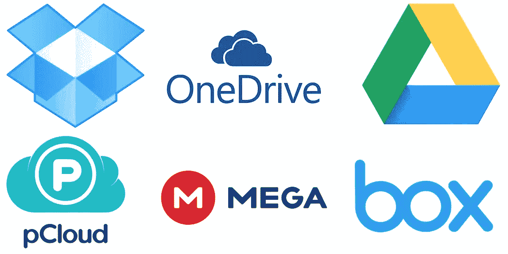
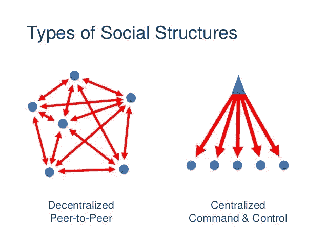
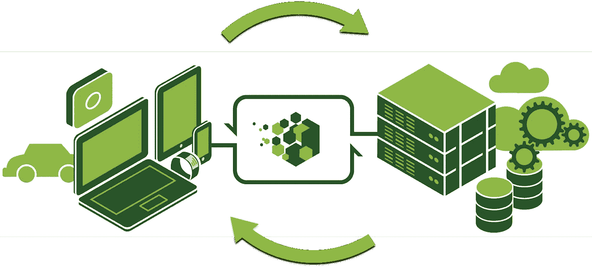
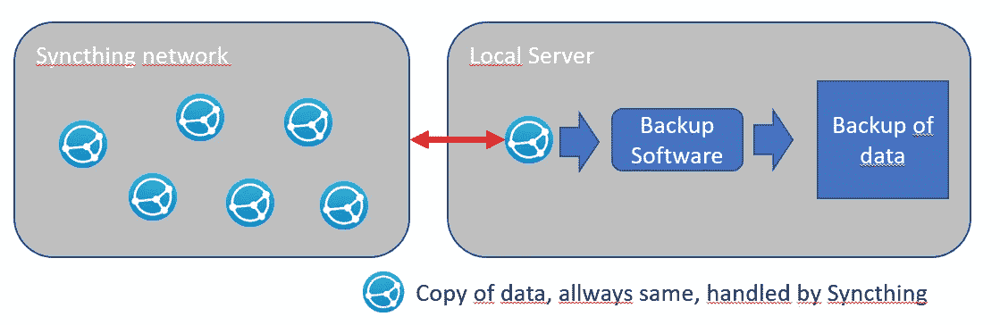

# 供个人使用的云存储解决方案、分散式系统和分离式架构

> 原文：<https://medium.com/geekculture/cloud-storage-solutions-decentralised-systems-and-decoupled-architectures-for-personal-use-fdbe27d74ce6?source=collection_archive---------4----------------------->

Image by [gorodenkoff](https://www.istockphoto.com/portfolio/gorodenkoff?mediatype=photography) from [iStock](https://www.istockphoto.com/photo/shot-of-corridor-in-working-data-center-full-of-rack-servers-and-supercomputers-with-gm943065362-257705009)

我最近一直在思考云存储对基本互联网模式的影响，即开放、分散的服务。个人使用的云存储与以前的个人或家庭海量存储模式相比有几个优势。也就是说，用户不会被他们的硬件所限制。

在公共云存储解决方案激增之前，消费者仅限于个人使用传统的大容量存储方式，如家庭网络上的廉价网络连接存储设备、便携式存储(例如 USB 驱动器)，甚至只是他们个人机器的硬盘驱动器。

以及前期硬件成本限制，使这些不一定是理想的选择；诸如同步、备份和文件版本控制等问题必须由消费者自己来处理。

对于一般的非技术人员来说，这些相对简单的技术任务不是他们能够或者想要做的。此外，重要的是，这意味着企业和公司用户长期以来可以选择，例如以高数据速度远程访问文件&公众无法获得带宽。

Image by [tuto4net](https://tuto4net.blogspot.com/) from [Blogspot](https://tuto4net.blogspot.com/2019/01/2019_23.html)

T 公共云存储的激增弥补了上述问题的解决。我的整个个人和家庭基础设施都建立在这些服务之上，我认为这是一种相当典型的方式；我的个人和商业文件存储在 [Google Drive](https://www.google.com/drive/) 中，我消费的所有媒体从电视剧&电影到书籍都存储在 [Mega](https://mega.nz/) 中，为了与朋友分享数据或文件，我使用 [Dropbox](https://www.dropbox.com/) 。

这些解决方案非常有效，这意味着我不再使用或需要任何物理介质，例如蓝光光盘，甚至是可以在智能电视上播放个人视频的 u 盘，而且重要的是，我可以随时随地在任何设备上快速获取我的所有数据。

Image by [Andrew Burger](http://microgridmedia.com/author/andrew-burger/) from [Microgrid News](http://microgridmedia.com/blockchain-distributed-peer-peer-energy-markets/)

虽然这些解决方案运行良好，但却打破了互联网的一个基本方面。它是在冷战的黑暗日子里发明的，在核浩劫中作为一个通信系统，一个基于开放标准的分散化和通信系统。

对大多数人来说，这可能完全不是问题；公共云存储服务按原样工作，这种担忧比影响日常使用更具哲理性和抽象性。对于一个正在构建解决方案甚至只是修补的技术人员来说，这些问题变得具体了。

基于公共云存储服务构建个人文档存储等家庭解决方案会给你带来单点故障。它还冒着将您的解决方案与所述服务紧密耦合的风险。

对于一个依赖近乎实时的通信系统的技术专家来说，即使是个人使用，这也不好。虽然核战争幸好不是我们现在迫切关注的问题之一，但突然发现云存储提供商的不可预见的问题意味着您的企业不再拥有今天的客户，或者甚至没有看到您最喜爱的电视节目的最新一集没有从您的 PVR 同步到您的家庭影院 PC 供您在那天晚上观看，这是令人讨厌的，或者在以前的情况下可能是灾难性的。

Image by [Dmitry Sutyagin](https://commons.wikimedia.org/wiki/User:%D0%94%D0%BC%D0%B8%D1%82%D1%80%D0%B8%D0%B9_%D0%A1%D1%83%D1%82%D1%8F%D0%B3%D0%B8%D0%BD) from [Wikipedia](https://en.wikipedia.org/wiki/SA3_coupler)

上述问题可能只是由我们的公共云存储提供商同步服务的问题引起的。他们的存储服务和数据本身应该仍然是可访问的。

但是如果不可预见的问题影响到两者，那就不一定了，因为我们无法知道它们的服务在内部是如何耦合的。从他们的在线存储器远程访问我们的文件的唯一方法是通过他们专有的网络界面，可以想象这也遇到了问题。

在这种情况下，我们不仅失去了文件同步，而且还失去了数据存储，因为通过使用公共云存储服务，这两者紧密耦合在一起，上述问题导致无法访问您的任何业务帐户数据，所有电视节目都说。

Image by [sergeyvasutin](https://stock.adobe.com/uk/contributor/205866457/sergeyvasutin?load_type=author&prev_url=detail) from [Adobe Stock](https://stock.adobe.com/uk/images/concept-of-virtual-private-server/135542336)

那么我们可以做些什么来补救这一点，同时仍然拥有云存储的所有优势，如在线同步、高可用性、快速连接和带宽，以及大量存储不依赖于我们的硬件？第一种方法是将我们自己从与特定服务相关的海量存储中分离出来。

我们需要更换公共云服务提供商的存储容量。廉价、广泛可用的虚拟专用服务器主机是实现这一点的理想选择。它们提供大量存储和低计算能力，成本大约是完全托管的云存储服务提供商每月高级用户计划成本的一半。

这使我们能够以高数据速度和带宽访问大量存储，与现有的公共云存储服务相当。它将我们从主要云服务的专有 web 接口中分离出来，直接访问我们的数据。我们通常可以使用 FTP、rsync、 [Samba](https://www.samba.org/) 、NFS、 [SSHFS](https://github.com/libfuse/sshfs) 等标准来直接访问 VPS 上的存储。

Image by [strongloop](https://strongloop.com/) from [IBM](https://www.ibm.com/)

它仍然缺少公共云存储的一个关键方面，即跨多个设备或与其他设备的文件同步和共享。这也许是云存储的杀手锏，也是 Dropbox 这样的服务如此受欢迎的原因。文件将在设备间异步同步。

例如，当我打开我的笔记本电脑时，无论我在哪里，它都会自动下载我前一天晚上在我的卧室 HTPC 上修改的任何新的或更改的文件，也就是说，无论其他设备是否可用，甚至是否打开。共享的一个例子是我可以为朋友提供一个文件。

Image source unknown

一个开源同步解决方案，比如 [Syncthing](https://syncthing.net/) 项目，是这方面的理想选择。它为本地网络或互联网上的设备提供免费的点对点同步，支持文件版本控制等功能，并通过 Web GUI 支持多平台配置管理&。然而，这种特殊的解决方案仅用于文件同步，没有共享功能。

至关重要的是，由于我们与特定存储分离，所以我们使用什么同步解决方案并不重要。只要它从公共云中复制我们需要的功能；我们可以从几个竞争选项中自由选择我们的解决方案，例如前面提到的 Syncthing、 [Resilio Sync](https://www.resilio.com/) ，或者基于非对等的同步&共享选项，例如 [NextCloud](https://nextcloud.com/) 、 [Pydio](https://pydio.com/) ，以及其他具有我们需要的任何功能的选项。

考虑到 VPS 主机的可承受性和所用应用程序的开源性质，电力用户的成本通常也比公共云解决方案更便宜。通过将点对点同步和共享应用程序与我们的 VPS 服务器存储相结合，我们便拥有了自己的经济实惠的私有云存储服务，该服务复制了公共云存储的所有功能，但基于开放标准，使用分散模式，并与特定的大容量存储或同步应用程序等任何单个应用程序分离，这些应用程序可以根据更好的选项是否可用或完全删除而换入或换出。