# 云与内部 ERP:哪一个适合您？

> 原文：<https://medium.com/geekculture/cloud-vs-on-premise-erp-which-is-right-for-you-5dbaf3bacc9d?source=collection_archive---------18----------------------->

## 企业资源规划(ERP)软件对企业的成功极其重要，因此为您的公司选择合适的 ERP 至关重要。在为您的组织决定 ERP 系统时，您会遇到多种类型。阅读并理解所有选项至关重要，因为您选择的 ERP 系统类型将极大地影响您的企业在未来从 ERP 中获得的好处。

在本文中，我们深入探讨并解释了基于云的企业资源规划系统和本地企业资源规划系统之间的差异，比较了顶级 ERP 系统，并根据 Steelkiwi 的经验为您提供了一些提示。

# 什么是 ERP 系统，为什么一个公司想要一个？

**企业资源规划**系统受到许多公司和行业的重视。这些系统将业务流程连接在一起，并帮助它们之间的信息流动。企业资源规划软件通过从多个来源收集公司的共享数据，作为单一的事实来源，大大提高了内部沟通的效率和清晰度。

Panorama Consulting Group 的一份 [2021 年报告](https://hs.panorama-consulting.com/hubfs/Reports/ERP+Report/2021-ERP-Report-Panorama-Consulting-Group.pdf)显示，91.7%已经实施企业资源规划软件的公司认为他们的 ERP 项目是成功的，因为他们已经注意到了好处。

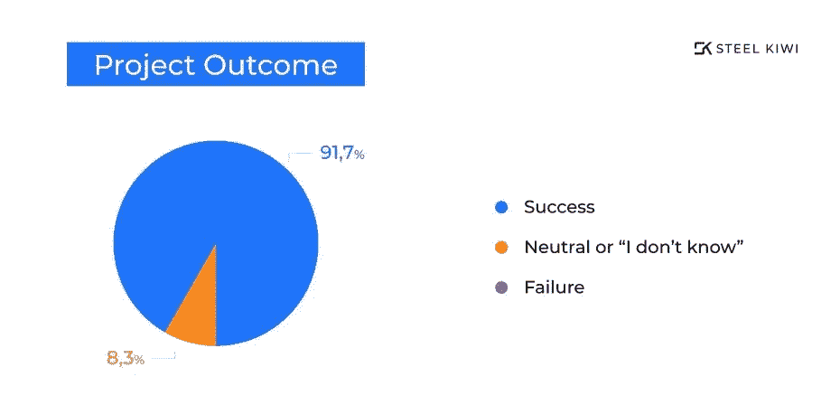

公司实施 ERP 系统有不同的原因。根据 [2020 年 ERP 报告](https://drive.google.com/file/d/1qjnEIj6jtDA5BofBPZQiGARF7O6lpXAN/view)通过软件途径:

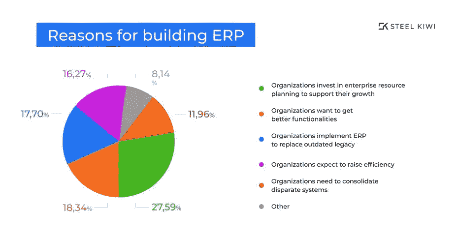

ERP 有多种好处可以帮助公司实现这些目标。ERP 系统最重要的优势之一是**优化生产力**。ERP 自动化了许多操作，大大减少了手动输入数据的需要，同时消除了重复信息。此外，现代企业资源规划系统允许工作人员从移动设备远程访问和输入信息。

**访问实时数据**是另一项重要优势。数据是公司可以拥有的最重要的资源。定期收集和处理数据以及能够从任何地方实时访问数据对于确保业务增长至关重要。此外，与拥有大量电子表格和数据库相比，将数据放在一个位置更有效，您可以在一个会话中轻松查看所有数据。

现代 ERP 系统提供了**广泛的有用工具和功能**，从最基本的(如财务规划和人才管理)到特定的功能，如批次可追溯性和工程变更控制(ECC ),这些都是由制造 ERP 软件为汽车零部件和附件制造商提供的。各种行业特定的功能使得企业急于从其遗留软件转换到企业资源规划软件。此外，由于这些功能和工具是专门为解决特定行业的问题而设计的，它们能够提高公司的效率并节省时间。

根据您实施的企业资源规划系统的类型，您还可以获得许多其他好处。云和内部 ERP 都有坚实的优势，可以促进您公司的成功。让我们开始吧！

# 什么是基于云的 ERP 系统？

**基于云的 ERP** 是一种技术基础设施，其特点是企业通过互联网访问 ERP，服务器位于异地数据中心。

*通常，当有人提到云 ERP 时，他们指的是* ***软件即服务****【SaaS】类型。SaaS 模型是最常见的基于云的 ERP，但许多人错误地认为这些术语是可以互换的。*

*在 SaaS 部署中，您不拥有软件。它是由供应商通过每月订阅提供给您的。然后，该软件可以通过互联网使用，你的数据存储在云中。*

近年来，基于云的 ERP 系统的普及发展迅速。2017 年，只有 6%的 ERP 软件部署在云端，Panorama Consulting Solutions 的 [2017 年 ERP 系统和企业软件报告](https://www.panorama-consulting.com/wp-content/uploads/2017/07/2017-ERP-Report.pdf)证明了这一点。

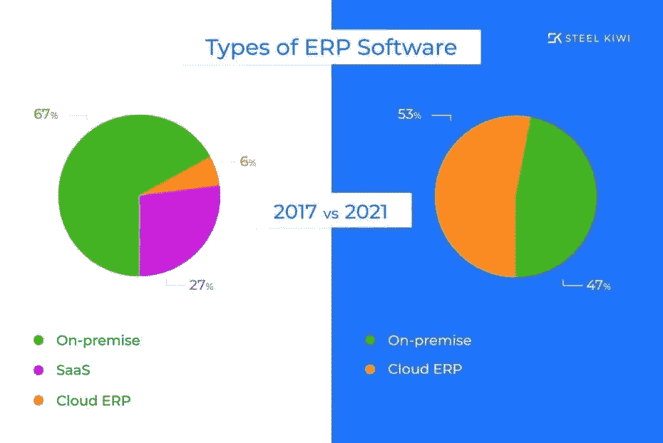

这一比例在四年内大幅增长。在其 2021 年 ERP 报告中，Panorama Consulting Solutions 指出，53.1%的组织使用云部署，而不到一半的组织拥有内部 ERP 系统。

为什么在短短几年内，更喜欢云托管而不是本地 ERP 系统的组织的比例会飙升？这是因为基于云的 ERP 解决方案可以为企业提供强大的优势。

# 云 ERP 的优势和劣势

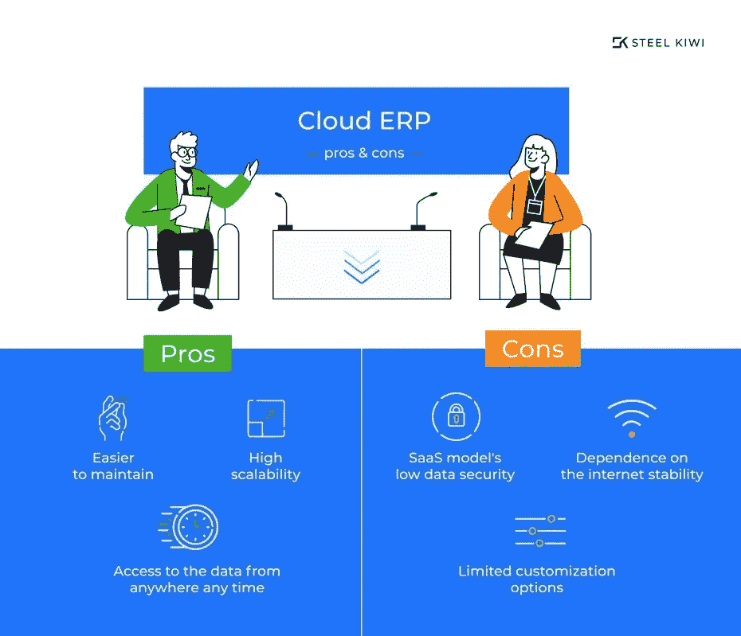

# 优势

基于云的 ERP 系统的第一个主要好处是更容易维护。由于云 ERP 软件通常是基于订阅的，供应商完全负责 ERP、其更新、备份和硬件，因此您不需要雇用内部 IT 人员，从而节省您的时间、金钱和麻烦。

其次，基于云的 ERP 系统为您提供了从任何地方、任何时间通过任何设备访问数据的能力。对于大型企业、拥有多个办公室的公司以及需要远程工作的情况，这是一个巨大的优势。云 ERP 提高了效率，因为你可以节省大量的时间，而不是被束缚在一台电脑上。

此外，由于**的高可扩展性**，基于云的 ERP 系统可以随着您的业务平稳增长。您需要的或未来可能需要的一切都可以按需交付给您，比如添加新用户、模块或工具。

# 不足之处

然而，实施这种类型的 ERP 系统有一些缺点。首先，T4 非常依赖稳定的互联网连接。如果您的连接经常出现故障，它们可能会降低速度并中断您的工作。因此，你需要选择一个互联网提供商，以避免这些问题。

此外，云 ERP 解决方案通常定制选项**较少**，并且不容易根据业务需求进行定制。然而，根据 ERP 提供商的不同，该软件可以进行定制。

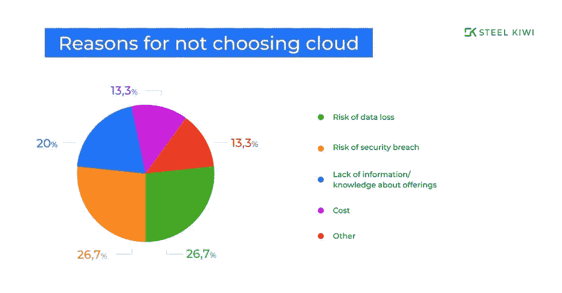

**数据安全性**是企业在考虑 SaaS 云 ERP 模型时最关心的问题。组织有大量的敏感数据，他们不希望供应商或其他任何人访问。数据泄露会给公司带来巨大的损失，例如完全停止生产。出于这个原因，国防、航空和类似行业的公司选择私有云或内部解决方案来避免哪怕是最小的数据泄露风险。

# 基于云的顶级 ERP 系统比较

由于云企业资源规划系统的流行，大多数(如果不是全部)ERP 供应商提供云解决方案。考虑每一个都需要很长的时间，这就是为什么我们准备了一个市场上三个基于云的 ERP 系统的表格以及它们的特征的候选列表。

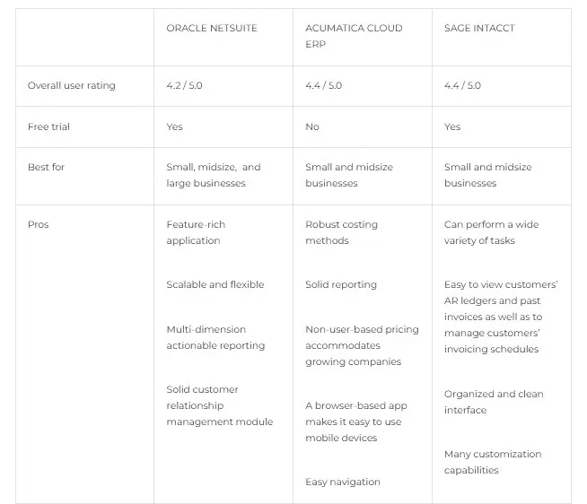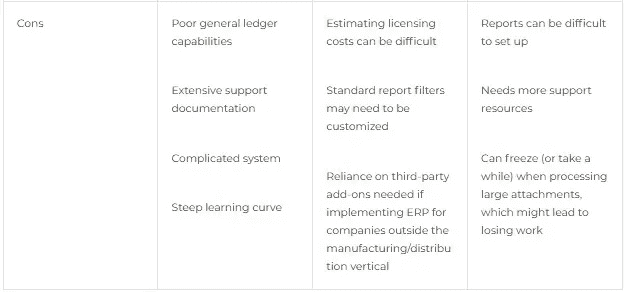

# 什么是内部 ERP？

一个**内部 ERP 系统**被安装在一个组织的场所的计算机上，并且由一个组织的内部 IT 团队维护。

ERP 可能需要额外强大的服务器、操作系统或数据库软件，这些都是你负责购买的。您将需要维持一个 IT 团队来处理软件和硬件，但作为交换，您将拥有对系统、其更新和安全性的完全控制权。

尽管云 ERP 系统在过去几年越来越受欢迎，但内部解决方案并不容易屈服。根据 2021 年的统计数据，内部 ERP 系统仍然占据 46.9%的市场份额，与 2017 年的统计数据相比，这种部署类型的受欢迎程度仅下降了 20.1%，Panorama Consulting Solutions 的 ERP 报告证明了这一点。

# 内部 ERP 的优势和劣势

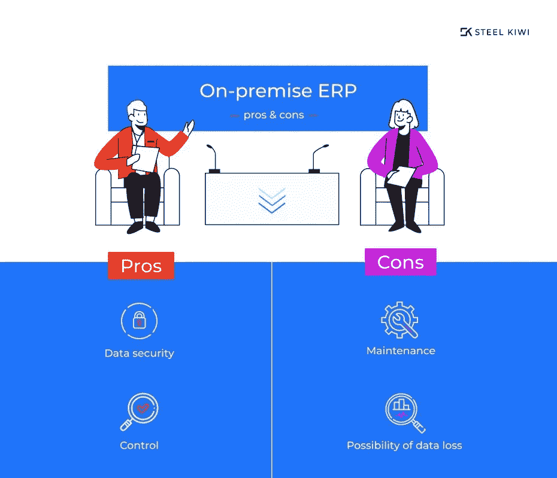

# 优势

内部 ERP 的最大好处之一是您可以完全控制系统，而不依赖于供应商。您可以在组织需要和方便的时候安排更新、备份或安全检查。您还将有时间准备维护流程，从而减少甚至消除工作流程中断，从而节省您的时间和精力。此外，在对系统进行修改之前，您不必征求供应商的许可。此外，内部 ERP 系统具有更强的**可定制性**，因此您可以轻松满足组织的需求。

**数据安全性**通常是企业选择内部 ERP 的原因。通过在内部部署 ERP，您可以确保您的敏感数据存储在内部，并且只能在内部访问。您还可以完全控制您的备份系统，并且不需要互联网连接来访问您的数据。来自隐私问题严重的行业的公司通常不愿意转向云。这是因为对他们来说，完全控制自己的数据至关重要，这也是他们通常选择内部部署或混合部署的原因。

# 不足之处

内部 ERP 系统更有可能在灾难期间**丢失数据**，因为它们位于内部。因此，如果不定期备份内部系统，公司将面临完全丢失数据或不得不暂停许多业务流程以尝试和恢复数据的风险。

**硬件维护**是一项相当复杂的任务。为了确保您的系统平稳运行，您必须确保服务器机房为可能发生的一切做好准备。

首先，您需要监控您的硬件是否是最新的，并在需要时购买新的硬件。一台完整的服务器和必要的额外机架安装硬件需要大量资金，维护成本也很高。

同样重要的是，你要有一个合适的冷却系统，这样你的硬件不会过热。

此外，你需要确保断电时有备用电源，并且需要购买一个强大的不间断电源(ups)。

此外，遵守严格的消防安全法规并为您的服务器机房和硬件实施多种防火方法也至关重要。大公司安装特殊的灭火系统。一种方法是把房间里的氧气抽出来。

这些步骤是确保您的硬件和软件正常工作所必需的，但是它们会使本地系统变得昂贵。

# 顶级内部 ERP 系统的比较

这里有一个方便的表格，比较了一些顶级的内部 ERP 系统。

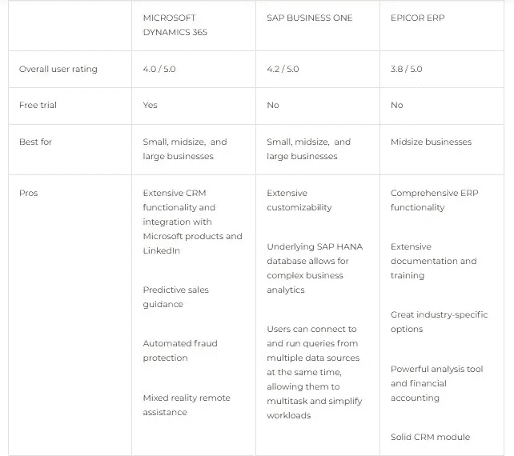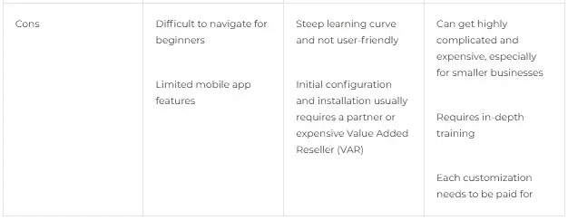

# 混合 ERP 解决方案

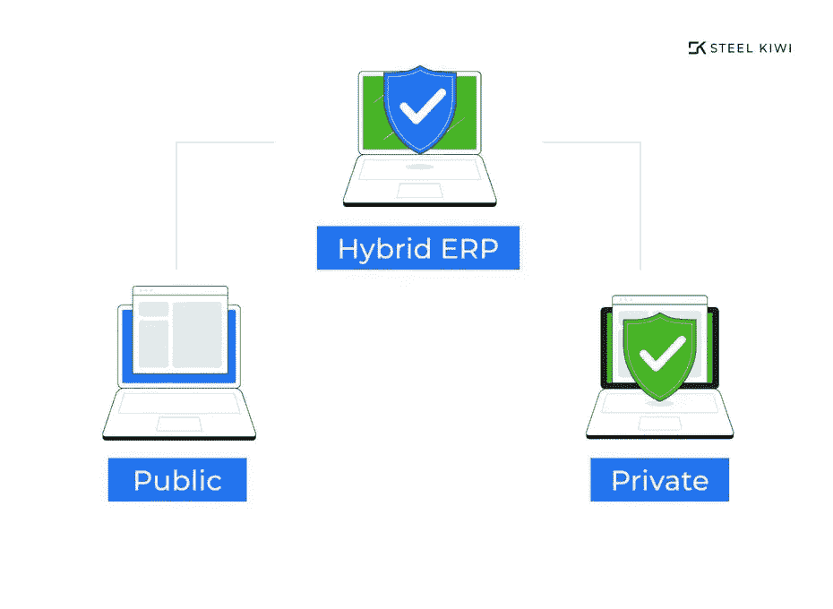

混合解决方案允许您保持对组织的控制。您可以选择哪些数据保留在本地，哪些数据可以发送到云中。这提供了强大的数据安全性，并允许您的员工通过云访问文件、电子邮件和应用程序。

**混合 ERP** 解决方案结合使用内部解决方案和云解决方案，可以通过以下方式进行安排:

*   该公司继续使用其现有的内部企业资源规划系统，用于人力资源、财务、设施管理和 IT 采购等公司职能，但**增加了云 ERP，以提供远程工作机会或支持一些业务单位或地区**。这种方法有助于降低成本，提高工作效率。
*   该公司**开始将云 ERP 用于特定的业务功能**，这些功能得到了云 ERP 供应商的更好支持，如移动访问或客户关系管理(CRM)系统。
*   该公司继续使用内部 ERP，但**将某些数据存储在云中**。

# 云 ERP 和内部 ERP 有什么区别？

选择正确的 ERP 部署类型可能很棘手。为了帮助您做出这一决定，我们制作了全面的云与内部部署对比图表，向您展示这两类系统之间的主要差异。

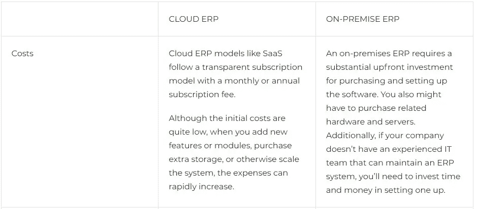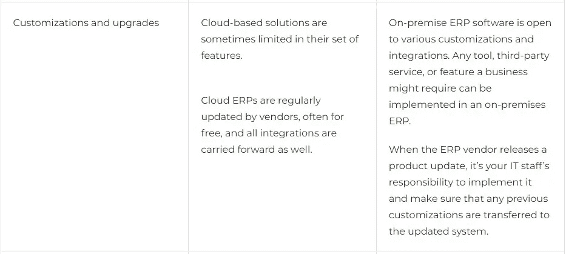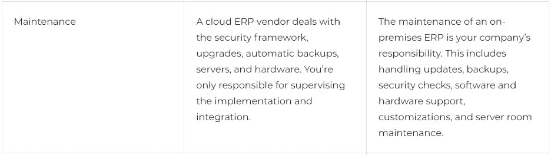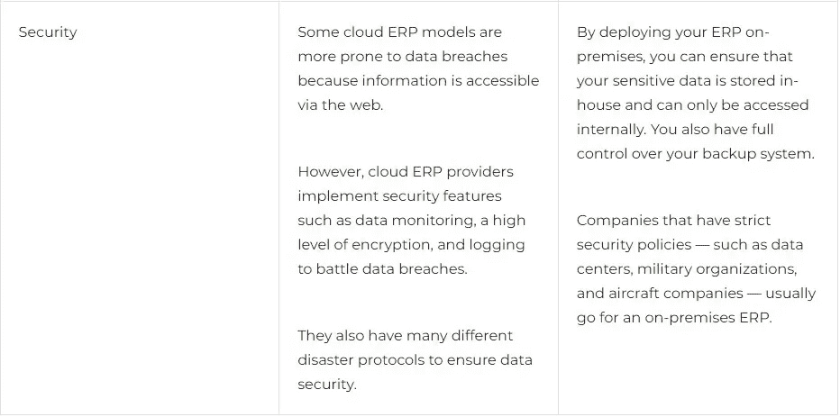

# 哪种 ERP 系统适合您的企业？

正确的 ERP 系统可以让你在工作效率、利润和成功方面走得更远。因此，第一次尝试时选择正确是很重要的。

如果在阅读了所有的优点、缺点和比较之后，你仍然对你需要的 ERP 软件类型犹豫不决，我们可以给你一些基于经验的建议。

# Steelkiwi 的建议

本地 ERP 解决方案最适合那些具有苛刻的数据安全策略、需要独家定制、拥有或可以雇佣内部 IT 团队，并且有能力自行维护系统的大中型公司。

但是，如果您还需要支持良好的移动可访问性和/或 CRM 软件，最好选择混合云或投资私有云。这样，你可以获得最大的业务回报。

否则，采用云解决方案会更有利。有了基于云的 ERP 系统，服务器、硬件、更新和安全检查都由您来处理，因此您可以专注于推广您的产品或服务，还可以在此过程中节省大量资源。在发生灾难的情况下，如果提供商的一些服务器出现故障或失败，它不应该破坏你的系统的性能，因为云 ERP 供应商有成千上万的服务器。

根据我们的经验，我们的客户通过实施云 ERP 获得的好处要比他们从本地解决方案中获得的多得多。

寻找 ERP 合作伙伴？在 Steelkiwi，我们不仅致力于成为您的发展公司，还致力于成为顾问和值得信赖的商业盟友。我们将与您一起挑选最适合您公司的 ERP 解决方案。

## [给我们发消息](https://steelkiwi.com/contacts/)讨论您理想的 ERP 解决方案，明天我们就可以开始通话了！

—最初发表于 Steelkiwi.com