# 成人数据集上的聚类分析

> 原文：<https://medium.com/geekculture/cluster-analysis-on-adult-dataset-9ac3e8263aff?source=collection_archive---------10----------------------->

感谢 **Hyosang Kim(富柏林)、Raniyaharini Rajendran(富柏林)**的团队合作！

**代码:**[*https://colab . research . Google . com/drive/1 EDA xpkzq 8 gzwkgpq 1 ehay 80 P0 ahtms-t # scroll to = rujaepog 0 T2 h*](https://colab.research.google.com/drive/1EdAXpKzQ8GzWKgPQ1EHay80P0AHTms-t#scrollTo=rujaEpoG0T2h)

我们将对上一篇关于 Medium 的文章中使用的数据集执行聚类分析。让我们记住这一套的一般信息。

数据集特征:多元

属性特征:分类，整数

实例数量(总数):48842

实例数量(训练):32561

实例数量(测试):16281

属性数量:14

**数据预处理和转换**

对于数据集成、数据清理、识别或删除异常值，我们应用了与上一篇文章中相同的步骤…

**功能选择**

首先，我们分析属性的类型。年龄字段被认为是一个数值。“教育”和“教育编号”字段含义相同，但形式不同。我们接受这两个字段作为有序分类值。对于其余的列，请参见下图。

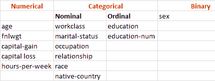

由于我们的数据集由不同类型的特征组成，并且我们的方法是无监督学习，我们必须设计我们将遵循的方式。一般来说，对于特征选择，有不同的方法。如果数据集仅包含数值，PCA 可能有用，或者如果数据集仅包含分类值，CA 或 MCA 可能是分析属性之间对应关系的其他方法。在我们的情况下，混合数据的 f [行动者分析](https://en.wikipedia.org/wiki/Factor_analysis_of_mixed_data) (FAMD)可能是好的。关于 FAMD 方法的信息非常有限(王子图书馆)。因此，我们在将数据集分成数字列和分类列后，分别使用了 PCA 和 MCA 方法。在 PCA、MCA 技术之后，我们有了不同的色谱柱(对于 PCA，我们选择了 3 种组分，对于 MCA，我们选择了 5 种组分)。我们知道，在特征选择方法之后，数据集应该包括相似的特征。因此，我们决定改变我们的方法来选择有效的特征。

主要思想是检测属性之间的相关性。我们的新方法是数值列的相关矩阵和分类列的卡方检验。

[卡方独立性检验](https://www.statisticssolutions.com/free-resources/directory-of-statistical-analyses/chi-square-2/)用于确定两个名义(分类)变量之间是否存在显著关系。因此，对于这种方法，我们将只考虑名义值和二进制值。Education 和 education-num 含义相同，但形式不同。所以以后我们只考虑其中一种。

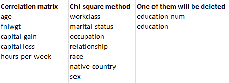

*分类 _ 主要 _ 数据=主要 _ 数据[['工作阶级'，'教育'，'婚姻状况'，'职业'，'关系'，'种族'，'性别'，'本国']]*

*numeric _ main _ data = main _ data[[' fnl wgt '，'资本收益'，'资本损失'，'每周小时数']]*

*数值 _ 主数据['年龄']= PD . to _ 数值(主数据['年龄'])*

**数值的相关性**

相关性应该在-1 和+1 之间变化。这个范围的含义是:

*   -1:完全负线性相关
*   +1:完美的正线性相关
*   不相关

可以使用以下公式推导相关性:

*相关性=协方差(X，Y) / SQRT( Var(X)* Var(Y))*

相关性高的特征更具线性相关性，因此对因变量的影响几乎相同。所以，当两个特征高度相关时，我们可以去掉其中一个特征。

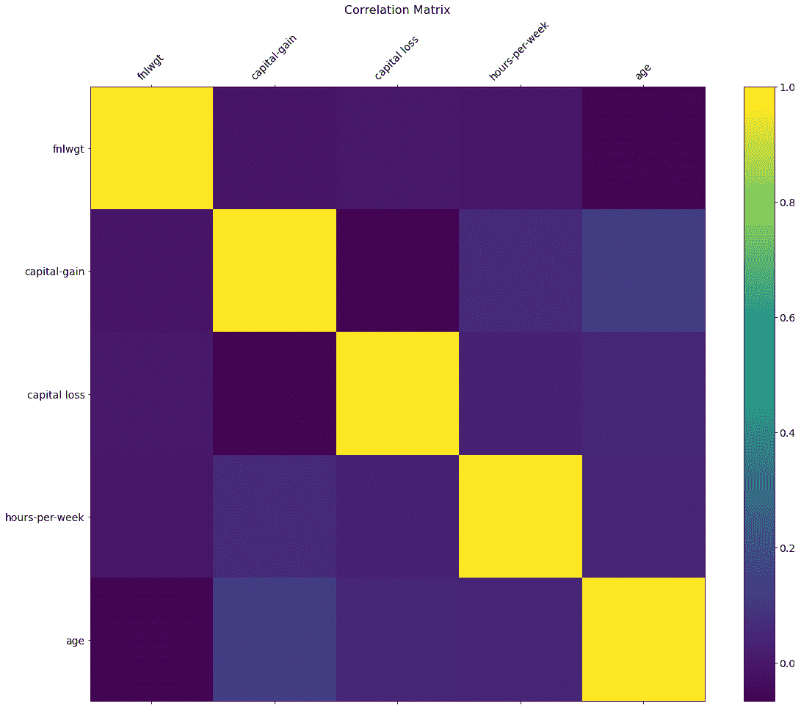

**Figure** Correlation matrix with colors

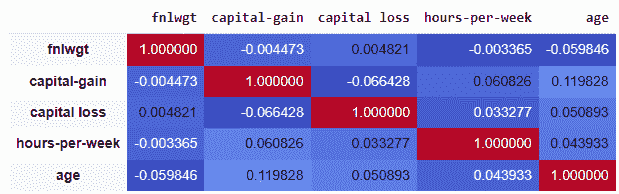

**Figure** Correlation matrix with colors and numerical values

沿着表格对角线的相关系数都等于 1，因为每个变量与其自身完全相关，并且相关矩阵完全对称。一般来说，低于 0.3 的相关系数值被认为是弱的；0.3–0.7 为中度；> 0.7 为强。**我们可以看到，最大值(不含对角线)为 0.119828，最小值为-0.004473。这些相关性很弱。因此，我们不能说有相关的价值。**

**分类值的卡方检验**

卡方独立性检验是一种检验两个分类变量在某些人群中是否相关的程序

卡方检验统计量的计算方法如下

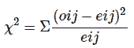

**无效假设:**选择的属性是独立的。

**备选假设:**选择的属性是相关的。

0.05 是零假设为真的概率。

**工作类别-婚姻状况**

我们从两个不同的分类栏开始分析，工作阶级和婚姻状况。

**Chi2:**

1765.0402635587825

**测试的 p 值:**

0.0

**结果:0 < 0.05，替代假设正确。**

零假设:选定的属性是独立的。

替代假设:选定的属性是相关的。

P > 0.05 是零假设为真的概率。

**工作类别-职业**

**Chi2:**

12315.810397342453

**测试的 p 值:**

0.0

**结果:0 < 0.05，替代假设是正确的。**

零假设:选定的属性是独立的。

替代假设:选定的属性是相关的。

P > 0.05 是零假设为真的概率。

我们将所有卡方检验结果(p 值)收集在下面的列表中。p <0.05 situations highlighted by red color. We see that workclass-marital status, workclass-occupation,workclass-occupation,workclass-relationship, marital status-occupation,maritalstatus-relationship,occupation-native-country,occupation-sex,relationship-sex are dependent.In this situation, we have to remove one of the pairs.

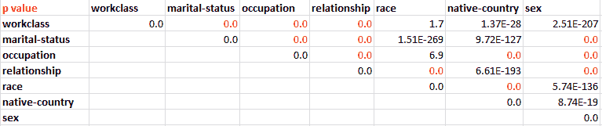

After checking p values, we decided to remove occupation and relationship from our dataset.

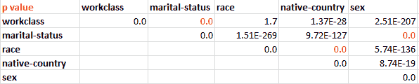

For the ordinal data, we will continue with the education column. Last version of our dataset:

**年龄:**连续。

**工作类:**私人，自营企业，自营企业，联邦政府，地方政府，州政府，无薪，从未工作。

**fnlwgt:** 连续。

**教育:**学士、部分大学、11 年级、HS-grad、Prof-school、Assoc-acdm、Assoc-voc、9 年级、7-8 年级、12 年级、硕士、1-4 年级、10 年级、博士、5-6 年级、学前班。

**婚姻状况:**已婚-同居-配偶、离婚、未婚、分居、丧偶、已婚-配偶不在、已婚-配偶。

**种族:**白人，亚洲太平洋岛民，美洲印第安爱斯基摩人，其他，黑人。

**性别:**女，男。

**资本增值:**持续不断。

**资金损失:**持续。

**每周小时数:**连续。

**本土国家:**美国、柬埔寨、英国、波多黎各、加拿大、德国、美国外围地区(关岛-USVI 等)、印度、日本、希腊、韩国、中国、古巴、伊朗、洪都拉斯、菲律宾、意大利、波兰、牙买加、越南、墨西哥、葡萄牙、爱尔兰、法国、多米尼加共和国、老挝、厄瓜多尔、台湾、海地、哥伦比亚、匈牙利、危地马拉、尼加拉瓜、苏格兰、泰国、南斯拉夫、萨尔瓦多、特立尼达多巴哥、秘鲁、香港、荷兰。

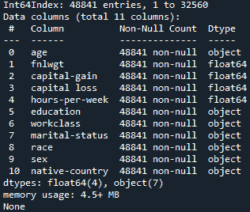

**降维**

**FAMD**

在执行聚类之前，我们需要将数据集处理成可执行的格式。因为我们的数据集由数值和分类要素组成，所以混合数据类型的因子分析(FAMD)将有助于整合要素类型，以便我们可以使用它进行聚类。这是因为与 OHE 不同，可以给**相同的权重**来计算预计惯性值。由于我们已经完成了上面的特征选择，这一步的重点是处理数据集。

**FAMD 的参数调整**

n_components:组件的数量

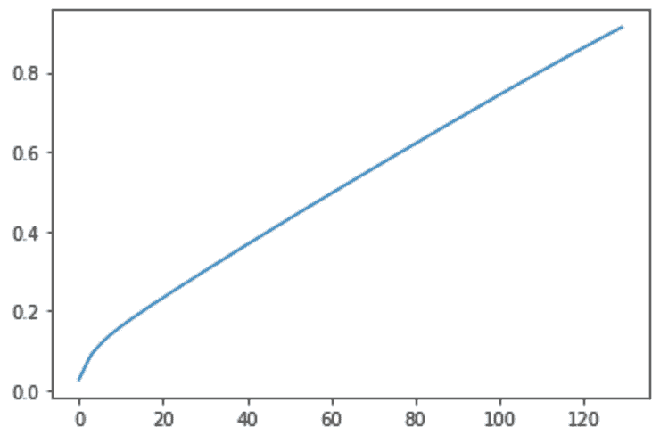

为了计算用于 FAMD 的主要成分的数量，我们用不同的参数来拟合模型，并通过图上的成分数量来观察所解释的惯性。正如您在上面的图表中看到的，对于要解释的 90%的方差，应该是**非常高的值**。

**n_iter:** 用于计算奇异值分解的迭代次数

我们没有改变缺省的 n_iter，因为我们已经有了很高的 n_components，增加迭代次数会恶化时间复杂度。

**聚类**

***选择算法***

**K 均值聚类:**

k-means 聚类方法是一种无监督的 ML 技术，用于识别数据集的数据对象的聚类。

**参数调谐**

Sklearn 给出的 k-means 聚类的超参数是:n_clusters，init，n_init，max_iter，tol，verbose，random_state，copy_x，algorithm。

*   n_clusters — 3 要形成的簇的最佳数量
*   init — k-means++为 kmeans 聚类选择初始聚类中心以加速收敛。就惯性而言，最终结果将是 n_init 次连续运行的最佳输出。
*   max _ iter 针对不同质心种子运行算法的次数(默认值=10)
*   tol 单次运行中的最大迭代次数(默认值= 300)
*   详细—默认值=0
*   random_state —随机数的质心初始化(此处标记为 none)
*   copy_x —通常用于使数据居中(此处为真)。如果 copy_x 为 True，则不修改原始数据。如果为 False，原始数据将被修改，并在函数返回之前放回原处，但是通过减去然后加上数据平均值可能会引入较小的数值差异。请注意，如果原始数据不是 C 连续的，即使 copy_x 为 False，也将进行复制。如果原始数据是稀疏的，但不是 CSR 格式，那么即使 copy_x 为 False，也会进行复制。
*   算法—默认=自动(向后兼容)。经典的 EM 式算法一般用“满”。通过使用三角形不等式,“elkan”变体对于具有良好定义的聚类的数据更有效。然而，由于分配了一个额外的 shape 数组(n_samples，n_clusters ),它需要更多的内存。

目前“auto ”(为了向后兼容而保留)选择“elkan ”,但将来可能会有更好的启发。

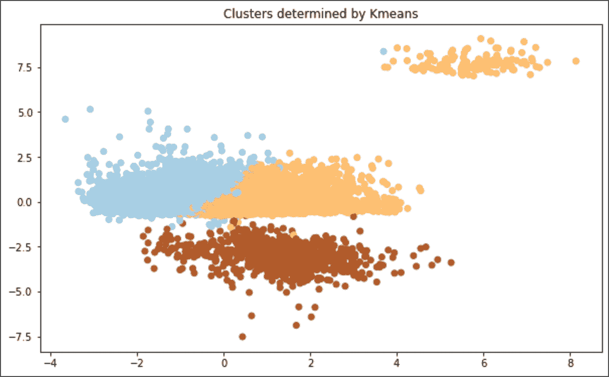

**评估措施**

这里，我们使用了两种方法来评估模型性能:

*   **内在测量** —轮廓评分，Calinski Harabasz 评分

为了在聚类中测量聚类的适合度，我们可以计算该聚类中所有对象的平均轮廓系数值。为了测量聚类的质量，我们可以使用数据集中所有对象的平均轮廓系数值。

分数被定义为组内离差和组间离差之间的比率。

*   **外在测量** —同质性得分，V 测量得分

如果一个聚类的所有聚类都只包含属于单个类的数据点，则该聚类结果满足同质性。介于 *0* 和 *1* 之间，低值表示同质性低。

V measure score 可用于评估同一数据集上两个独立赋值的一致性。

**数据库扫描:**

为什么它适合我们的数据集？

1.  (分区聚类)K-means，K-medoids:由于上面使用了 K-means，所以使用具有不同聚类类型的 K-means 将是有效的。
2.  (层次聚类)Agglomerative，DIANA:对于大型数据集效率低下。
3.  **(密度聚类)数据库扫描:**

*   优点:抗噪音和处理不同形状和大小的集群。
*   缺点:然而，它不能识别不同密度的集群。此外，由于维数灾难，它在高维数据中存在问题。但是我们的数据集不具有高维度，因为观察值的数量大于特征的数量。

DBSCAN 是基于密度的聚类，它可以抵抗噪声，因此可以处理不同形状和大小的聚类。由于维数灾难，不适用于高维数据。然而，我们的数据集不具有高维度，因为观察值的数量大于特征的数量。

**DBS can 的参数调整**

min_samples:最小实例数

这是形成集群的最小实例数。按照调整该参数的常用方法，它应该等于或大于维数。首先我们给了 min_samples = 2 * n_components。

eps:形成一个聚类所需的最少点数

这是通过运行 K-最近邻算法确定的。首先，计算每个点与其 K 个最近邻点之间的平均距离，其中 K 是我们上面定义的 min_samples。

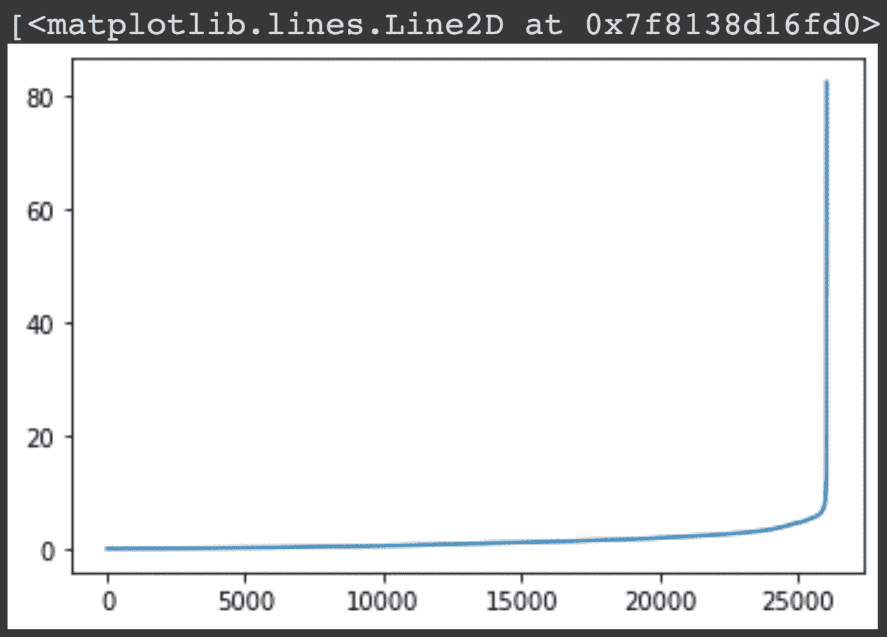

该图显示了按照到第 260 个相邻点的距离排序的点。直到ε达到大约 8 的值，排序点的增加似乎是可接受的。最后，我们将ε值设置为 8。

但是，eps = 8，min_samples = 260 设置仅生成一个带有异常值的聚类。因此，我们尝试通过设置新的 min_samples、执行 K-NN 算法、然后挑选能够分类至少 3 个聚类的最佳ε值来调整参数，其中 2 个聚类用于主聚类，一个聚类用于离群值。

**DBS can 的最终参数设置**

每股收益: 6.8

**最小样本数:** 130

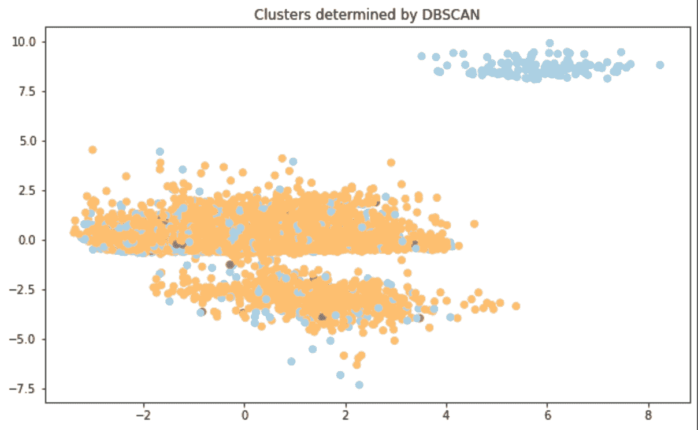

**评估措施**

DBSCAN 有自己的衡量集群性能的方法，称为 DBCV。这是一个更好的评价措施，具有处理噪声和非球状星团的能力。

然而，DBCV 只能通过 github 的代码实现来访问，在我们的代码上运行它并没有结束。

因此，我们使用了与 K-均值聚类相同的评估方法。但是，它很可能偏向于具有更高的值。

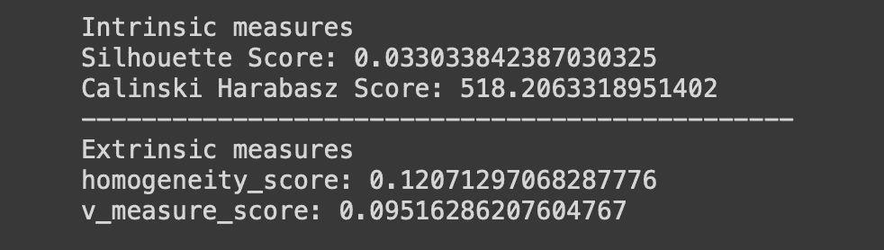

**聚类中的偏差和公平性**

机器学习中训练模型的偏见可能源于反映现有偏见的数据本身。这种历史性的不公平是我们试图从我们的训练模型中衡量的。当错误类似地分布在保护组中时，模型是公平的。在我们的任务中，受保护的属性是‘性别’，指的是男性和女性不同的生理特征。

聚类中的公平性不同于分类中的公平性，因为它关注于实例在聚类中的分布，即使它们被受保护的属性划分，聚类中的实例也应该是平衡的。如果参考来自([http://aitime-lundao . OSS-cn-Beijing . aliyuncs . com/aitime report/2021 08 26/1629963170842](http://aitime-lundao.oss-cn-beijing.aliyuncs.com/AitimeReport/20210826/1629963170842))的这张图就比较好理解了

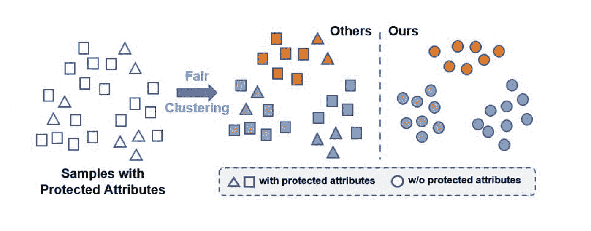

因此，我们将看到按受保护属性划分的一个集群中实例的分布。当使用和不使用受保护属性计数时，具有相同集群标签的实例被认为是公平编号的。

**数据集** = fair_data

**受保护属性** = '性别' { '女性'，'男性' }

**集群标签** = y_hat

这里，y_hat 根据集群模型和参数设置而变化。

**公平性衡量标准—统计奇偶差异(SPD)**

如果预测分类标签独立于受保护的属性，则这将评估分类模型是无偏的，因此

**P(y_hat| S ) == P(y_hat)**

这可以通过检查由 s =“男性”或 s =“女性”决定的 y 的预测概率之间的差异来测量。测量的方程式是，

**SPD = P( y_hat = 1 | S = '男性')— P( y_hat = 1 | S = '女性')**

受保护组和未受保护组的受试者被分配到阳性组的概率是否相等。

**公平范围**

为了评估每个聚类模型的公平性，我们参考以下关于公平范围的论文(https://arxiv . org/pdf/2110.13029 . pdf)。

如果测量值落在-0.1 到 0.1 之间的范围内，我们可以说模型不包含对数据集中受保护属性 S 的偏向。换句话说，如果测量值低于-0.1 或高于 0.1，我们可以说模型对于属性 s 是有偏差的。

**来自 K 均值的 SPD**

**数据集** : fair_data

**受保护的属性**:数据集中的‘性别’列

**Y_hat** : 'kmeans_y_0 '，' kmeans_y_1 '数据集中的列

**结果表**

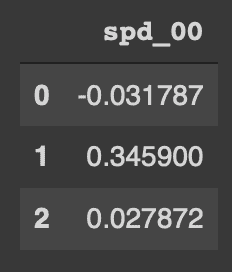

n_cluster = 3

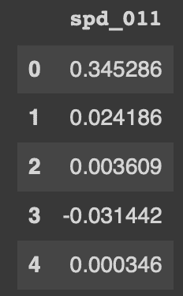

n_cluster = 5

**来自 DBSCAN 的 SPD**

**数据集** : fair_data

**受保护的属性**:数据集中的“性别”列

**Y_hat** :数据集中的“dbscan_y_0”、“dbscan_y_1”列

**结果表**

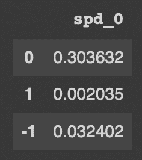

eps = 6.8, min_samples = 130

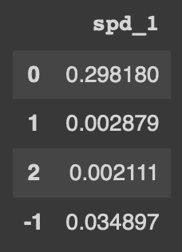

eps = 6.5, min_samples = 140

模型的结果表明，当协调参数时，簇的数目变大，总的 SPD 变小。然而，这一事实并不证明具有更多聚类的模型会导致更少的偏差。由于实例在具有更大数量的聚类的模型中更稀疏，两个聚类之间的分布差异也将很小。

此外，比较两种不同聚类方法之间的 SPD 表，没有有意义的差异。

4 个表显示，我们的数据集模型不能保证完美的公平聚类，因为一个 SPD 模型中最多有 2 个标签显示值超出公平范围(-0.1，0.1)。

**参考**

*K-均值聚类*

[https://real python . com/k-means-clustering-python/# how-to-perform-k-means-clustering-in-python](https://realpython.com/k-means-clustering-python/#how-to-perform-k-means-clustering-in-python)

[https://towards data science . com/clustering-with-k-means-1e 07 a 8 bfb 7 ca](https://towardsdatascience.com/clustering-with-k-means-1e07a8bfb7ca)

*了解 FAMD*

[https://www . data camp . com/community/tutorials/introduction-factor-analysis](https://www.datacamp.com/community/tutorials/introduction-factor-analysis)

[https://www.wikiwand.com/en/Factor_analysis](https://www.wikiwand.com/en/Factor_analysis)

[http://data-mining-tutorials . blogspot . com/2013/03/factor-analysis-for-mixed-data . html](http://data-mining-tutorials.blogspot.com/2013/03/factor-analysis-for-mixed-data.html)

*参数调谐*

[https://medium . com/@ tarammullin/DBS can-parameter-estimation-ff 8330 E3 a3 BD](/@tarammullin/dbscan-parameter-estimation-ff8330e3a3bd)

*公平聚类*

[https://arxiv.org/pdf/2110.13029.pdf](https://arxiv.org/pdf/2110.13029.pdf)

[http://aitime-lundao . OSS-cn-Beijing . aliyuncs . com/aitime report/2021 08 26/1629963170842](http://aitime-lundao.oss-cn-beijing.aliyuncs.com/AitimeReport/20210826/1629963170842)