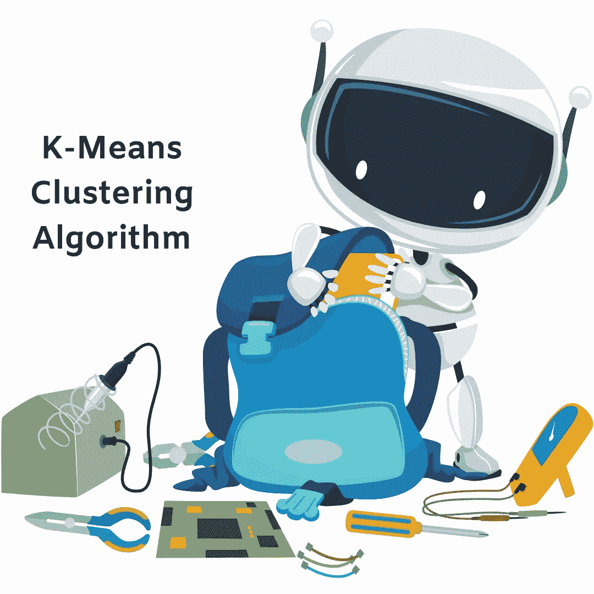
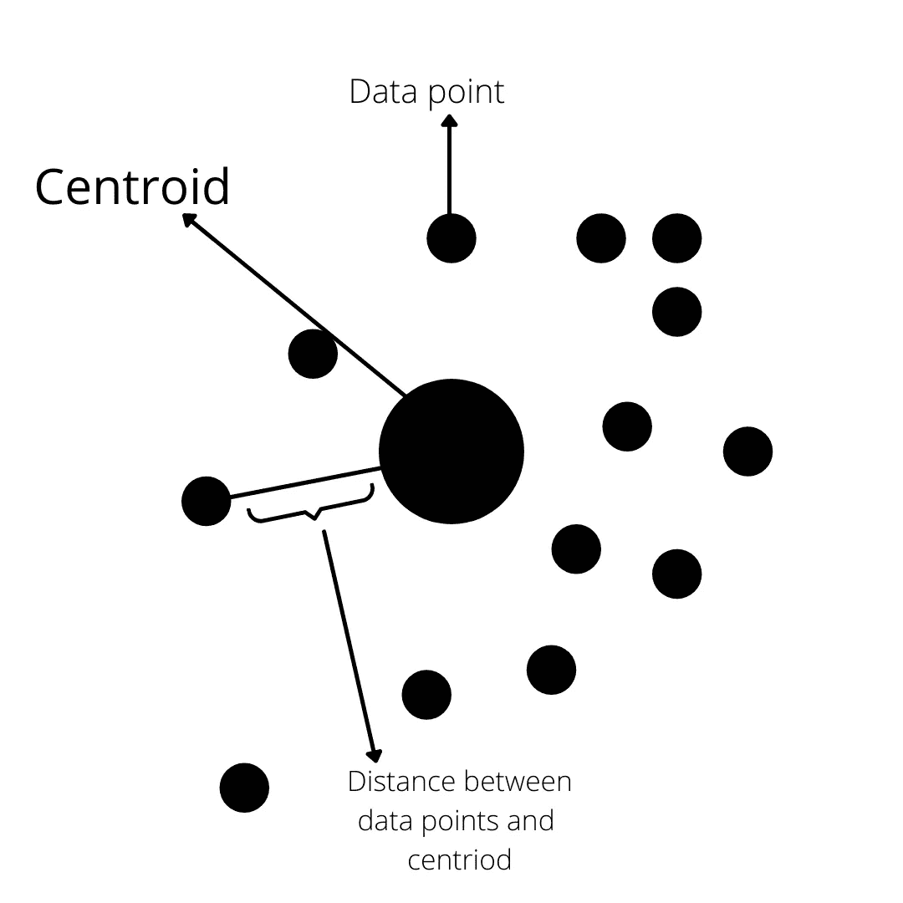
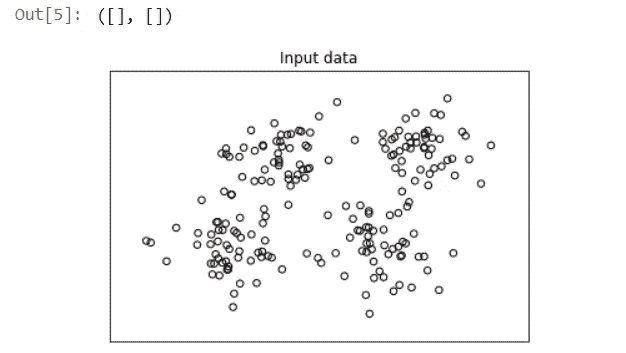
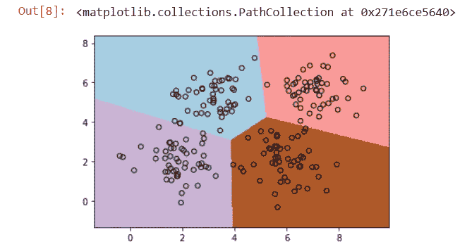
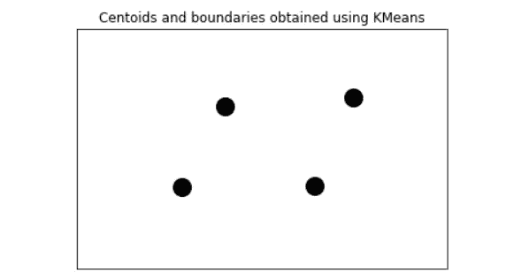

# 机器学习中的 K-means 算法聚类数据

> 原文：<https://medium.com/geekculture/cluster-data-using-k-means-algorithm-in-machine-learning-299304301a0c?source=collection_archive---------27----------------------->

## 什么是 k-means 算法？K 均值算法示例

ML 爱好者们你们好..！！

让我们直接跳到使用 K-means 算法进行聚类的主题。因为 k-means 算法是无监督机器学习中最流行的聚类算法之一。在无监督机器学习中，我们处理未标记的数据。在我们看代码和解释之前。让我们看看什么是 k-means，它是如何工作的。喝杯咖啡，开始忙碌吧。



K-Mean Clustering Algorithm

# 什么是 K-means 算法？

K-means 是由 James MacQueen 在 1967 年开发的，他设计了它来根据对象的属性将对象分组为 k 个分区。这是最流行的聚类算法之一。在该算法的帮助下，我们使用数据的各种属性将输入数据分成 k 个子组。

K-Means 形成了一个向量空间，因为它假设对象的属性可以用向量来表示。k-means 聚类中的每个聚类都由质心来标识。主要目标是最小化总的组内方差。



K-means algorithm in unsupervised machine learning

使用优化技术实现这些数据点的分组。在该技术中，我们试图最小化数据点和相应的聚类质心之间的距离的平方和。正如你在上面的图片中看到的。

该算法遵循迭代过程，如下所示:

*   选择 k 个簇的数量
*   最初，创建 k 个分区，并随机或通过使用一些启发式信息来分配每个条目分区
*   计算每组的质心
*   计算每个观测值和每个聚类质心之间的距离
*   然后，通过将每个入口点与质心更靠近它的聚类相关联来构建新的分区
*   重新计算新群的质心
*   重复步骤 4 到 6，直到算法收敛

由于质心的不同位置导致不同的结果，因此，每个质心的位置特别重要。该算法的目的是定位 k 个质心，每个聚类一个。最好的选择是把它们放在彼此尽可能远的地方。

让我们举一个例子，在这个例子中，我们将使用 k-means 算法将数据分组到由相对质心识别的四个聚类中。我们还将能够追踪边界，以确定彼此相关的领域。

# K 均值聚类算法的示例代码

您可以使用 Jupyter Notebook 或 Google Colab 来执行这个示例，或者您可以简单地创建一个 python 文件。数据集将在本文末尾提供。

*   导入所需的库

```
import numpy as np
import matplotlib.pyplot as plt
from sklearn.cluster import KMeans
```

*   加载输入数据并根据属性定义聚类的数量。

```
input_file = ('data_multivar.txt') #dataset
# Load data
x = []
with open(input_file, 'r') as f:
    for line in f.readlines():
        data = [float(i) for i in line.split(',')]
        x.append(data)
data = np.array(x)
num_clusters = 4
```

*   现在用下面的代码看看我们的数据。

```
plt.figure()
plt.scatter(data[:,0], data[:,1], marker='o', facecolors='none', edgecolors='k', s=30)
x_min, x_max = min(data[:, 0]) - 1, max(data[:, 0]) + 1
y_min, y_max = min(data[:, 1]) - 1, max(data[:, 1]) + 1
plt.title('Input data')
plt.xlim(x_min, x_max)
plt.ylim(y_min, y_max)
plt.xticks(())
plt.yticks(())
```

当您运行该单元时，您会看到类似这样的内容:



Clustering using k-means algorithm

*   现在让我们训练我们的数据模型

```
kmeans = KMeans(init='k-means++', n_clusters=num_clusters, n_init=10)
kmeans.fit(data)
```

*   现在我们的数据被训练，我们需要可视化的边界。

```
# Step size of the mesh
step_size = 0.01# Plot the boundaries
x_min, x_max = min(data[:, 0]) - 1, max(data[:, 0]) + 1
y_min, y_max = min(data[:, 1]) - 1, max(data[:, 1]) + 1
x_values, y_values = np.meshgrid(np.arange(x_min, x_max,
step_size), np.arange(y_min, y_max, step_size))# Predict labels for all points in the mesh
predicted_labels = kmeans.predict(np.c_[x_values.ravel(),
y_values.ravel()])
```

*   现在，让我们绘制结果来查看边界。

```
# Plot the results
predicted_labels = predicted_labels.reshape(x_values.shape)
plt.figure()
plt.clf()
plt.imshow(predicted_labels, interpolation='nearest', extent=(x_values.min(), x_values.max(), y_values.min(), y_values.max()), cmap=plt.cm.Paired, aspect='auto', origin='lower')
plt.scatter(data[:,0], data[:,1], marker='o', facecolors='none', edgecolors='k', s=30)
```

结果将是这样的:



clustering using k-means algorithm

*   如果我们看一下质心

```
centroids = kmeans.cluster_centers_
plt.scatter(centroids[:,0], centroids[:,1], marker='o', s=200, linewidths=3, color='k', zorder=10, facecolors='black')
x_min, x_max = min(data[:, 0]) - 1, max(data[:, 0]) + 1
y_min, y_max = min(data[:, 1]) - 1, max(data[:, 1]) + 1
plt.title('Centoids and boundaries obtained using KMeans')
plt.xlim(x_min, x_max)
plt.ylim(y_min, y_max)
plt.xticks(())
plt.yticks(())
plt.show()
```

输出:



Centroids in clustering

嗯，刚果..！！你做了这个。

**代码和数据集是** [**这里是**](https://github.com/imrohit007/K-means-Example)

嗯，就是这样。感谢您的阅读。如果这篇文章内容丰富，那么一定要鼓掌并与你的社区分享。

快乐学习..！！