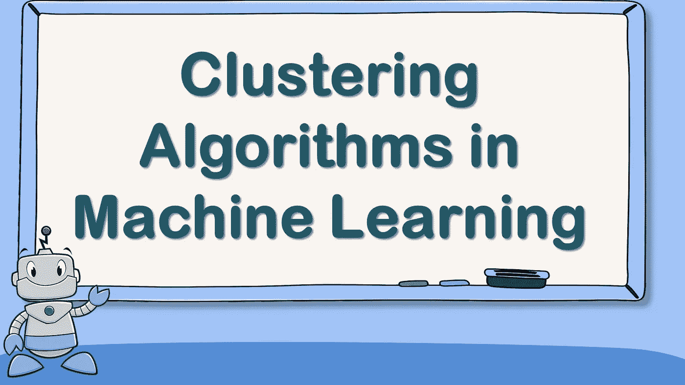

# 机器学习中的聚类算法

> 原文：<https://medium.com/geekculture/clustering-algorithms-in-machine-learning-f30300177c55?source=collection_archive---------14----------------------->

## 机器学习中你应该知道的聚类算法。

聚类的任务是根据相似的特征识别相似的实例，并根据相似的实例将它们分配到聚类中。这听起来像是分类，其中每个实例也被分配到一个组，但与分类不同，聚类是基于无监督学习的。这里你处理的数据集没有标签，所以我们不能在没有标签的数据集上使用分类算法，这就是聚类算法的用武之地。如果您想学习作为数据科学家应该了解的所有聚类算法，那么这篇文章就是为您准备的。在本文中，我将带您了解机器学习中的所有聚类算法。

# 聚类算法

下面是您应该知道的所有聚类算法:

1.  k 均值聚类
2.  DBSCAN 聚类
3.  凝聚聚类
4.  桦树聚类
5.  均值漂移聚类

所以这些都是你需要知道的机器学习中的聚类算法。现在让我们继续逐一介绍所有这些聚类算法，以及它们使用 Python 的实现。

## k 均值聚类

K-Means 是机器学习中的一种聚类算法，可以在几次迭代中非常快速有效地对未标记的数据集进行分组。它的工作原理是用最近的质心标记集群上的所有实例。当实例以特定点为中心时，该点称为质心。如果您收到实例标签，您可以通过对每个分类的所有实例进行平均来轻松定位所有项目。

但是在这里，我们没有给定标签或质心，所以我们必须通过选择 k 个随机实例并使用它们的位置作为质心来随机放置质心。然后，我们标记实例，更新质心，重新标记实例，再次更新质心，等等。K-Means 聚类算法保证在几次迭代中收敛，它不会永远继续迭代。从 [**这里**](https://thecleverprogrammer.com/2021/02/16/k-means-clustering-in-machine-learning/) 可以了解 K-Means 聚类算法的实现。

## DBSCAN 聚类

DBSCAN 聚类算法基于核心样本、非核心样本和异常值的概念:

1.  岩心样本:高密度区域中的样本具有最小的 eps 半径样本点。
2.  非岩心样品:样品接近岩心样品，但不是岩心样品，但非常接近岩心样品。非岩心样本位于岩心样本的 eps 半径内，但它们没有最小样本点。
3.  异常值:不属于核心样本和非核心样本的样本，远离所有样本。

如果所有分类都足够密集，并且由低密度区域很好地表示，则 DBSCAN 分类算法工作良好。从 [**这里**](https://thecleverprogrammer.com/2021/02/03/dbscan-clustering-in-machine-learning/) 可以了解 DBSCAN 聚类算法的实现。

## 凝聚聚类

凝聚聚类是一种聚类算法，其中对相似实例进行分组的过程开始于创建多个组，其中每个组在初始阶段包含一个实体，然后它找到两个最相似的组，合并它们，重复该过程，直到它获得最相似实例的单个组。

例如，想象气泡漂浮在水面上并附着，在最后，你会看到一大群气泡。这就是凝聚聚类算法的工作原理。使用该算法进行聚类的一些优点是:

1.  它非常适合大量的实例
2.  它可以捕捉不同形状的星团
3.  它形成灵活和信息丰富的集群
4.  它也可以用于任何成对距离

你可以从 [**这里**](https://thecleverprogrammer.com/2021/08/11/agglomerative-clustering-in-machine-learning/) 了解凝聚聚类算法的实现。

## 桦树聚类

BIRCH 是机器学习中的一种聚类算法，专门设计用于对非常大的数据集进行聚类。它通常比 K-Means 等其他聚类算法更快。如果数据集中的要素数量不超过 20，它会提供与 K-Means 算法非常相似的结果。

当使用 BIRCH 算法训练模型时，它会创建一个具有足够数据的树结构，以便快速将每个数据点分配到一个分类中。通过将所有数据点存储在树中，该算法允许在处理非常大的数据集时使用有限的内存。你可以从 [**这里**](https://thecleverprogrammer.com/2021/03/15/birch-clustering-in-machine-learning/) 了解 BIRCH 聚类算法的实现。

## 均值漂移聚类

均值漂移聚类是一种非参数聚类算法，不需要任何关于聚类数的先验知识。下面是均值漂移聚类算法的完整过程:

1.  首先在每个样本上画一个圆圈
2.  然后，对于每个圆，它计算位于该圆中的所有样本的平均值
3.  然后它移动圆圈，使其以平均值为中心
4.  然后，它重复均值偏移步骤，直到所有的圆都停止移动
5.  然后，它在最高密度的方向上移动圆，直到每个圆达到局部密度的最大值
6.  然后，其圆位于相同位置的所有实例被分配到相同的集群

该算法的一些特性类似于 DBSCAN 聚类算法，例如它如何找到任意形状的任意数量的聚类。但是与 DBSCAN 聚类算法不同，当聚类具有内部密度变化时，均值漂移倾向于将聚类分割成块。从 [**这里**](https://thecleverprogrammer.com/2021/09/29/mean-shift-clustering-in-machine-learning/) 可以了解均值漂移聚类算法的实现。

# 摘要

这些就是你应该知道的机器学习中的聚类算法。聚类的任务是根据相似的特征识别相似的实例，并根据相似的实例将它们分配到聚类中。这听起来像是分类，其中每个实例也被分配到一个组，但与分类不同，聚类是基于无监督学习的。我希望您喜欢这篇关于您应该知道的所有聚类算法的文章。欢迎在下面的评论区提出你有价值的问题。