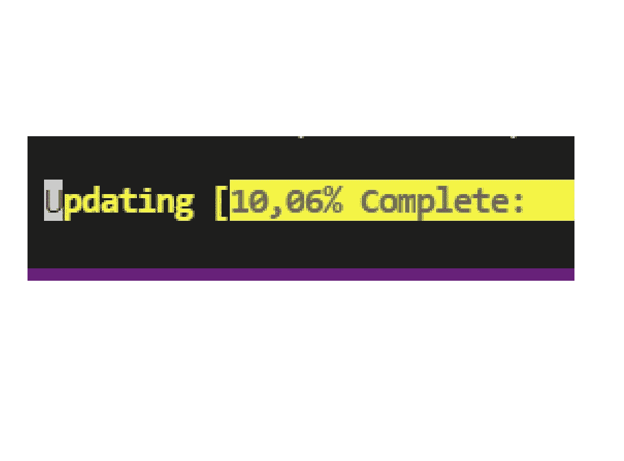

# 在 Powershell 中编写进度条

> 原文：<https://medium.com/geekculture/code-a-progress-bar-in-powershell-481927175657?source=collection_archive---------9----------------------->

## 简单的方法

这就是你如何编写一个**进度条**的方法，如果你知道你将要执行的迭代次数的话。

假设在数组`$lines`上有一个 for 循环。