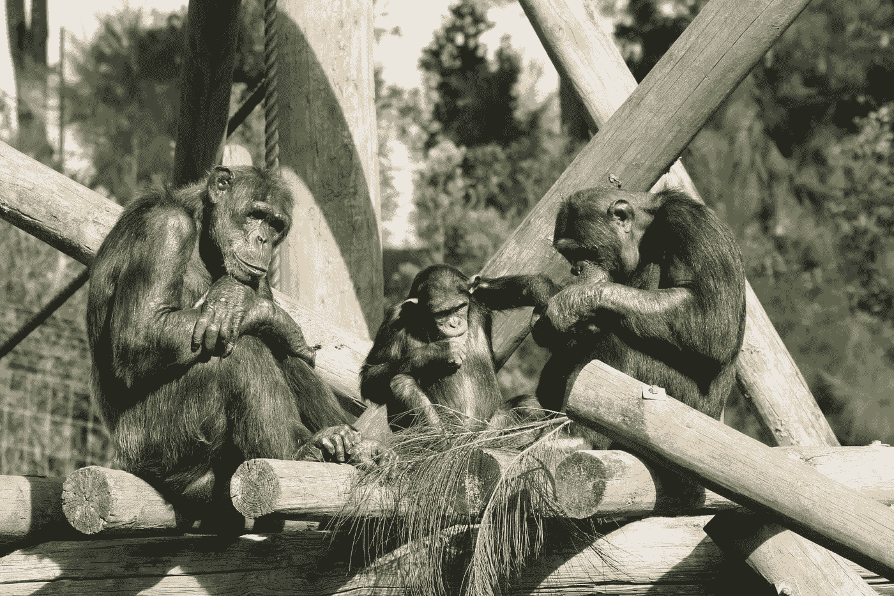

# 代码猿

> 原文：<https://medium.com/geekculture/code-apes-d6123451be9b?source=collection_archive---------28----------------------->

我们都知道创建一个充满代码猴子的团队是一件坏事。付给工程师一小笔钱让他们仅仅执行精确的命令是没有意义的，他们中的大多数人反对被微观管理和被剥夺任何自主权。你的意图是组建一个拥有所有权和代理权的工程团队。尽管如此，我正在目睹一场演变，团队陷入了一个奇怪的境地，并且经常没有意识到这一点。就是*码猿*的形成。

代码猿不是你日常生活中常见的灵长类动物。明确剥夺他们的自由不会飞。相反，他们面对的情况是，他们认为自己的地位比实际情况要好。在我寻求帮助编码灵长类动物学家的过程中，这里有一些迹象:

# 对工具和技术的痴迷

仅仅因为他们有相对的拇指并不意味着他们应该只关注他们自己的工具。我看到一些团队不停地谈论他们的高质量代码、降低债务和浏览器设置中的 k8s。这通常意味着团队没有办法影响实际的产品计划和路线图，因此不得不让他们的代理过多地关注最新的闪亮软件包。

这可能让人觉得团队在做有价值的、聪明的事情。毕竟，没有人会说积累科技债务是一件好事。尽管如此，这通常意味着团队正在沿着阻力最小的道路前进。

# 远离现实世界

如果团队与公司的客户没有真正的联系，它就会变得孤立。这种脱节意味着他们将更有可能专注于技术(见上一点)，而不会拥有*的产品掌握能力*(见第二章和第十章 [*的技术执行操作系统*](https://techexecutiveoperatingsystem.com) )。

接触真实世界是帮助团队校准其信念和努力的要求。没有它，他们就不会在没有意义的事情上反推或者提出自己的想法。

# 饲养

你的路线图和目标是什么样的？代码猴子并不知道实际的目标和目的，而是被喂了吉拉门票。对于猿类来说，这就有点不同了。他们可能会有一些更高的分辨率要求，但这些要求并没有真正的授权和自主权。例如，我见过一些团队，他们的目标更重要，这样就不会成为“微观管理”，但是他们也有过度的规定性。

当领导认为他们必须“喂野兽”的时候，他们的注意力就集中在给团队提供任务上。喂食过多反而适得其反。你应该给他们自由，让他们不时自己去打猎。

# 过度保护

从长远来看，创造一个让团队保持完全“安全”的环境，不会发生任何错误是具有破坏性的。一个总是实现所有目标并且从不尝试可能失败的事情的团队是一个所有时间都呆在舒适区的团队。从来没有探索和漫游选项的团队成员永远不会受伤，也永远不会有任何有意义的发现。

培养创新和创造力对于世界级的工程团队来说是必须的(顺便说一句，这是你可以在下面得到的*技术执行操作系统*的样本章节的主题)。让他们犯错误，尝试新事物。这就是我们如何进化！

*Aviv Ben-Yosef 2021 —在我最近出版的书中获得更多:* [***科技高管操作系统***](https://techexecutiveoperatingsystem.com/)