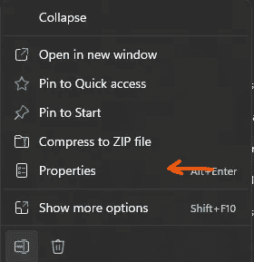
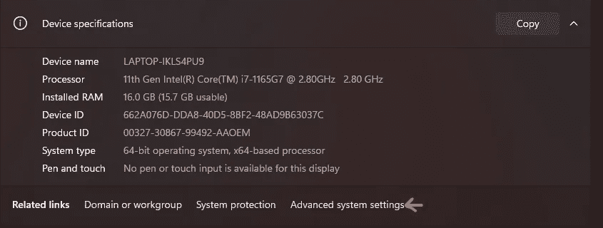

# 代码文档:释放你内心的高级开发人员

> 原文：<https://medium.com/geekculture/code-documentation-unleash-the-senior-developer-inside-you-bb8b9591e2b3?source=collection_archive---------13----------------------->


Photo by [Patrick Tomasso](https://unsplash.com/@impatrickt?utm_source=medium&utm_medium=referral) on [Unsplash](https://unsplash.com?utm_source=medium&utm_medium=referral)

> 任何傻瓜都能写出计算机能理解的代码。优秀的程序员会写出人类能理解的代码。”—马丁·福勒

正如 Martin Fowler 所说，开发人员应该编写一个其他开发人员可以阅读、清理、重构、维护和添加的代码。

代码文档是创建代码片段的过程中的一个关键角色，您可以将它发布到卢浮宫博物馆。

> “在某些方面，编程就像绘画。你从一块空白的画布和一些基本的原材料开始。你综合运用科学、艺术和工艺来决定如何处理它们。”— *安德鲁·亨特*

因此，在本文中，我们将看到代码文档是如何真正有用，以及创建一个好的代码文档的规则是什么。

本文中的示例将使用 Dart / Flutter，但是代码文档背后的思想和规则在任何其他技术中都是一样的。

# 什么是代码文档？

“代码文档是伴随软件代码的文本，用来解释你的代码在做什么，为什么要这样写，和/或如何使用它。”——**托比·奥斯本(** [**什么是代码文档**](https://textexpander.com/blog/code-documentation) **)**

换句话说，代码文档是支持代码的代码注释和/或降价文件的工作台，以便于将来代码的维护。

代码文档可以是代码旁边的注释形式，也可以是分开的文件(例如 markdown 文件)。

# 自文档化代码是一种解决方案吗？

当寻找最佳代码质量时，您可能会发现的第一件事是代码本身需要是可理解的，这样您就不必解释它，但是对于初级开发人员来说，解决问题或创建功能本身是非常耗时的，所以您没有足够的时间来清理混乱，即使对于一些高级开发人员来说，他们最终也会编写出质量很差的代码。

自记录代码是避免记录每个函数的最佳选择，但是很少需要记录自记录代码来解释每个参数的效用，例如，因为不是每个将要面对代码的开发人员都会理解您的逻辑。

最终的目标是保持代码质量，无论开发人员是谁，所以你需要保证每个开发人员都能理解你写的东西。

# 我们如何记录我们的代码？

## 约定

*   **要像句子一样格式化评论。**

第一个单词要大写，除非它是区分大小写的标识符。以句号“！”结束, "?"

*   **不要对文档使用块注释，如下例所示**

```
/* Assume we have a valid name. */
  print('Hi, $name!');
```

*   **使用适当的注释语法:**

在每种语言中，我们都有写注释的语法(python 用#，Java 用//…)

在每种语言中，我们都有合适的语法来编写代码文档

在 Java 中:

```
*/**
* code documentation goes here
*/
void*  displayName(*String* name){
  *System*.*out*.println(name);
}
```

*   **用一句摘要开始文档注释**

例如，代替做:

```
/// Depending on the state of the file system and the user's permissions,
/// certain operations may or may not be possible. If there is no file at
/// [path] or it can't be accessed, this function throws either [IOError]
/// or [PermissionError], respectively. Otherwise, this deletes the file.
void delete(String path) {
  ...
}
```

这样做更好，更好，甚至更清晰易读

```
/// Deletes the file at [path] from the file system.
void delete(String path) {
  ...
}
```

*   **将第一个总结句子单独成段**

建议将包含摘要的第一句话与文档的其余部分分开，这些帮助工具如 dartdoc、javadoc 和其他工具可以生成更清晰的文档文件。

示例:

```
/// Deletes the file at [path].
///
/// Throws an [IOError] if the file could not be found. Throws a
/// [PermissionError] if the file is present but could not be deleted.
void delete(String path) {
  ...
}
```

*   **关注读者不知道的，避免冗余**

```
class RadioButtonWidget extends Widget {
  /// Sets the tooltip for this radio button widget to the list of strings in
  /// [lines].
  void tooltip(List<String> lines) {
    ...
  }
}
```

正如你在上面的例子中看到的，类名和类成员是显而易见的，所以没有必要在文档中提及。

示例:

```
class RadioButtonWidget extends Widget {
  /// Sets the tooltip to [lines], which should have been word wrapped using
  /// the current font.
  void tooltip(List<String> lines) {
    ...
  }
}
```

*   用第三人称动词开始函数

```
/// Returns `true` if every element satisfies the [predicate].
bool all(bool predicate(T element)) => ...

/// Starts the stopwatch if not already running.
void start() {
  ...
}
```

*   **变量的文档以名词短语开始**

```
/// The current day of the week, where `0` is Sunday.
int weekday;
```

# 我们如何使用 dartdoc？

Dartdoc 是一个文档生成器工具，它使用编写的代码文档来生成 html 文件，其中包含了设计精美的类、方法、变量和 api 文档。

**安装**

要在你的电脑上安装 dartdoc，你只需要执行下面的命令

```
pub global activate dartdoc
```

或者

```
flutter pub global activate dartdoc
```

对于有些人，你可能会遇到一个问题，说 dartdoc 不是已知的内部命令，在这种情况下，只需添加<complete_path>“flutter”。pub_cache\bin，示例 C:\FLUTTER\发布缓存\bin</complete_path>

*   **Linux**

导出路径=颤振/。发布缓存/bin:$PATH

*   **Windows 10:**

[https://stack overflow . com/questions/44272416/how-to-add-a-folder-to-path-environment-variable-in-windows-10 with screensho](https://stackoverflow.com/questions/44272416/how-to-add-a-folder-to-path-environment-variable-in-windows-10-with-screensho)

*   **视窗 11:**

第一步:在文件浏览器中右键点击“这台电脑”

第二步:点击“属性”



第三步:点击“高级系统设置”



接下来的步骤和 Windows 10 一样。

**用法**

要生成项目文档文件，你首先需要用“flutter analyze”或“dart analyze”分析你的代码

然后启动命令

```
dartdoc
```

在项目文件中。然后一个名为 api 的新文件夹被添加到您的项目中，它包含所有的 HTML 文档文件

有关 api 文件夹内容的更多详细信息，请查看下面的链接

[](https://pub.dev/packages/dartdoc) [## dartdoc |镖包

### 使用 dartdoc 为您的 Dart 包生成 HTML 文档。有关向 dartdoc 投稿的信息…

公共开发](https://pub.dev/packages/dartdoc) 

# 结论

正如我们在本文中看到的，代码文档是您需要添加的重要部分，以保持您的代码活着，并在将来向其他开发人员甚至您解释(开发人员是最健忘的生物🤣)算法的逻辑。

要了解更多关于代码文档的信息，您可以查看下面的链接

[https://text expander . com/blog/Code-documentation #:~:text = Code % 20 documentation % 20 is % 20 text % 20 that，支持% 20 documentation % 20 about % 20 the % 20 Code](https://textexpander.com/blog/code-documentation#:~:text=Code%20documentation%20is%20text%20that,supporting%20documentation%20about%20the%20code)。

[https://www . write the docs . org/guide/writing/初学者指南文档/](https://www.writethedocs.org/guide/writing/beginners-guide-to-docs/)

[](https://blog.education-ecosystem.com/code-documentation-tools/) [## 完美代码文档的 10 个工具

### 代码文档工具是当前的需要，因为它们有助于记录您的代码。代码文档是一个由…

blog.education-ecosystem.com](https://blog.education-ecosystem.com/code-documentation-tools/)