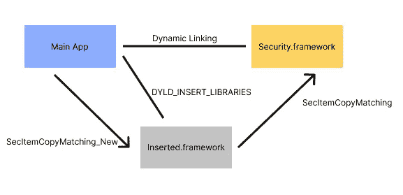
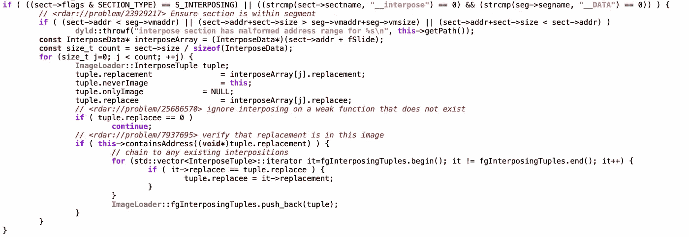
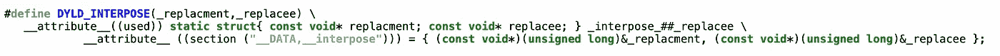

# 插入 Dyld 的代码注入

> 原文：<https://medium.com/geekculture/code-injection-with-dyld-interposing-3008441c62dd?source=collection_archive---------5----------------------->

Objective-C 运行时的动态特性可以用于许多目的，包括方法重组。有很多教程解释了如何使用 swizzling，它可以完成很多任务。但是，不能一直用。

Swizzling 处理 Objective-C 方法，但不能用于 C/C++函数。当对 iOS 应用程序进行逆向工程时，一些非 Obj-C 底层调用可能是最有用的，有时您需要在没有源代码的应用程序中拦截它们。

在本帖中，我们将会看到一种鲜为人知的在函数调用中注入代码的技术，这种技术适用于 C/C++函数和未修改的应用程序二进制文件。这些基本构件支撑了许多开发工具，包括我使用的 [Emerge Tools](https://www.emergetools.com) 。

## 例子

假设您正在尝试对一个应用程序进行逆向工程，以了解它如何使用钥匙串。您知道在某个时候应用程序调用了`[SecItemCopyMatching](https://developer.apple.com/documentation/security/1398306-secitemcopymatching)`，但是不确定存储了什么数据以及它存储在什么键下。这个函数不能 swizzled，因为它不客观-C .你也不能修改原始源代码，你有的只是编译好的 app。

在这篇文章中，我们将实现一个解决方案，在应用程序运行时，将从 keychain 请求的所有数据打印到 stdout。该解决方案使用了一个插入了`SecItemCopyMatching`的框架，并在启动时用 DYLD_INSERT_LIBRARIES 加载。

## DYLD _ 插入 _ 库

虽然对于插入来说并不是绝对必要的，但是插入库通常与插入结合在一起，对于任何探索 iOS 内部的人来说都是一个极好的资源，因此值得快速浏览一下。

DYLD_INSERT_LIBRARIES 是一个环境变量，允许您向应用程序的进程添加代码。该格式只是一个冒号分隔的框架列表，将在应用程序启动时链接。例如:`DYLD_INSERT_LIBRARIES=@executable_path/Frameworks/InterposingSample.framework/InterposingSample`。如果你曾经在 Linux/Android 上使用过 LD_PRELOAD，这就是 iOS 的等价物。

这个环境变量[1]有很大的潜力，你可以写一个+load 方法来添加任何你想应用程序启动的额外逻辑，包括 swizzling，响应 NSNotifications，或者呈现一个全新的 UI。这甚至被 SwiftUI 预览使用，从预览中检查一个崩溃报告会显示一行:`DYLD_INSERT_LIBRARIES=/Applications/Xcode.app/Contents/Developer/Platforms/iPhoneOS.platform/Library/Developer/CoreSimulator/Profiles/Runtimes/iOS.simruntime/Contents/Resources/RuntimeRoot//System/Library/PrivateFrameworks/PreviewsInjection.framework/PreviewsInjection`

## DYLD_INTERPOSE

当你使用 dyld 插入时，你甚至不需要使用初始化器，比如+load，因为它是一个比 swizzling 更具声明性的 API。正如[我在](https://www.emergetools.com/blog/posts/SwiftReferenceTypes)之前讨论过的，应用启动时运行的第一个代码是 dyld，而不是你写的代码。dyld 的职责之一就是将调用从一个二进制绑定到另一个，比如从你的应用绑定到苹果的框架。插入是告诉 dyld 用一个绑定函数替换另一个绑定函数的一种方式。

**Dyld 绑定**

嵌入在你的二进制文件中的是一个外部引用的符号表，我在[之前的博客文章](https://www.emergetools.com/blog/posts/iOS15LaunchTime)中写过这个数据的新 iOS 15 格式。一些符号只是在第一次被使用时才被延迟绑定，这是通过每个名为`dyld_stub_helper`的应用程序中包含的一个功能实现的。其他符号在应用程序启动时绑定。这两种方法都允许 dyld 对另一个二进制文件中定义的任何函数的地址拥有最终发言权，幸运的是，它给了您修改这个地址以指向您自己的函数的机会。

**插入**

Interposing SecItemCopyMatching with an inserted framework

插入的工作方式是添加一个新的 Mach-O 部分(__DATA，_ _ interpose)，该部分包含一个元组列表，该列表保存替换函数和被替换对象的地址。如果任何库(包括插入的库)包含 Mach-O 部分(__DATA，__interpose)，那么 dyld 将使用这个列表用替换来替换对被替换对象的任何调用，只要调用不是来自包含替换函数的二进制文件。**这意味着对你试图插入到你插入的框架中的函数的任何调用仍然会转到原始函数。**

查看 dyld 的源代码，我们可以准确地看到这些插入的地址是在哪里加载的:

为了在你的二进制文件中制作这个新的部分，苹果提供了一个[方便的宏](https://github.com/apple-opensource/dyld/blob/b6b86eb2db14440d373f6f7fd21be4a2bc0da897/include/mach-o/dyld-interposing.h):

现在，将所有这些放在一起，我们可以看到如何实现一个框架来完成我们从最初的示例中想要的功能:

## 你能用这个做什么？

很多！在 [Emerge Tools](https://www.emergetools.com) ，我们将这种技术用于所有的运行时性能测量，例如订单文件生成和性能测试。通过插入，你可以连接到未修改的应用程序，以测量应用程序的行为，提取信息，或完全改变行为。它是开发人员工具可以利用的强大的运行时工具。任何时候你发现自己需要调用一个 C/C++函数或者任何不是 Objective-C 的一部分的东西(所以它不能被调用),意识到插入是你可以求助的一种选择是很好的。一个免责声明:我没有在 app store 的应用程序中尝试过，但一般来说，我会推荐它只用于本地测试！

## 其他方法

在 iOS 应用程序的 Objective-C 运行时之外，还有其他一些方法可以实现代码注入。[鱼钩](https://github.com/facebook/fishhook)是脸书发明的一种广受欢迎的鱼钩。类似于 dyld 插入，它利用了 Mach-O 符号绑定。有了 fishhook，你不需要一个单独的 dylib，如果你能控制应用程序的源代码，这就方便多了。如果可能的话，我更喜欢使用 dyld 插入，因为这是一个完全第一方的解决方案，但是 fishhook 只有几百行 C 代码，对于从较低的层次了解符号绑定过程是如何工作的很有帮助。

勇敢的读者可能会注意到 dyld 源代码中的另一个特性:用函数`dyld_dynamic_interpose`进行动态插入。这只是在运行时告诉 dyld 开始插入函数的一种方式。这类似于 fishook 的工作方式；您不需要总是插入一个函数，而是可以通过编程安装一个钩子。Peter Steinberger 在 Chrome 源代码中发现了这个 API 的至少一个用例。看起来 Chrome 正在覆盖 CoreAudio 来修改它的行为，有趣的是看到了一个在生产中使用插入的例子！

[1]如果您对其他 dyld 环境变量感兴趣，请查看`man dyld`