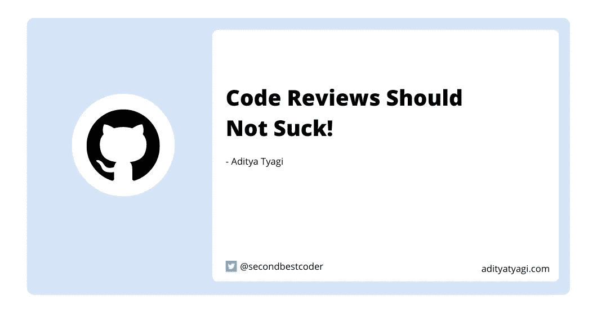

# 代码审查不应该很糟糕！

> 原文：<https://medium.com/geekculture/code-reviews-should-not-suck-495cfce2b57b?source=collection_archive---------9----------------------->

## 作为初学者，如何提出拉动式请求(PR)

Image by [author](https://twitter.com/secondbestcoder)

代码审查是开发人员每天必须做的主要事情之一。对一些人来说，审查代码的经历可能是愉快的，但对另一些人来说，这可能是相当有压力的！

> 根据 Stack Overflow，开发人员生活中压力的头号原因是代码审查。开个玩笑！