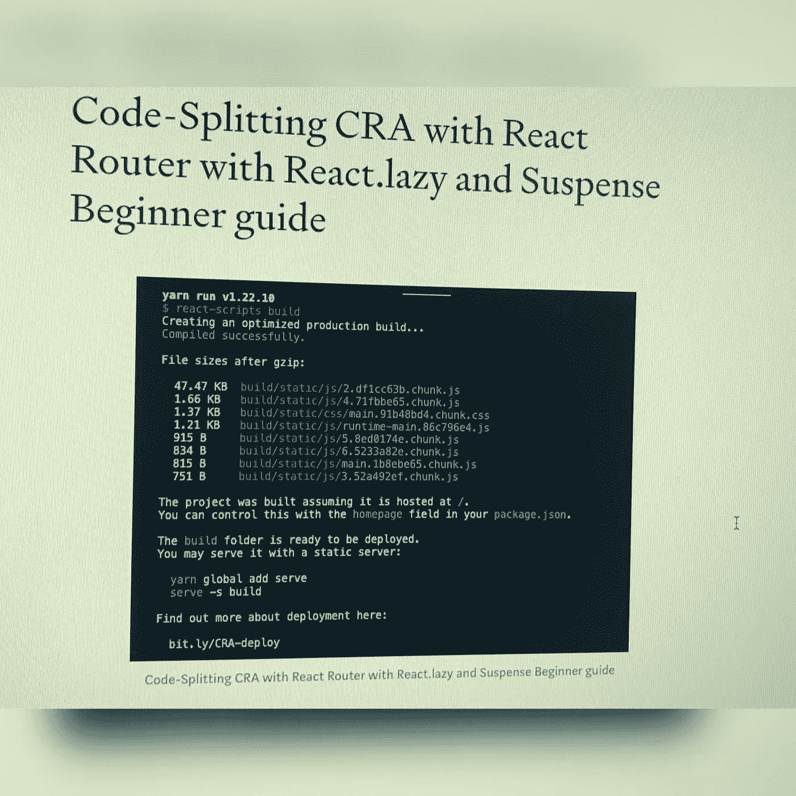

# 代码分裂 CRA 与反应路由器与反应。懒惰和悬念初学者指南

> 原文：<https://medium.com/geekculture/code-splitting-cra-with-react-router-with-react-lazy-and-suspense-beginner-guide-3e9818651700?source=collection_archive---------26----------------------->

下面的文章将帮助你理解如何用 React 进行代码拆分。懒惰和悬念与反应路由器初学者指南。

在 React 中实现代码拆分有几种方法。

> 今天我们用 React。代码拆分的懒惰方法。