# 编码你自己的 ERC-20 代币

> 原文：<https://medium.com/geekculture/code-your-own-erc-20-token-1678d9b381da?source=collection_archive---------1----------------------->

Photo by [Executium](https://unsplash.com/@executium?utm_source=medium&utm_medium=referral) on [Unsplash](https://unsplash.com?utm_source=medium&utm_medium=referral)

我属于这样一群人，他们认为加密货币和加密空间总体上有可能在未来取代我们当前的集中融资和法定货币系统。随着以太坊(Ethereum)等区块链网络纳入智能合同，以及各种区块链上更好、更智能的合同的持续发展，这一技术将朝着未来发展，不仅仅局限于融资。话虽如此，我认为智能合约的主要吸引力之一是创建令牌的能力。

Photo by [Executium](https://unsplash.com/@executium?utm_source=medium&utm_medium=referral) on [Unsplash](https://unsplash.com?utm_source=medium&utm_medium=referral)

## 那么什么是代币呢？

在区块链科技，一枚**硬币**是一种源自其区块链的数字资产。与直接代表交易媒介的硬币不同，**加密代币**是一种资产的代表。

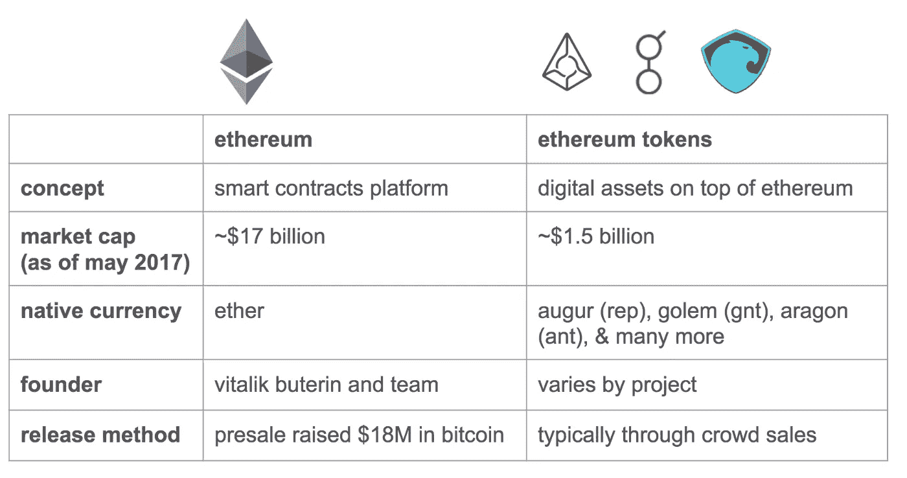

在区块链以太坊，**以太**是其本国货币。奥格、假人、阿拉贡等。是令牌****是建立在以太坊区块链之上的。****

****一个**令牌**是一个**智能契约**代表可以有价值并且可以被发送和接收的数字资产。它们与分散式应用程序(Dapps)一起使用，通常构建在现有区块链之上。虽然代币可以分享现有区块链的好处，但它们没有独立的基础设施。****

# ****ERC-20 令牌标准****

******ERC-20** 或 ***以太坊征求意见稿 20*** 令牌规范已经成为以太坊令牌事实上的标准，目前大多数以太坊合约都符合 ERC20。该标准允许开发人员构建令牌应用程序，这些应用程序可以与以太坊区块链上的其他产品和服务进行互操作。****

****根据以太坊的官方网站，ERC-20 标准是，****

> ****这是可替换令牌的标准，换句话说，它们有一个属性，使每个令牌与另一个令牌完全相同(在类型和值方面)****

**** [## ethereum.org ERC-20 令牌标准

### 以太坊是一个全球性的、分散的资金和新型应用平台。在以太坊上，你可以写代码…

ethereum.org](https://ethereum.org/en/developers/docs/standards/tokens/erc-20/) 

# ERC-20 方法

以太坊改进提案中提出了 ERC-20 令牌所需的标准。为了使令牌符合 ERC-20 标准，需要包含一些强制方法和事件。

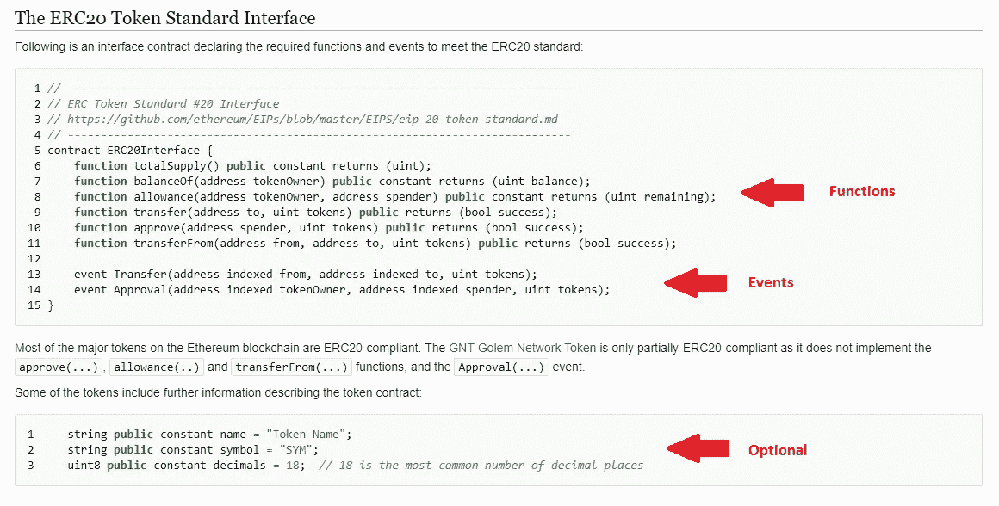

当我们编写自己的 ERC-20 令牌时，我们将更深入地研究这些方法。所以我们开始吧！

我们将使用一个简单的在线 solidity 编辑器和名为 **Remix** 的智能合同部署平台。

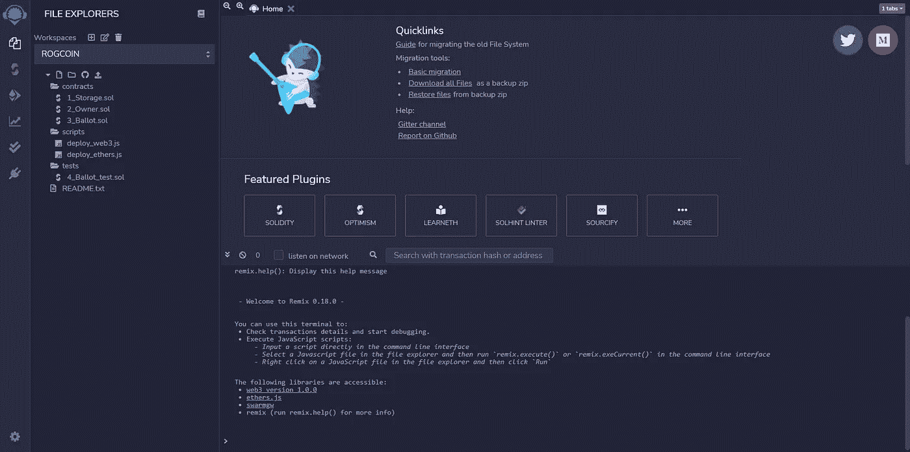

我们将把这枚硬币命名为**‘ROG’**代币。您可以为您的令牌指定任何名称。在合同文件夹中创建一个新文件“Rogtoken.sol”。

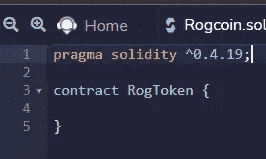

像往常一样，我们将通过编写**杂注指令**来开始编写我们的合同，这对于 solidity 编译器知道使用哪个版本的 solidity 来编译我们的合同是必不可少的。然后我们将我们的合同命名为 **RogToken** 。

Solidity 中的契约类似于面向对象语言中的类。它们包含状态变量中的持久数据，以及可以修改这些变量的函数。

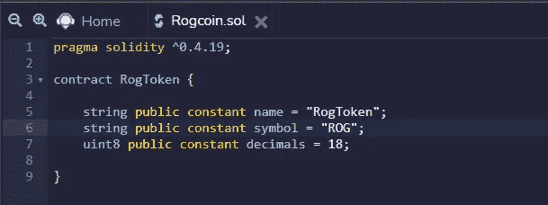

令牌函数的名称、符号和小数是可选的，但它提高了可用性。

现在，我们将定义两个映射对象。**映射**充当哈希表，由键类型和相应的值类型对组成。

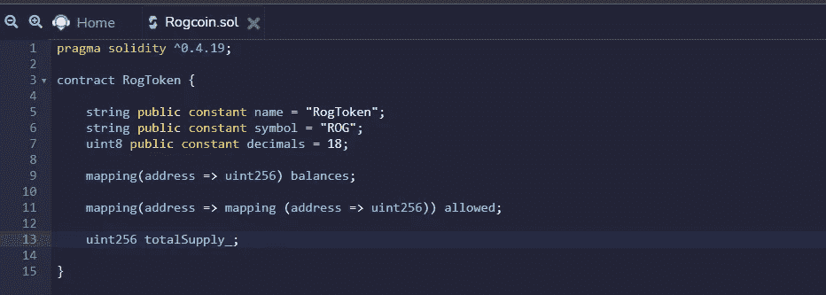

我们定义了“balances”和“allowed”映射对象，它们将类型**地址**作为键，其值属于类型 **uint256** 。

> ***余额*** 映射对象持有每个所有者地址的令牌余额。
> 
> ***允许*** 映射对象将包括所有被允许从给定账户中提款的账户，以及每个账户允许的提款金额。

> 区块链存储价格昂贵，合同用户需要以某种方式付费。因此，我们应该始终尝试最小化存储大小并写入区块链。

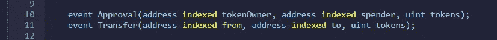

Declaration of events

批准和转移是 ERC-20 令牌所要求的强制性事件。在函数中使用这些事件之前，我们需要先声明它们。

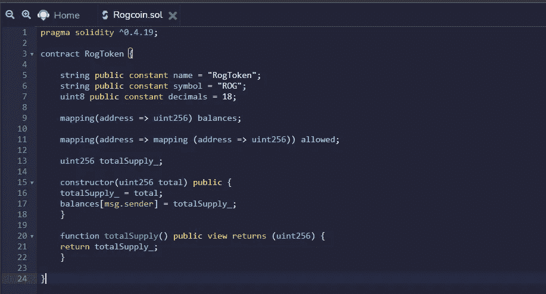

我们在构造函数中定义了令牌的总量。一个**构造函数**是一个特殊的函数，当我们部署智能契约时会调用它。我们在合同创建时设置令牌的总量，并最初将它们全部分配给“合同所有者”，即部署智能合同的帐户

**msg.sender** 包含执行当前合同功能的以太坊账户。因此，我们在首次发行硬币时，先将总供应量设定到这个账户。

**totalSupply()** 函数返回令牌的总供应限额，而不考虑所有者。

balanceOf() function

我们现在定义 **balanceOf()** 函数，它将一个地址作为参数，并返回参数地址的余额。totalSupply()和 balanceOf()函数对于 ERC-20 令牌都是必需的。

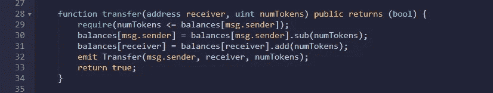

transfer() function

**transfer()** 函数将令牌传送到指定的地址。该函数还必须触发**传输事件**。我们使用 require 关键字**断言谓词**，这里我们断言变量 **numTokens** 应该小于或等于当前地址(发送者地址)的余额。

如果断言成功，我们从发送方地址中减去 numTokens 中的值，并将 numTokens 的值添加到我们需要传输令牌的地址中。

最后，我们发出**传输事件**，允许注册的监听器对其完成做出反应。

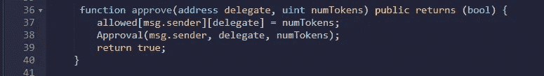

approve() function

**approve()** 函数通常在市场设置中使用。此功能批准在没有事先批准的情况下，在不使市场等待完成交易的情况下，撤回高达 numTokens 中的值的代币。一个**批准()事件**必须在函数结束时触发。

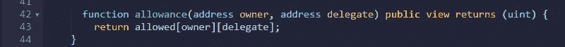

allowance() function

**allowance()** 函数返回代表地址允许从所有者地址提取的限额。

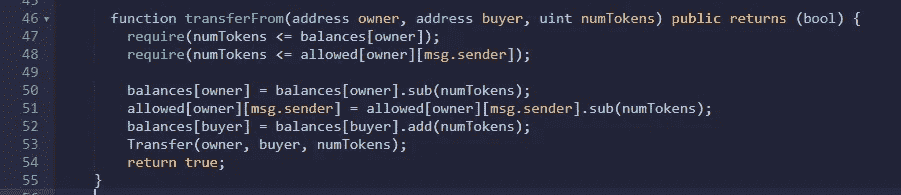

transferFrom() function

**transferFrom()** 功能允许被批准提款的代表将所有者资金转移到第三方账户。因此，我们断言 numTokens 应该小于或等于所有者帐户的余额以及所有者帐户批准的取款限额。如果断言成立，则进行令牌的传输。

我们已经完成了符合 ERC 20 协议的智能合同。然而，我们需要为我们的智能合同增加一点安全性。为此，我们使用了一个名为 **safemath** 的库。

# 安全数学库

这个库处理整数溢出攻击，黑客通过传递参数迫使合同使用不正确的数值，这些参数将使相关整数**超过它们的最大值**。

*SafeMath* 通过在执行算术运算之前测试溢出来防止这种情况，从而消除溢出攻击的危险。

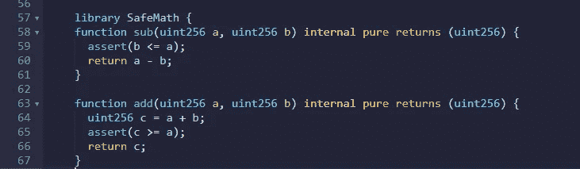

SafeMath

我们在上面定义的其他函数中使用这个 **sub** 和 **add** 函数，以确保它能够抵抗整数溢出攻击。

# 部署

为了部署智能合约，我使用了 **Rinkeby 测试网络**，在那里我可以将免费的测试醚放入我的 **Metamask** 钱包中。将环境设置为 **Injected Web3** 并设置令牌的总供应量。我设定 100 万代币为总供应量。

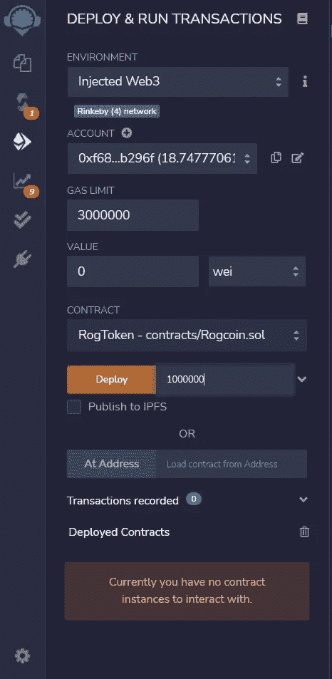

在 Rinkeby 测试网络上部署智能合约后，您可以使用 remix 本身与合约进行交互。

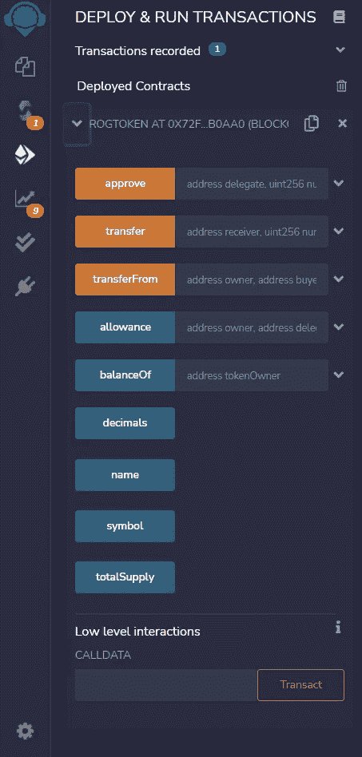

Interact with the smart contract

这是我们如何在区块链以太坊上编码我们自己的 ERC-20 兼容令牌的基本想法。使用像**openzeplin**这样的库来实现 ERC-20 令牌有更好的、经过实战检验的方法。您可以使用这些库来获得更好的安全性和高效的 ERC-20 令牌。

 [## OpenZeppelin |合同

### OpenZeppelin Contracts 通过使用经过战斗考验的智能合同库来帮助您最大限度地降低风险

openzeppelin.com](https://openzeppelin.com/contracts/) 

# 参考

 [## EIP-20:令牌标准

### 令牌的标准接口。以下标准允许实现令牌的标准 API

eips.ethereum.org](https://eips.ethereum.org/EIPS/eip-20)  [## 如何以简单的方式创建 ERC20 令牌

### 本文的目标是演示如何在尽可能短的时间内创建一个 ERC20 令牌。让我们从…开始吧

www.toptal.com](https://www.toptal.com/ethereum/create-erc20-token-tutorial)****