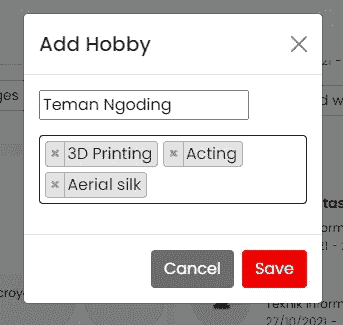

# Codeigniter 3 教程~使用多重选择 2 并以 json 格式保存

> 原文：<https://medium.com/geekculture/codeigniter-3-tutorial-using-multiple-select2-and-saving-with-json-format-a0da18abeea7?source=collection_archive---------5----------------------->


大家好，朋友们好，这次我们讨论的是 codeigniter 3 和 select2。在某些数据之后创建搜索数据时，Select2 对我们来说非常有用。在构建基于 web 的应用程序时，Select2 对开发人员非常有帮助。在我们继续之前，请[学习 Codeigniter 3 的基础知识。](https://temanngoding.com/category/tutorial/codeigniter/)

让我们直接进入介绍，如何在 Codeigniter 3 中使用 select2。

# 1.数据库ˌ资料库

用 sql 做一个用户和爱好的表格，朋友。表格结构如下所示。

**表用户**

```
CREATE TABLE `users` (
  `id` varchar(25) NOT NULL,
  `name` varchar(255) NOT NULL,
  `data_pro_hobby` text DEFAULT NULL COMMENT 'Data Format JSON',
) ENGINE=InnoDB DEFAULT CHARSET=utf8;
```

这个 users 表只是以 json 格式存储爱好数据的一个例子。

**爱好表**

```
CREATE TABLE `hobbies` (
  `id` varchar(25) NOT NULL,
  `data_name` varchar(255) NOT NULL,
) ENGINE=InnoDB DEFAULT CHARSET=utf8;
```

爱好表用于插入爱好数据。

# 2.控制器索引

这次，朋友们，制作一个控制器作为显示数据的功能。

```
public *function* index()
    {
        $data['name'] = $this->security->get_csrf_token_name();
        $data['hash'] = $this->security->get_csrf_hash();
        $data["hobby"] = $this->db->get_where('hobbies',array('status'=>1))->result();
        $this->display('index', $data);
        }

    }
```

# 3.查看爱好

接下来，我们为我们的爱好数据输入添加一个视图。

```
<div class="modal fade" id="modalHobby" role="dialog" aria-labelledby="Label" aria-hidden="true">
        <div class="modal-dialog modal-sm">
            <div class="modal-content">
            <div class="modal-header">
                <h5 class="modal-title" id="Lable">Add Hobby</h5>
                <button type="button" class="btn-close" data-bs-dismiss="modal" aria-label="Close">
                </button>
            </div>
            <form action="<?php echo base_url('user/profile/add_hobby/) ?>" method="post" role="form" enctype="multipart/form-data">
            <input type="hidden" name="<?php echo $CSRF['name']; ?>" value="<?php echo $CSRF['hash']; ?>"/>
            <input type="hidden" name="id" value="<?php echo $users->id ?>" />
            <input type="hidden" name="form" value="profile/setting" />
            <div class="modal-body">
                <div class="mb-3">
                <input type="text" name="name" class="form-controll">
                </div>
                <div class="mb-3">
                <select class="hobby w-100 form-select" name="hobbies[]" multiple="multiple" require>
                    <?php
					           if(!empty($hobby)){
					              foreach($hobby as $value){
						              echo "<option value='$value->id'>$value->data_name</option>";
					          }}
                    ?>
                </select>
                </div>
            </div>
            <div class="modal-footer border-top">
                <button type="button" class="btn btn-muted" data-bs-dismiss="modal">Cancel</button>
                <input type="submit" class="btn btn-danger" value="Save">
            </div>
            </form>
            </div>
        </div>
    </div>
```

所以下一步我们添加代码 select2。

```
<link rel="stylesheet" href="https://cdnjs.cloudflare.com/ajax/libs/twitter-bootstrap/4.5.0/css/bootstrap.min.css" integrity="sha256-aAr2Zpq8MZ+YA/D6JtRD3xtrwpEz2IqOS+pWD/7XKIw=" crossorigin="anonymous" />
<script src="https://cdnjs.cloudflare.com/ajax/libs/twitter-bootstrap/4.5.0/js/bootstrap.min.js" integrity="sha256-OFRAJNoaD8L3Br5lglV7VyLRf0itmoBzWUoM+Sji4/8=" crossorigin="anonymous"></script>
<script src="//ajax.googleapis.com/ajax/libs/jquery/1.9.1/jquery.js"></script>
<link href="https://cdnjs.cloudflare.com/ajax/libs/select2/4.0.3/css/select2.min.css" rel="stylesheet" />
<script src="https://cdnjs.cloudflare.com/ajax/libs/select2/4.0.3/js/select2.min.js"></script>
<script>	
$(this).find('.hobby').each(function() {
				var dropdownParent = $(document.body);
				if ($(this).parents('.modal.show').length !== 0)
					dropdownParent = $(this).parents('.modal.show');
				$(this).select2({
                    theme: "bootstrap5",
                    placeholder: '-Select Hobby-',
					dropdownParent: dropdownParent,
                    ajax: {
                        url: '<?php echo base_url();?>user/setting/searchhobby',
                        dataType: 'json',
                        delay: 250,
                        processResults: function (data) {
                            return {
                                results: data
                            };
                        },
                        cache: true
                    },
                    tags: true
                });
			});
</script>
```

上面代码的结果:



# 4.途径

添加运行 select2 和我们的数据存储的路由。

```
// Hobby
$route['user/setting/searchhobby'] = 'users_setting/searchHobby';
$route['user/profile/add_hobby/(:any)'] = 'users_profile/hobby_add';
```

# 5.控制器搜索数据爱好

```
function searchHobby()
    {
        $q = $this->input->get('q');
        $this->load->model('M_hobby');
        echo json_encode($this->M_setting->getHobby($q));
    }
```

# 6.模特爱好

```
<?php
class M_hobby extends CI_Model
{
    function __construct()
    {
        parent::__construct();
    }

    function getHobby($str)
    {
        $this->db->select('id, data_name as text');
        $this->db->like('data_name', $str);
        $query = $this->db->get('mst_hobbies');
        return $query->result();
    }
}
?>
```

# 7.控制器爱好

这次我们将创建一个函数来将我们的爱好数据保存到 users 表中。

```
/** add hobby */
    public function hobby_add()
    {
        $this->form_validation->set_rules('hobbies[]', 'hobby', 'trim|required');
        $name    = $this->input->post('name');
        $hobbies    = $this->input->post('hobbies');
		    if(!empty($hobbies)){
                $result = [];
                foreach($hobbies AS $key => $val){
                $hobby = $this->db->get_where('hobbies', array('id'=>$hobbies[$key]))->row();
                $result[] = array(
                    'hobby_id'          => $hobby->id,
                );
                }
        $contact['hobby'] = json_encode($result, true);
        $update = $this->db->update('users', $contact);
        }
        if($update == true){
            $this->session->set_flashdata('success', 'Account has been saved');
        }
        redirect('index');
    }
```

将 json 数据输出到用户表:

```
[{"hobby_id":"21090861384371A7E59"},{"hobby_id":"210908613842CA630B1"},{"hobby_id":"210908613842D26118E"},{"hobby_id":"210908613842D8F29B9"}]
```

这是我可以传达的指南，希望它对我所有的朋友都有用。

另请阅读其他教程:

[Codeigniter 4 教程~使用 ajax 加载更多内容](https://temanngoding.com/tutorial-codeigniter-4-load-more-menggunakan-ajax/)

[CodeIgniter 4 教程~ RESTful API JWT 认证](https://temanngoding.com/tutorial-codeigniter-4-restful-api-jwt-authentication/)

[从 Codeigniter URL 4 中移除 Public 和 Index.php](https://temanngoding.com/menghilangkan-public-dan-index-php-dari-url-codeigniter-4/)