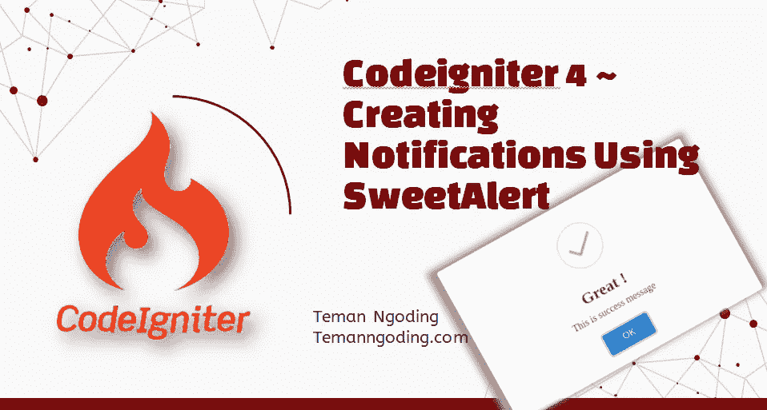
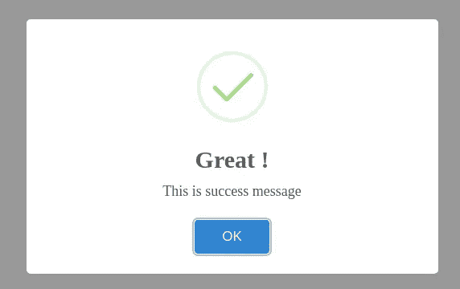
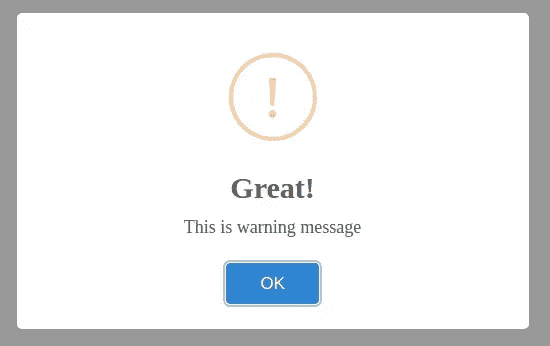
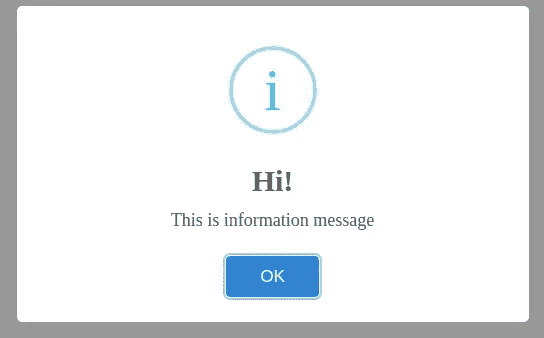
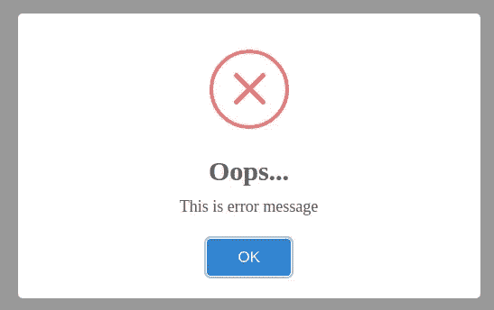

# Codeigniter 4 ~使用 SweetAlert 创建通知

> 原文：<https://medium.com/geekculture/codeigniter-4-creating-notifications-using-sweetalert-5bed070db499?source=collection_archive---------4----------------------->



你好，朋友们，我祝你们身体健康，永远成功。

这次我们将使用 SweetAlert 创建一个通知。您可以在此了解其他 codeigniter 4 教程:

[CodeIgniter 4 教程第 2 部分~ Rest Api CRUD Codeigniter 4](https://temanngoding.com/tutorial-codeigniter-4-part-2-rest-api-crud/)

[Codeigniter 4 教程~使用 ajax 加载更多内容](https://temanngoding.com/tutorial-codeigniter-4-load-more-menggunakan-ajax/)

CodeIgniter 教程 4 第 1 部分~ RESTful API JWT 认证

SweetAlert 是 jquery 的一个插件，用于在应用程序中生成通知。我假设我所有的朋友都能够安装 Codeigniter 4。框架。还没能做到的，请在这里学习。

# 必需的插件文件

**JS 文件**

```
[https://cdn.jsdelivr.net/npm/sweetalert2@9.17.2/dist/sweetalert2.min.js](https://cdn.jsdelivr.net/npm/sweetalert2@9.17.2/dist/sweetalert2.min.js)
```

**CSS 文件**

```
[https://cdn.jsdelivr.net/npm/sweetalert2@9.17.2/dist/sweetalert2.min.css](https://cdn.jsdelivr.net/npm/sweetalert2@9.17.2/dist/sweetalert2.min.css)
```

您需要使用 CSS 和 JS sweetAlert 来更改通知的外观。对于文档，可以在这里学习。[点击这里](https://sweetalert2.github.io/)。

# Jquery SweetAlert 插件实现

让我们按照以下步骤，使用 SweetAlert 创建一个示例应用程序。

**创建路线**

我们配置 Routes.php，它位于 **/app/config** 文件夹中。

```
//...$routes->get('notification', 'MessageController::showSweetAlertMessages');//...
```

**创建控制器**

```
$ php spark make:controller Message --suffix
```

从/app/Controllers 打开**MessageController.php**

```
<?phpnamespace App\Controllers;use App\Controllers\BaseController;*class* MessageController extends BaseController
{
	public *function* showSweetAlertMessages()
	{
		// Flash messages settings session()->setFlashdata("success", "This is success message"); session()->setFlashdata("warning", "This is warning message"); session()->setFlashdata("info", "This is information message"); session()->setFlashdata("error", "This is error message"); return view("sweetalert-notification");
	}
}
```

**创建刀片模板文件**

在/app/Views 文件夹中创建一个名为 sweetalert-notification.php 的文件。

```
<script src="https://code.jquery.com/jquery-3.5.1.min.js"></script>
<script src="https://cdn.jsdelivr.net/npm/sweetalert2@9.17.2/dist/sweetalert2.min.js"></script>
<link rel="stylesheet" type="text/css" href="https://cdn.jsdelivr.net/npm/sweetalert2@9.17.2/dist/sweetalert2.min.css"> <script>
$(*function*(){ <?php if(session()->has("success")) { ?>
        Swal.fire({
            icon: 'success',
            title: 'Great!',
            text: '<?= session("success") ?>'
        })
    <?php } ?>
});
</script>
```

下面是根据收到的信息显示通知的一些代码。

错误块

```
<script>
$(*function*(){

    <?php if(session()->has("error")) { ?>
        Swal.fire({
            icon: 'error',
            title: 'Oops...',
            text: '<?= session("error") ?>'
        })
    <?php } ?>
});
</script>
```

警告块

```
<script>
$(*function*(){ <?php if(session()->has("warning")) { ?>
        Swal.fire({
            icon: 'warning',
            title: 'Great!',
            text: '<?= session("warning") ?>'
        })
    <?php } ?>
});
</script>
```

信息块

```
<script>
$(*function*(){ <?php if(session()->has("info")) { ?>
        Swal.fire({
            icon: 'info',
            title: 'Hi!',
            text: '<?= session("info") ?>'
        })
    <?php } ?>
});
</script>
```

使用运行您的应用程序

$ php spark 服务

URL—[http://localhost:8080/notification](http://localhost:8080/notification)

**成功**



警告



信息



错误



这就是我这次可以传达的教程，希望有用。