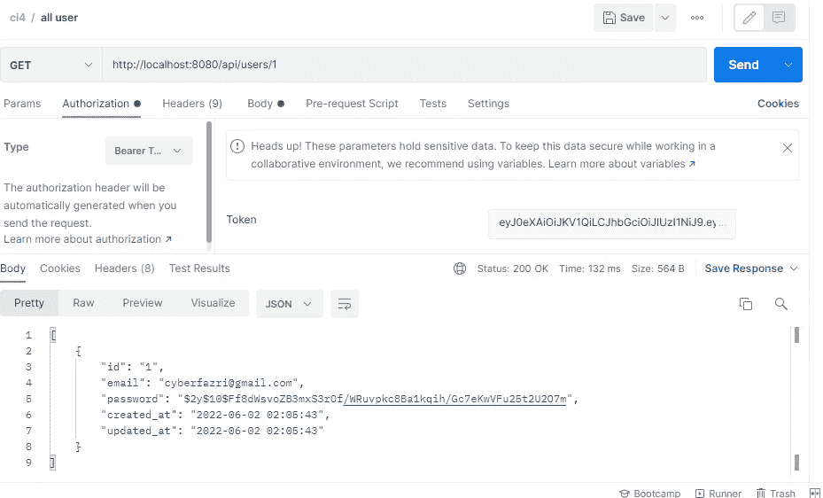
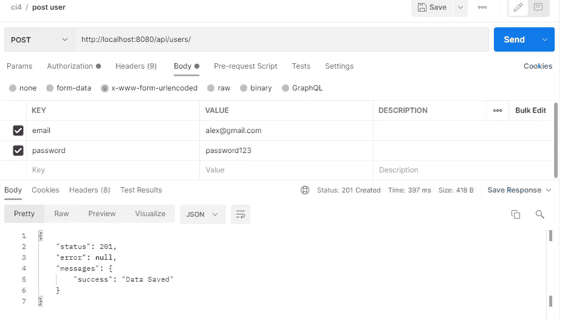
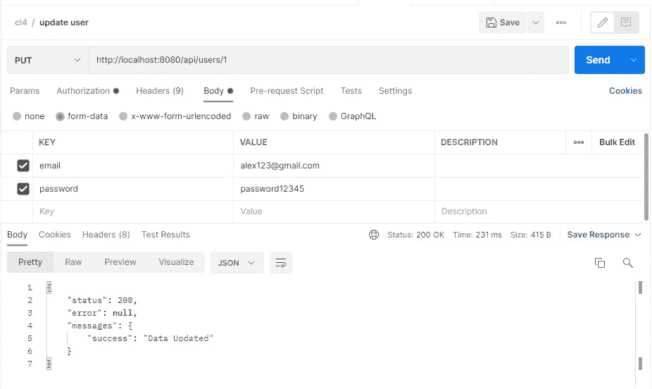
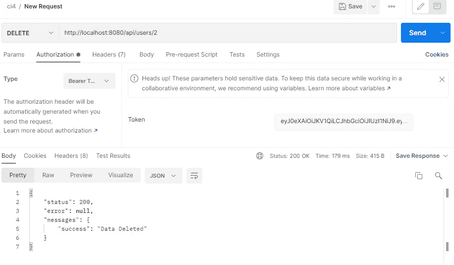

# CodeIgniter 4 教程第 2 部分~ Rest Api CRUD Codeigniter 4

> 原文：<https://medium.com/geekculture/codeigniter-4-tutorial-part-2-rest-api-crud-654ebbf49452?source=collection_archive---------5----------------------->


你好，你们都好吗，我希望你们都永远健康和成功。这次我们将讨论使用 Codeigniter 4 的 Rest API CRUD，之前我们讨论了使用 Codeigniter 4 的 Rest API 登录和注册。在我们继续这个讨论之前。请朋友们研究以前的教程。对于那些已经学习过之前教程的人，我们这次将继续我们的讨论。

我们将创建一个 Rest Api CRUD(创建、读取、更新、删除)用户。因为我们的用户表已经创建了它。而且我们会在邮差 app 里测试。

# CodeIgniter 4 教程第 2 部分~ Rest Api CRUD

*   步骤 1 —功能控制器
*   步骤 2 —设置路线
*   步骤 3-启动开发服务器

由于我们在上一个教程中创建了一个数据库，我们将直接为用户创建一个控制器。

# 步骤 1 —功能控制器

我们的第一步将是在我们已经创建的用户控制器上创建一些功能。

*   显示

```
public *function* show($id = null)
    {
        $model = new UserModel();
        $data = $model->getWhere(['id' => $id])->getResult();
        if($data){
            return $this->respond($data);
        }else{
            return $this->failNotFound('No Data Found with id '.$id);
        }
    }
```

*   创造

```
public *function* create()
    {
        $model = new UserModel();
        $data = [
            'email' => $this->request->getVar('email'),
            'password' => password_hash($this->request->getVar('password'), PASSWORD_DEFAULT)
        ];
        $model->insert($data);
        $response = [
            'status'   => 201,
            'error'    => null,
            'messages' => [
                'success' => 'Data Saved'
            ]
        ];
        return $this->respondCreated($response);
    }
```

*   更新

```
// update product
   public function update($id = null)
    {
        $model = new UserModel();
        $input = $this->request->getRawInput();
        $data = [
            'email' => $this->request->getVar('email'),
            'password' => password_hash($this->request->getVar('password'), PASSWORD_DEFAULT)
        ];
        $model->update($id, $data);
        $response = [
            'status'   => 200,
            'error'    => null,
            'messages' => [
                'success' => 'Data Updated'
            ]
        ];
        return $this->respond($response);
    }
```

UserController 控制器方法将按如下方式工作:

Index() —用于检索所有用户。
create() —这个方法用于将用户信息插入到数据库表中。
update() —这用于验证服务器端表单数据，并将其更新到 MySQL 数据库中。
show() —该方法用于将单个用户信息提取到 DB 表中。
delete() —该方法用于从 MySQL 数据库中删除数据。

# 步骤 7-设置路线

要定义路由，请访问 app/Config/目录并打开 Routes.php 文件。然后向其中添加以下路线:

```
$routes->group('users', ['filter' => 'authFilter'], *function*($routes) {
        $routes->get("/", "User::index");
        $routes->get("(:any)", "User::show/$1");
        $routes->post("/", "User::create");
        $routes->put("(:any)", "User::update/$1");
        $routes->delete("(:any)", "User::delete/$1");
    });
```

# 步骤 8-启动开发服务器

在命令提示符或终端中运行以下命令，启动 codeigniter 4 应用程序:

```
php spark serve
```

访问您的 web 浏览器并输入以下 url:

```
http://localhost/demo/

OR

http://localhost:8080/
```

接下来，打开 postman app 调用上面创建的 API，如下:

1:从 DB 表中获取所有产品信息，您可以使用从 postman 获取所有用户信息 api 调用所有数据，如下所示:


2:如果你想获得单个用户的信息，你可以在邮差应用程序中使用以下内容:



3:要将新的用户数据插入到 DB 表中，可以调用 create api，如下所示:



4:要使用 api 将数据更新到 DB 表，可以调用数据修饰符 info api，如下所示:



5:要使用 codeigniter api 删除用户数据，可以如下调用 delete api:



使用 Codeigniter 4 创建 CRUD API 非常容易。

这是我这次做的教程，希望对我所有的朋友都有用。

谢了。

# 其他推荐教程:

[CodeIgniter 教程 4 第 1 部分~ RESTful API JWT 认证](https://temanngoding.com/tutorial-codeigniter-4-restful-api-jwt-authentication/)

[Codeigniter 4 教程~登录注册](https://temanngoding.com/tutorial-codeigniter-4-login-dan-register/)

[Codeigniter 4 教程~使用 ajax 加载更多内容](https://temanngoding.com/tutorial-codeigniter-4-load-more-menggunakan-ajax/)

从 Codeigniter URL 4 中删除公共和 Index.php