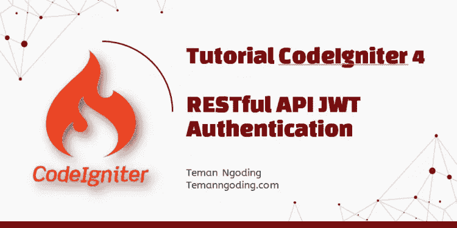
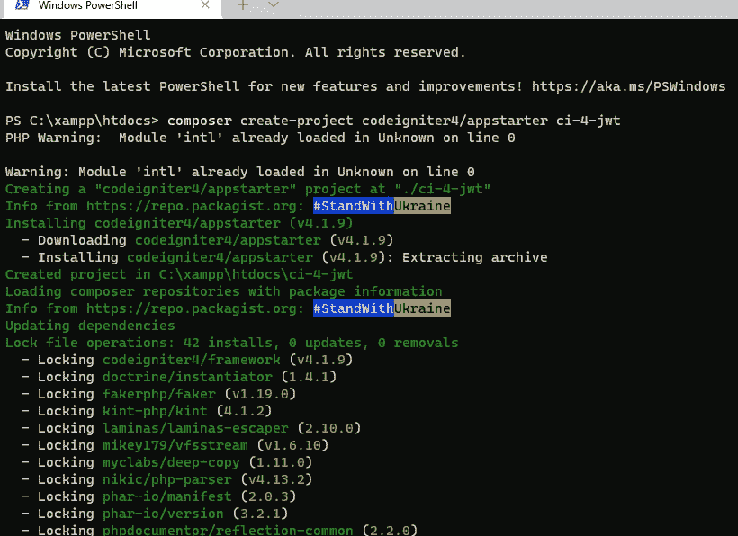
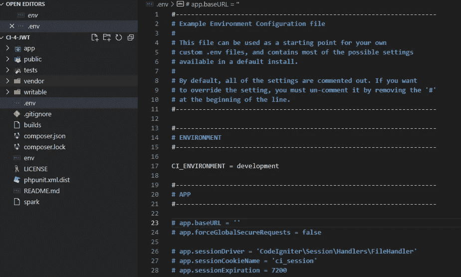
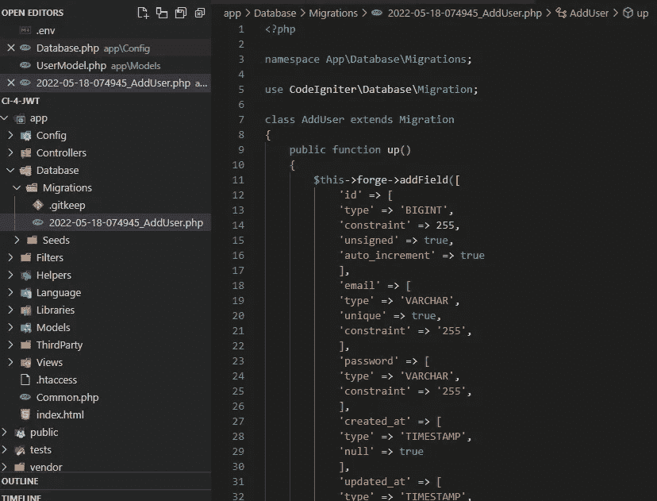
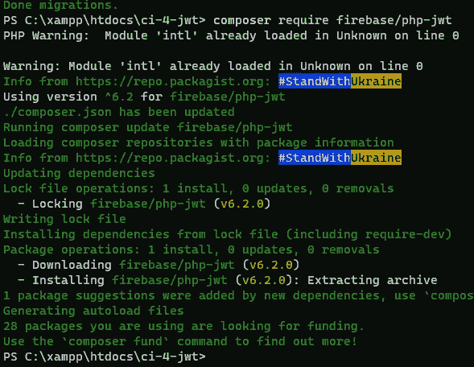
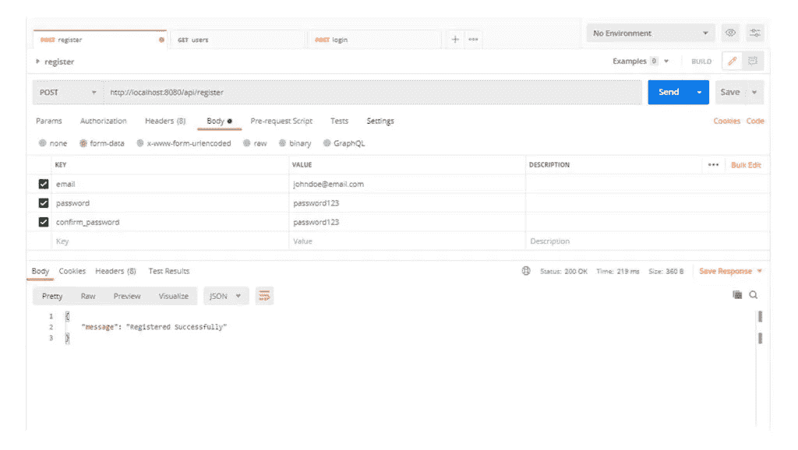
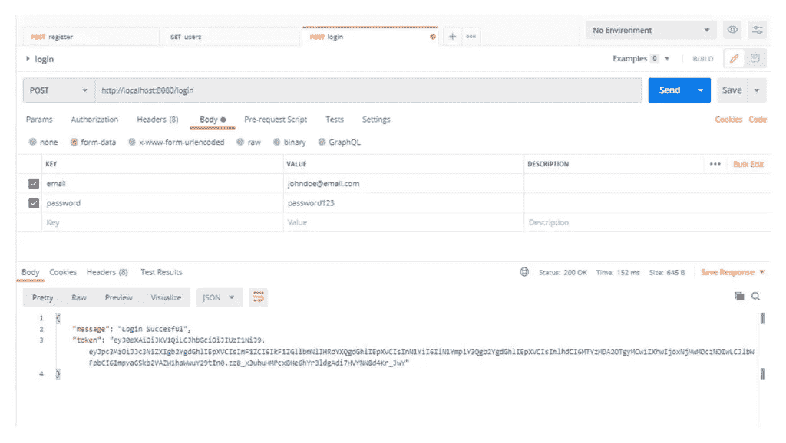
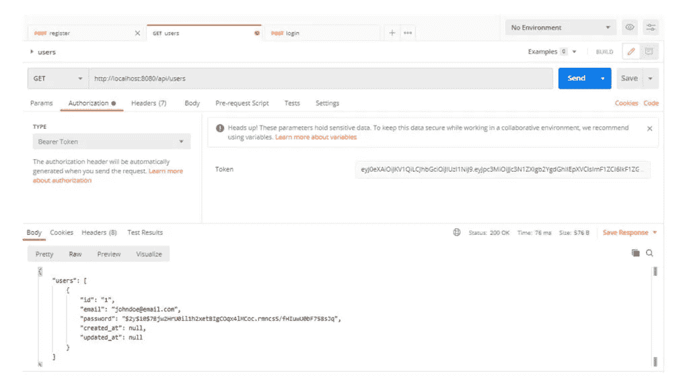

# CodeIgniter 4 教程第 1 部分~ RESTful API JWT 认证

> 原文：<https://medium.com/geekculture/codeigniter-4-tutorial-restful-api-jwt-authentication-d5963d797ec4?source=collection_archive---------0----------------------->



朋友们，你们好，这次我们将讨论带 JWT 认证的 Restful API。在之前的 Codeigniter 4 教程中，我们讨论了使用 Codeigniter 4 登录和注册[。](https://temanngoding.com/tutorial-codeigniter-4-login-dan-register/)

在我们继续之前，我们将讨论什么是 API 和 JWT。

# 喜欢看视频的可以访问我的视频 here Rest Api 登录并注册 Codeigniter 4:

API 代表应用程序接口，API 是允许应用程序交换数据的接口。更清楚地说，API 是程序员可以用来构建软件和应用程序的函数集合。

JWT 代表 JSON Web Token，它是一个开放标准(RFC 7519 ),定义了一种紧凑的自包含方式，以 JSON 对象的形式在各方之间安全地传输信息。JWT 通常用于授权、信息交换等。

现在我们将创建应用程序。

# 步骤 1:安装 CodeIgniter 4

通过编写器安装:

```
composer create-project codeigniter4/appstarter ci-4-jwt
```



# 步骤 2:更改 CodeIgniter 环境

环境。CodeIgniter 默认为 production，这是一个为应用程序增加安全性的安全特性。接下来，我们将 env 文件的名称改为。给你的环境添加一个句号。重命名后，打开。env 文件，我们将更改一些命令。

。包封/包围（动词 envelop 的简写）

```
CI_ENVIRONMENT = development
```



# 步骤 3:配置数据库

设置完 env 之后，它将配置数据库。您可以在中配置它。在本教程中，我们将在 app/Config/Database.php 中配置它。

***app/Config/database . PHP***。

# 步骤 4:建模和迁移

模型-表示数据库表的类。

迁移——类似于数据库的版本控制，允许我们更改数据库模式并与您的团队共享。

在终端或 CMD 中运行以下命令来创建模型:

```
php spark make:model UserModel
```

在 app/Models/UserModel.php 中打开创建的模型，在文件中可以看到配置选项，可以阅读文档了解更多关于配置选项的信息。现在我们将更新配置:

***app/Models/user model . PHP***

创建模型后，我们将创建迁移文件。

在终端或 CMD 中运行以下命令来创建迁移:

```
php spark make:migration AddUser
```

打开在 app/Database/Migrations/中创建的迁移文件，并粘贴以下代码:



通过执行`migrate`命令运行迁移:

```
php spark migrate
```

# 步骤 5:安装 JWT 软件包

然后我们将使用 composer 安装 jwt 包:

```
composer require firebase/php-jwt
```



安装 jwt 包后，将 JWT_SECRET 添加到。环境。文件

***。env***

```
#--------------------------------------------------------------------
# JWT
#--------------------------------------------------------------------
JWT_SECRET = 'JWT SECRET KEY SAMPLE HERE'
```

# 步骤 6:创建控制器

控制器是负责接收请求和返回响应的人。

在终端或 CMD 中运行该命令创建一个控制器:

运行该命令后，会在 app/Controllers 中创建一个文件。打开文件并输入以下代码:

***app/Controllers/log in . PHP***

***app/Controllers/register . PHP***

***app/Controllers/user . PHP***

# 步骤 7:创建控制器过滤器

过滤器控制器是一个类，它允许我们在一个动作执行之前或之后执行它。

我们现在将创建一个过滤器，用于检查请求是否被允许以及是否有授权。在终端或 CMD 中运行以下命令:

```
php spark make:filter AuthFilter
```

运行该命令后，它将在 app/Filters 中创建一个文件。打开该文件并输入以下代码:

创建过滤器后，我们必须将其添加到 app/Config/Filters.php 中的过滤器配置中。

***app/Config/filters . PHP***

# 步骤 8:注册路由

打开 app/Config/Routes.php 中的配置文件并注册该路由:

```
$routes->group("api", function ($routes) {
    $routes->post("register", "Register::index");
    $routes->post("login", "Login::index");
    $routes->get("users", "User::index", ['filter' => 'authFilter']);
});
```

# 步骤 9:运行应用程序

既然我们已经完成了上述步骤，现在我们将运行应用程序。要运行该应用程序，请运行以下命令:

```
php spark serve
```

# 截图:

***/API/寄存器***



***/API/登录***



***/API/用户***



这是我可以传达的指南，希望它对我所有的朋友都有用。谢谢你访问我的博客。

不要忘记访问其他教程:

[从 Codeigniter URL 4 中删除公共和 Index.php](https://temanngoding.com/menghilangkan-public-dan-index-php-dari-url-codeigniter-4/)

[Codeigniter 4 教程~登录注册](https://temanngoding.com/tutorial-codeigniter-4-login-dan-register/)

# 谢谢你。