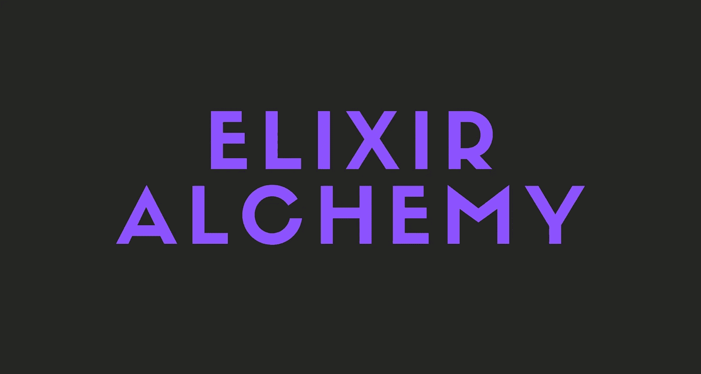

# 用长生不老药和炼金术编写一个不和谐机器人

> 原文：<https://medium.com/geekculture/coding-a-discord-bot-using-elixir-and-alchemy-cb2ca41b397c?source=collection_archive---------8----------------------->

灵药和炼金术入门指南。



在这个故事中，你将学习如何使用**仙丹**和 [**炼金术**](https://github.com/cronokirby/alchemy) 制作一个简单的不和谐机器人。

## 注意:

我不会在这里解释什么是长生不老药。如果你想了解更多关于仙丹的知识，一定要看看我的故事。

[](https://alimarslank.medium.com/what-is-elixir-3f6a96d8f642) [## 什么是仙丹？

### 什么是仙丹，为什么它很牛逼？

alimarslank.medium.com](https://alimarslank.medium.com/what-is-elixir-3f6a96d8f642) 

开始吧！

# 创造我们的机器人

以下是创建不和谐机器人的步骤。

1.确保您已登录到 [Discord 网站](https://discord.com/)。

2.导航至[应用程序页面](https://discord.com/developers/applications)。

3.单击“新建应用程序”按钮。

4.为应用程序命名，然后单击“创建”。我把我的机器人命名为 Allybot。

5.转到“机器人”选项卡，然后单击“添加机器人”。你必须通过点击“是，做它！”来确认

6.保留**公共 Bot** (选中)和**需要 OAuth2 代码授权**(未选中)的默认设置。

7.您的机器人已经创建。下一步是复制令牌。

这个令牌是你的机器人的密码，所以不要与任何人分享。它可以让某人登录你的机器人，做各种坏事。

顺便说一下，如果令牌意外地被共享，您可以重新生成它。

8.将令牌保存在某个地方，当我们开始编写机器人代码时，您将需要它。

# 编写我们的机器人

是时候写一些代码了！但是首先，我们必须初始化一个新项目。

## 初始化我们的项目

```
mix new allybot --sup
```

该命令将创建一个在主管下运行的新的 Elixir 应用程序。很简单，对吧？还有，你不一定要把你的机器人命名为“allybot”。你想怎么改都行。

您可以按照自己的意愿清理生成的项目。只要确保不删除除了`test`文件夹之外的任何内容。

## 添加炼金术

让我们在项目中加入炼金术。

打开你的`mix.exs`文件，在`deps`中添加下面的一行。

```
{:alchemy, "~> 0.7.0", hex: :discord_alchemy}
```

这是目前最新的炼金术版本。请务必检查炼金术文档，看看是否有任何新版本。

之后打开`lib/allybot/application.ex`，确保看起来像下面的代码。

这基本上是使用令牌启动您的 bot 并加载命令模块。

## 命令模块

让我们创建我们的命令模块。

在`lib`文件夹中创建一个名为`commands.ex`的新文件，并在其中添加以下代码。

该命令基本上会侦听“！乒”消息，然后用“乓！”。

但是如果你现在运行这个机器人，它将会失败。为什么呢？

因为我们还没有创建一个配置文件和我们的令牌，当然！

## 配置

让我们现在添加我们的配置。

创建一个名为`config`的文件夹，并在该文件夹中创建一个名为`config.exs`的文件。

然后在`config/config.exs`里面，添加下面的代码。

这就是我们如何在 Elixir 中设置配置变量。

最后一步是实际设置环境变量。为此，请在您的终端内部运行下面的命令。

```
export BOT_TOKEN=<your-bot-token>
```

就是这样！您现在可以运行您的 bot 并测试我们的 ping 命令。

# 最后的想法

你已经学会了炼金术的基础。我希望你能从这个故事中学到一些新的东西。

如果你想学习更多关于炼金术的知识，一定要看看它的文档。

# 仅此而已。感谢您阅读这个故事！

如果你喜欢这个故事，一定要为它鼓掌！你想问我什么都可以。

在 Twitter 上关注我:

[](https://twitter.com/Re_allyedge) [## re _ ally 边缘

twitter.com](https://twitter.com/Re_allyedge) 

在 Patreon 上支持我:

[](https://www.patreon.com/allyedge) [## 阿里木阿尔斯兰卡亚是创造编程故事和教程。帕特里翁

### 今天就成为阿里木阿尔斯兰卡亚的赞助人:在世界上最大的…

www.patreon.com](https://www.patreon.com/allyedge)