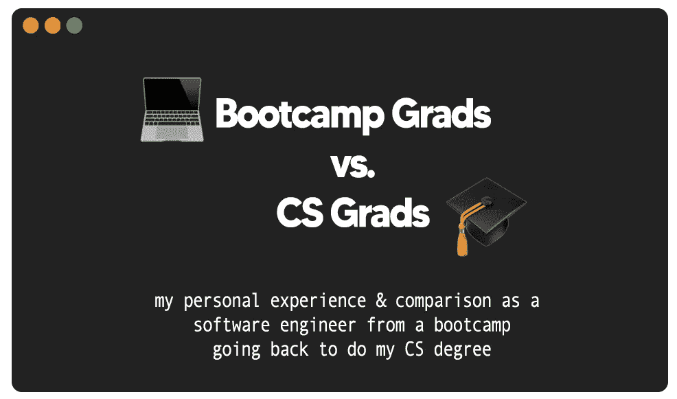

# 编码训练营与计算机科学毕业生

> 原文：<https://medium.com/geekculture/coding-bootcamps-vs-comp-science-grads-e16b5a246aaa?source=collection_archive---------4----------------------->

那是 2020 年，在暴风骤雨般的冠状病毒的笼罩下，你要么会听到有人失业，要么即将失业。

我和我的朋友们每周都在 Zoom 上“聚会”,度过孤独的风暴，抗击隔离孤独的病毒。

然而，我的朋友(让我们称他为吉米)在聚会上几乎不存在，声称他是…