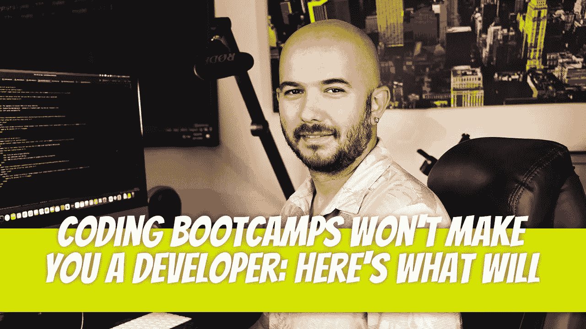

# 编写训练营的代码不会让你成为一名开发人员:这里有一些有用的东西

> 原文：<https://medium.com/geekculture/coding-bootcamps-wont-make-you-a-developer-here-s-what-will-help-b7d4a4d460e9?source=collection_archive---------2----------------------->

最近有一段时间，每个人都想快速学习编码。人们会来找我，向我寻求关于学习编码的指导，并为此参加为期 12 到 20 周的训练营。这段时间足够学习编码吗？我完成训练营后能找到工作吗？分别是和不是。成为开发者的时间还不够，但是…