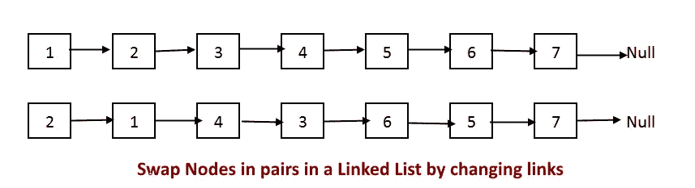

# 编码挑战:交换链表中的节点和成对交换节点

> 原文：<https://medium.com/geekculture/coding-challenge-swapping-nodes-in-a-linked-list-and-swap-nodes-in-pairs-6ad5513de6ce?source=collection_archive---------32----------------------->

在今天的文章中，我们把它扔回到我们学过的第一个数据结构；链接列表。参见[这里](https://javascript.plainenglish.io/linked-list-implementation-in-javascript-ca0d3038f797)复习链表以及如何用 JavaScript 实现你自己的链表。现在我们已经有了一些 LeetCode 练习和一些简单+中等的问题，我认为这是复习的好时机，涵盖一些比*“反转链表”更具挑战性的问题*

链表的基础是:

*   它们是一个简单的数据结构，由一段数据和一个' **next'** 指针组成。
*   它们是单向的，只能通过下一个指针遍历。
*   根据插入/移除的位置，插入和移除的运行时间为 O(1)。
*   在链表中搜索和访问需要 O(n)运行时间

## 问题 1:

*'给定一个链表，交换每两个相邻的节点并返回头'*-不要修改节点的值，只修改节点本身的指针。

现在看起来很简单，如果给我们一个`[1, 2, 3, 4]`的链表，我们希望返回类似于`[2, 1, 4, 3]`的东西。但是对于这些代码挑战来说，说起来容易做起来难。

我们的基本策略如下:

1.  声明头的两个副本(头是输入链表的根)。我们称一个为电流，另一个为结果。
2.  使用 while 循环，我们将遍历执行交换的链表。
3.  在 while 循环中，我们将声明另外两个变量，next 和 temp。这两个变量将利用我们的逻辑来执行交换。
4.  一旦 while 循环条件不再满足`(current && current.next)`，我们将返回结果，它应该是原始头的副本。

核心逻辑发生在第 30–38 行的 while 循环中。当问题归结起来，链表问题归结为指针的管理。我仍然经常感到困惑，但这就是为什么我们每天都练习提高一点。

## 问题二:

现在我们已经完成了第一个问题，让我们看看下面的内容:

给你一个链表和一个整数 n 作为输入。在交换列表开头的第 n 个节点和末尾的第 n 个节点后，返回链表的头。

请参见下面的示例进行说明。

给定:`[1,2,3,4,5] and n = 2`

预期:`[1,4,3,2,5]`

我们现在选择并交换 2 个节点值，而不是每隔一个节点交换一次，这 2 个节点值距离列表的开头和结尾有 *n* 个节点。

解决这个问题的策略如下:

*   申报 3 份人头，*克隆，第一，*，第二*。*
*   我们将使用的第一个循环是 for 循环，条件是:`for (let i = 1; i < n; i++){}` *。*在这个循环中，我们将向下遍历*克隆*和*第二个*列表副本。在这个循环的末尾，我们将距离开始处 n 个节点，而 *second.value* 就是我们要找的。
*   下一个循环将是 while 循环，因为我们不知道输入列表是什么。条件:`while(clone.next){}`。在这个循环中，我们现在将继续遍历*克隆*副本以及*第一个*副本。一旦*副本*克隆到达末尾，第一个克隆*将距离列表末尾 n 个节点，因为我们确保*克隆*副本在第一个循环中领先 n 个节点。我们现在可以先取*. value*,并用它来进行我们的交换。*
*   这个问题的最后一部分是执行一个简单的交换并返回原来的头。

解释有点罗嗦——但是请花点时间回顾一下 swapK 函数中的逻辑。我使用了一个虚拟列表，为我的另外两个副本指明了方向。一旦我获得了我需要转换的值，就在第 44–46 行进行了简单的交换，我返回了原来的头。

感谢你本周和我一起复习一些中级链表的问题。请务必留下你的方法和任何意见或 calps 非常感谢！