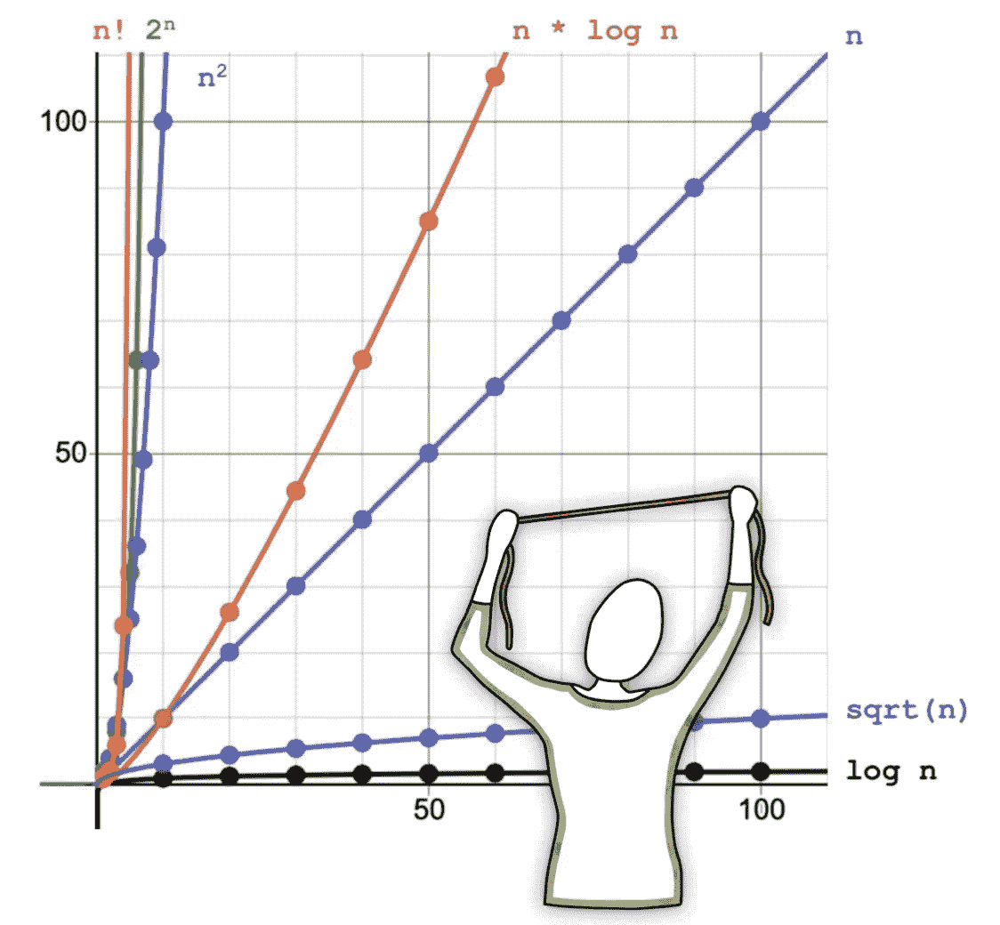
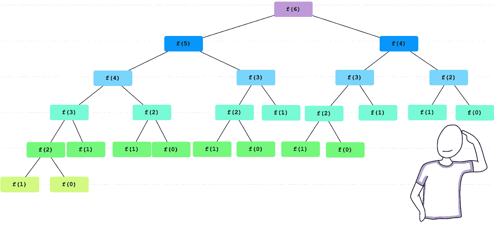
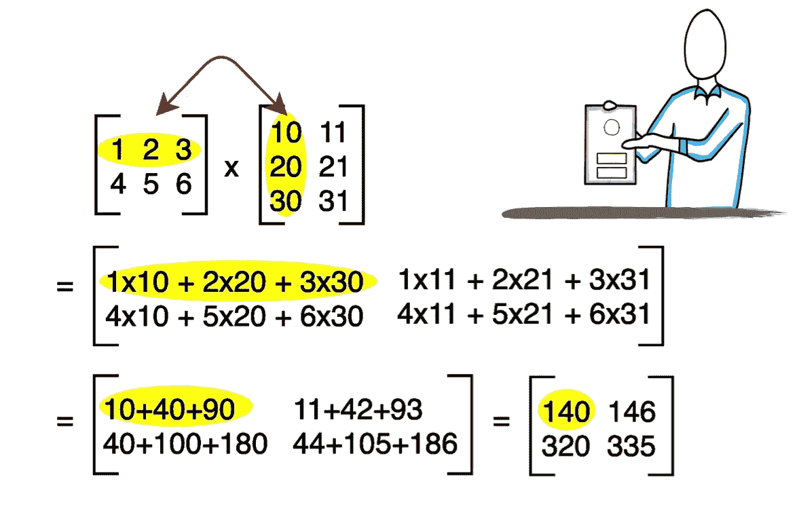

# 编码面试:简而言之的大 O 符号

> 原文：<https://medium.com/geekculture/coding-interview-big-o-notation-in-a-nutshell-23cc641594b1?source=collection_archive---------27----------------------->


Photo by [Chaitanya Tvs](https://unsplash.com/@tvschaitanya?utm_source=medium&utm_medium=referral) on [Unsplash](https://unsplash.com?utm_source=medium&utm_medium=referral)

**大 O** 符号将算法的**复杂度**描述为输入大小的函数。复杂性可能与性能(运行时复杂性)或空间(使用的内存量)有关。

**大 O** 是给定函数的最坏情况**或增长上限**的渐近符号。这不是找到一个确切的值，而是尽可能接近地描述最坏的情况。举个例子，

*   **打印 N 个元素的数组的所有元素**，需要 **O(N)** 时间，并且
*   **在一个有 N 个元素的数组中线性搜索一个元素**也是 **O(N)** 。

为什么？因为最坏的情况是在搜索时进行 N 次比较，一次检查每个元素，就像我们在打印时一样。

图 1 显示了输入大小从 0 到 100 的大 O 的典型值，这只是一个示例。可以注意到，很明显我们有三个区域:即使输入大小值很高也保持低的大 O，即使输入大小值很低也保持高的大 O，以及*几乎*随着输入大小的增加而线性增长的大 O。

现在，问题是如何计算给定一个算法源代码的大 O？让我们关注运行时复杂性，即性能。以下部分描述了各种可能性。



**Figure 1**. Typical values for Big O. X-axis represent the size of the input. Y-axis represents Big O function values. O(log n) is considered a good complexity. O(n) is fair. O(n log n), O(n²), and so are bad.

## 1.大 O 表示说明和条件

第一，**大 O** 对于一个指令，包括条件句，是一个常量 **O(1)** 。下面的算法(例 1)复杂度为 **O(1)** 。

```
// Example 1
void sayHello () {
  System.out.**println** ("Hello!");
}
```

同样的规则也适用于条件。下面的方法(示例 2)具有恒定的复杂度。为了实用，即使我们有两条指令，复杂度也是 **O(1)** 。

```
// Example 2
void isEven (int number) {
  if (**number % 2 == 0**) {
    System.out.**println** ("It is even!");
  }
}
```

> 关键思想: **O(1)** 典型为简单指令，包括条件。

## 2.大 O 代表循环

循环的大 O 回答问题，循环体将运行多少次。一个简单的例子运行 n 次，比如下面的算法(例子 3)具有复杂度 **O(n)**

```
// Example 3
void printNumbers() {
  for (int **i=0**; **i<n**; **i++**) {
    System.out.println(i); 
  }
}
```

> 关键思想: **O(n)** 是简单单循环的典型。

## 3.运行时删除常量和非主导术语

一个结合了指令和各种独立循环的算法怎么样呢，比如下面的例子(例 4)？

```
// Example 4
void doThis () {  
  **// sinlge instruction**
  System.out.println("Hello World!");
  **// condition**
  if (input % 2 == 0) {
    System.out.println("This is even!"); 
  }
  **// loop 1**
  for (int i=0; i < n; i++) {
    System.out.println(i); 
  }
  **// loop 2**
  for (int i=0; i < n; i++) {
    System.out.println(i); 
  }
}
```

如果你正在考虑增加，你是对的。描述运行时间的等式可能类似于(1 + 2 + n + n)或(3 + 2*n)。但是，在代表大 O 时，请记住以下关键观点:

*   **删除常量**。例如，O(2*n)是 O(n)
*   **删除非主导术语**。例如，O(1 +n)变成 O(n)，O(n +n)变成 O(n)，或者 O(n+ log n)变成 O(n)等等。

因此，我们的代码(例 4)只是 **O(n)。**

另一个例子，考虑一个如下的循环(例子 5 ),它不以 1 递增:

```
// Example 5
void doThis () {  
  for (int i=0; i < n; **i=i+2**) {
    System.out.println(i); 
  }
}
```

它运行了 n/2 次，所以它的复杂度是 O(n/2)或 O(0.5 * n)，但是在应用了我们的规则(**去掉常数)，**之后，对于之前给出的代码(示例 5)，我们的复杂度是 **O(n)** 。

> 关键思想:使用**加法**来组合算法复杂性的不同部分，但是**去掉常数**和**非主导项。**

## 4.改变问题空间的循环的运行时大 O

对于像二分搜索法这样的搜索算法，大 O 怎么样？

```
// Example 6
int binarySearch(int[] sortedArray, int key, int low, int high) {     
  int index = Integer.MAX_VALUE;          
  while (**low <= high**) {         
    int mid = (low + high) / 2;         
    if (sortedArray[mid] < key) {             
      **low** = mid + 1;         
    } else if (sortedArray[mid] > key) {             
      **high** = mid - 1;         
    } else if (sortedArray[mid] == key) {             
      index = mid;             
      break;         
    }     
  }     
  return index; 
}
```

这只是一个循环，但是你要记住，在每次迭代中，问题空间中的元素数量会减半。一个数可以减半多少次？答案是 **log n.** 例如，一个大小为 10 的数组将开始比较 5 中的元素，然后是 2，然后是 1。这是一个运行 3 次的循环。由此， **O (log n)。我们正在讨论以 2 为底的对数。然而，对数底数并不重要，因为以“*a”*为底数的对数和以“*b”*为底数的对数之差是一个常数值。是的，logₐn=·k·logᵦn.和我们在表达大 o 的时候去掉了常数**

> 数学笔记:**logᵦn=logₐ*b/*logₐn***。*

一个类似的例子如下所示(例 7)，注意变量在循环中是如何变化的

*   如果 n=5，那么它将打印 2，然后停止
*   如果 n=10，那么它将打印 2，9，然后停止
*   如果 n=20，那么它将打印 2，9，16，然后停止
*   如果 n=30，那么它将打印 2，9，16，25，然后停止

诸如此类。它运行的次数等于数字 *x* 的次数，因此 *x* *< n* 。这听起来像平方根的定义！没错，这是 **O(√n)**

```
// Example 7
public void method (int n) {
  for (int x = 2; **x * x < = n**; x++) {
    System.out.println (x);
  }
}
```

> 注意: **O(log n)** 是在每次迭代中问题空间减半的典型算法。
> 
> 注意:仔细检查循环中的停止条件。他们不总是 O(n)；您可以确定其他值，包括 **O(√n)。**

## 5.递归算法的运行时大 O

递归实现的大 O 类似于循环的大 O。它回答了肉体会被执行多少次的问题。简单的递归函数有一个大 O，就像它们的循环版本一样。例如，如下所示的递归阶乘(例 8)将运行 n 次；因此，它是 **O(n)。**

```
// Example 8
public long **factorial**(int n) {
    if (n <= 2) {
        return n;
    }
    return n * **factorial**(n - 1);
}
```

如果有不止一个递归调用，比如在下面显示的经典递归 Fibonacci 数计算中(示例 9)，会怎么样呢？

```
// Example 9
int **fibonacci** (int n) {
    if (n <= 1)
        return n;
    return **fibonacci**(n-1) + **fibonacci**(n-2);
}
```

它将创建一棵树。一个调用可以完成两个，这两个调用中的每一个都可以完成自己的两个调用，以此类推。它将创建一棵树，如图 2 所示。



**Figure 2.** Recursive calls when calculating Fibonacci of 6.

因此，树中的每个节点代表函数运行的总次数。树中的节点总数是 1 + 2 + 4 + 8 … 2 **ᵈ-** ，其中 *d* 是树的深度。它是一个几何级数，有一个方程可以求解。

> 数学笔记:**b⁰+ b+ b+ b…bᵈ- =(bᵈ-1)/(d-1)**

因此复杂度是(Bᵈ -1) / (d-1)。然而，我们放弃常数；结果是:对于一个进行多次调用的递归函数，大 o 通常是像 **O(B ᵈ)** 这样的东西，其中 b 是每次调用的分支数，d 是递归树的深度。在上面的例子中(例子 9)，每个调用创建两个分支，深度是 6。因此，我们的递归斐波那契有一个 **O(2ⁿ).请记住，我们表达的是最坏的情况，也就是树拥有所有节点的情况。**

下面代码的运行时大 O 怎么样(例 10)？

```
// Example 10
int **sum** (Node node) {
  if (node == null) 
    return 0;
 return **sum** (node.left) + node.value + **sum** (node.right);
}
```

有点棘手。分支机构每次调用 2 个；因此， *B=2* 。深度呢？嗯，这看起来像是一个树的方法，那么问题是，有一个 n 个节点的树，树的深度是多少？答案是 *d=log n* 。因此，B ᵈ = n。在这种情况下，我们的算法是 **O(n)** 。等等，如果所有的节点都插在不同的层次，所以形成一条线呢？那也是 **O(n)。**

> 注意:O **(B ᵈ)** 常见于你有一个递归函数，每次进行多次调用(分支)。

## 6.嵌套循环的运行时大 O

嵌套循环很有趣。例如，下面显示的冒泡排序算法实现的大 O 是什么？对于具有 n 个元素的数组，第一个循环运行 n 次，每次执行外部循环时，内部循环运行 **n** 次，因此 **O(n*n)** 或 **O(n )**

```
// Example 11
void **bubbleSort**(int[] arr) {
  for (int **k** = 0; k < **arr.length** - 1; k++) {
    for (int i = 0; i < **arr.length - 1 - k**; i++) {
      if (arr[i] > arr[i + 1]) {
        swap(arr, i, i + 1);
      }
    }
  }
}
```

您可能已经注意到了-k，并认为内部循环不会运行 n 次。第一次会运行 n 次，然后 n-1，n-2，n-3，n-4 等等。因此，代码执行的总次数不是 n * n，而是 n + (n-1) + (n-2) + (n-3) + …+ 1.

> 数学笔记: **n + (n-1) + (n-2) + (n-3) + …。+ 1 = n* (n-1) / 2**

通过去掉常数和非主导项，得到 **O(n)。**

如果我们有两个，比如在典型的矩阵乘法代码中，而不是一个数组，如下所示(图 12)，会怎么样？

```
// Example 12
public static int[][] multiplication(int[][] A, int[][] B) {
  int[][] C = new int[A.length][B[0].length];
  for (int i = 0; **i < A.length**; i++) {
    for (int j = 0; j < **B[0].length**; j++) {
      C[i][j] = 0;
    }
  }
  for (int i = 0; i < **A.length**; i++) { 
    for (int j = 0; j <  **B[0].length**; j++) {
      for (int k = 0; k < **A[0].length**; k++) {
        C[i][j] += A[i][k] * B[k][j];
      }
    }
  }
  return C;
}
```

有两个部分；首先，结果矩阵被初始化为零。该部分的执行次数等于矩阵 A 中的行数乘以矩阵 b 中的列数。它运行的次数等于矩阵 A 中的行数乘以矩阵 B 中的列数乘以矩阵 A 中的列数。图 3 突出显示了矩阵乘法的步骤，以供参考。



Figure 3\. Example of matrix multiplication step-by-step.

因此，O(aᵣ*b𝒸 + aᵣ*b𝒸*a𝒸).然而，由于我们丢弃了非主导项，所以它是 **O(aᵣ*b𝒸*a𝒸)** 。一个关键的想法是，我们可以有不止一个输入，因此不止一个变量控制大 O 方程。要知道这不是 n 或者 n

> 注意:在处理嵌套循环时，要注意输入。可能有 O(n*n)的情况，即 O(n)，或者有多个输入的情况，如 **O(n*m)** 。他们不一样。

## 6.循环和递归的运行时大 O

如果我们把循环和递归放在一起呢？复杂性与我们之前评估的并没有太大的不同。然而，关注停止条件是很重要的。让我们考虑下面的例子(例 13)。

```
// Example 13
private static void **permute**(String str, String permutedStr) {
  if (str.length()==0) {
    System.*out*.println(permutedStr);
  } else {
    for (int i=0; i<**str.length()**; i++) {
      String newStr = str.substring(0, i) 
                    + str.substring(i+1, str.length());
      ***permute***(newStr, permutedStr + str.charAt(i));
    }
  }
}
```

您可以找出问题所在:打印字符串中字符的所有排列。这个的大 O 是什么？

它看起来像我们之前看到的东西，像是 **O(B ᵈ)** 的东西，但它不是。分支的数量不是恒定的。在每一个层次上，我们都减少了分支。我们有:

*   顶部有 1 个节点
*   第二层中的 n 个节点
*   下一级中的 n*(n-1)个节点
*   下一级中的 n*(n-1)*(n-2)个节点
*   依此类推，直到 n*(n-1)*(n-2)*(n-3)… * 1

这可以表示为:

1 + n + n*(n-1) + n*(n-1)*(n-2) + …+n*(n-1)*(n-2)*(n-3)… * 1

通过一些数学魔法，这是一回事，

n！/n！+ n！/(n-1)！+ n！/(n-2)！+ n！/(n-3)！+ … + n！/(n-n)！

这是一样的，

n！* (1/n！+ 1/(n-1)！+ 1/(n-2)！… + 1/3!+ 1/2!+ 1/1!)

而且，也是

n！* (e)

> 数学笔记: **e = 1/n！+ 1/(n-1)！+ 1/(n-2)！… + 1/3!+ 1/2!+ 1/1!**

欧拉数(e)是一个数学常数，大约等于 2.71828。所以，我们的大 O 是 O (n！* e)，并且我们丢弃常数，那么我们得到 **O(n！)**。

好了，最后一件事，我们在 for 循环中计算的这些**子串**呢，它们是 O(n)，我们每次在递归调用之前计算它们，所以我们的运行时复杂度是 **O(n * n！)**

> 注意:注意 **O(n！)**进行排列。

## 常用算法的大 O

建议您记住不同版本的排序和搜索算法的大 O 值。我在线性和二分搜索法之前提到过:

*   线性搜索是 **O(n)**
*   二分搜索法是 **O(log n)**

此外，在上面的例子中，我们回顾了冒泡排序算法，并解释了它的大 O 为 **O(n )** 。快速排序或者合并排序呢？

*   快速排序是 **O(n )**
*   Mergesort 是 **O(n*log n)**

现在，测试一下你们自己。是时候练习了。

*   记住使用递归遍历二叉树的实现(前序、后序、按序)。这些的大 O 是什么？
*   常见的数据结构操作呢，比如在二叉查找树中插入新元素？在 AVL 树中插入一个新元素怎么样？在队列或堆栈中插入一个新元素怎么样？
*   Dijkstra 算法的大 O 是什么？