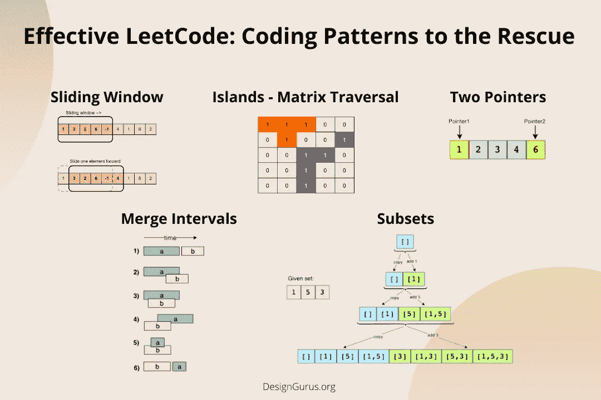
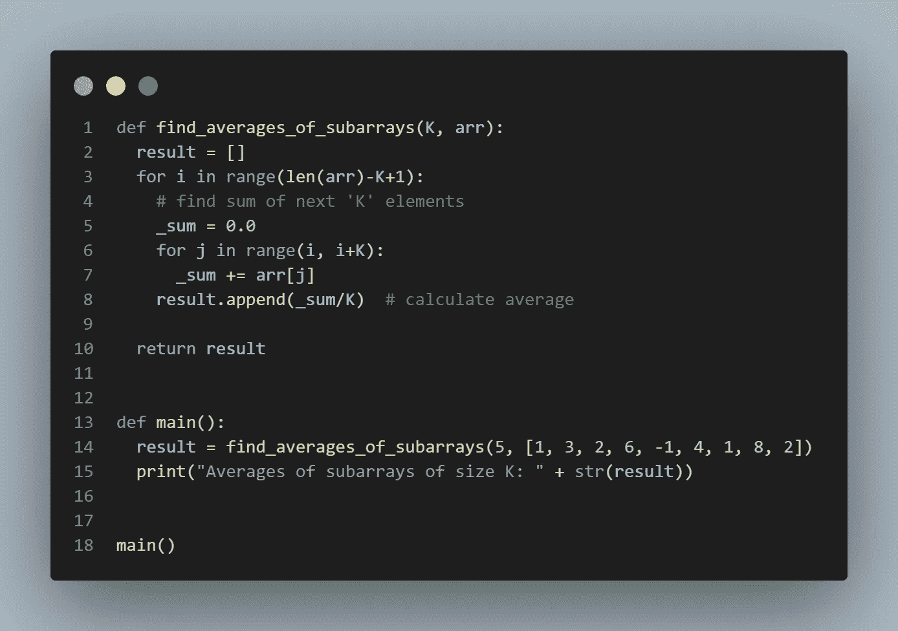
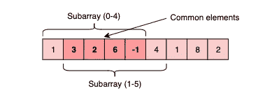
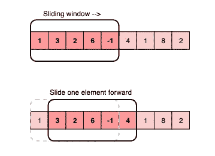
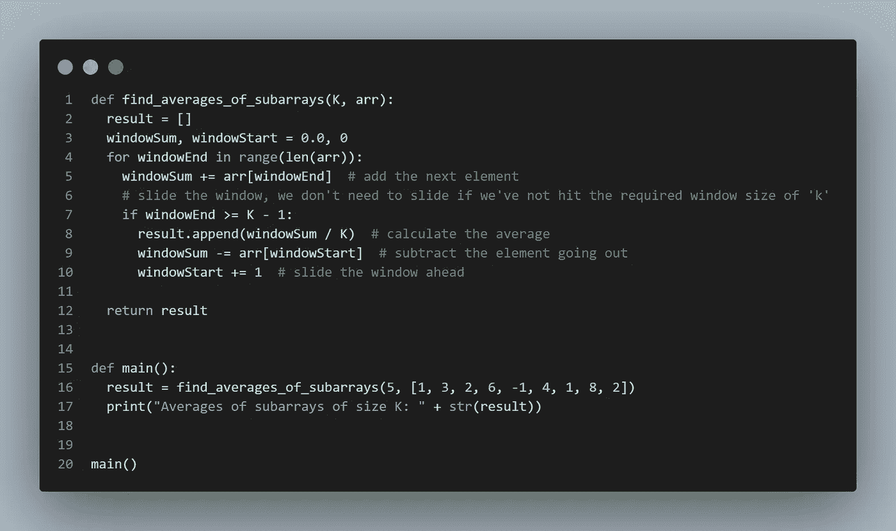

# 编码面试变得容易:理解滑动窗口模式

> 原文：<https://medium.com/geekculture/coding-interview-made-easy-understanding-the-sliding-window-pattern-df907ea6f521?source=collection_archive---------1----------------------->



[Coding Patterns](https://designgurus.org/course/grokking-the-coding-interview)

在许多处理数组(或链表)的问题中，我们被要求在给定大小的所有相邻子数组(或子列表)中寻找或计算一些东西。例如，看看这个问题:

> *给定一个数组，找出其中所有大小为“K”的相邻子数组的平均值。*

让我们用一个真实的输入来理解这个问题:

```
Array: [1, 3, 2, 6, -1, 4, 1, 8, 2], K=5
```

这里，我们被要求找出给定数组中所有大小为“5”的连续子数组的平均值。让我们来解决这个问题:

1.  对于前 5 个数字(从索引 0–4 开始的子数组)，平均值为:(1+3+2+6–1)/5 = > 2.2
2.  接下来 5 个数的平均值(从索引 1 到 5 的子数组)是:(3+2+6-1+4)/5 = > 2.8
3.  对于接下来的 5 个数字(索引 2–6 的子数组)，平均值为:(2+6–1+4+1)/5 = > 2.4

以下是包含所有大小为 5 的相邻子阵列平均值的最终输出:

```
Output: [2.2, 2.8, 2.4, 3.6, 2.8]
```

# 强力算法

强力算法将计算给定阵列的每个 5 元素连续子阵列的总和，并将总和除以“5”以得到平均值。这是 Python3 中的算法:



[Brute-force algorithm](https://designgurus.org/path-player?courseid=grokking-the-coding-interview&unit=grokking-the-coding-interview_1627871350324_0Unit)

**时间复杂度:**由于对于输入数组的每一个元素，我们都是在计算其接下来的‘K’个元素的和，所以上述算法的时间复杂度将是*O*(*N*∑*K*)其中‘N’是输入数组中元素的个数。

我们能找到更好的解决方案吗？你认为上述方法有什么低效之处吗？

# 推拉窗拯救世界

低效之处在于，对于任意两个大小为“5”的连续子阵列，重叠部分(将包含四个元素)将被评估两次。例如，以上面提到的输入为例:



如您所见，子数组(索引从 0–4)和子数组(索引从 1–5)之间有四个重叠元素。我们能以某种方式重用我们为重叠元素计算的`sum`吗？

解决这个问题的有效方法是将每个子阵列视为一个由“5”个元素组成的滑动窗口。这意味着当我们移动到下一个子数组时，我们将滑动窗口一个元素。为了重用前一个子数组中的`sum`,我们将减去离开窗口的元素，并添加现在包含在滑动窗口中的元素。这将使我们不必遍历整个子阵列来寻找`sum`，因此，算法复杂度将降低到 *O* ( *N* )。



以下是**滑动窗口**方法的算法:



[Sliding Window algorithm](https://designgurus.org/path-player?courseid=grokking-the-coding-interview&unit=grokking-the-coding-interview_1627871350324_0Unit)

在某些问题中，滑动窗口的大小是不固定的。我们必须根据问题约束来扩大或缩小窗口。

以下是使用滑动窗口方法可以解决的几个问题:

1.  [大小为 K 的最大和子阵列(简单)](https://designgurus.org/path-player?courseid=grokking-the-coding-interview&unit=grokking-the-coding-interview_1627871358579_1Unit)
2.  [给定和的最小子阵列(简单)](https://designgurus.org/path-player?courseid=grokking-the-coding-interview&unit=grokking-the-coding-interview_1628540999042_0Unit)
3.  [水果入篮(中号)](https://designgurus.org/path-player?courseid=grokking-the-coding-interview&unit=grokking-the-coding-interview_1628541018393_2Unit)
4.  [包含 K 个不同字符的最长子字符串(中等)](https://designgurus.org/path-player?courseid=grokking-the-coding-interview&unit=grokking-the-coding-interview_1628541009794_1Unit)
5.  [具有不同字符的最长子串(硬)](https://designgurus.org/path-player?courseid=grokking-the-coding-interview&unit=grokking-the-coding-interview_1628541027921_3Unit)
6.  [字符串中的排列(硬)](https://designgurus.org/path-player?courseid=grokking-the-coding-interview&unit=grokking-the-coding-interview_1628541055153_6Unit)
7.  [字符串变位(硬)](https://designgurus.org/path-player?courseid=grokking-the-coding-interview&unit=grokking-the-coding-interview_1628541063154_7Unit)
8.  [单词拼接(硬)](https://designgurus.org/path-player?courseid=grokking-the-coding-interview&unit=grokking-the-coding-interview_1628541078811_9Unit)

在 [**探索编码面试**](https://designgurus.org/course/grokking-the-coding-interview) **中了解更多关于滑动窗口模式的信息。**

这里有几个关于编码和系统设计面试的好帖子:

[](https://levelup.gitconnected.com/system-design-interview-survival-guide-2023-preparation-strategies-and-practical-tips-ba9314e6b9e3) [## 系统设计面试生存指南(2023):准备策略和实用技巧

### 2023 年系统设计面试剧本。

levelup.gitconnected.com](https://levelup.gitconnected.com/system-design-interview-survival-guide-2023-preparation-strategies-and-practical-tips-ba9314e6b9e3) [](https://levelup.gitconnected.com/dont-just-leetcode-follow-the-coding-patterns-instead-4beb6a197fdb) [## 不要只是 LeetCode 请遵循编码模式

### 面试前不喜欢练 100 个编码题怎么办？

levelup.gitconnected.com](https://levelup.gitconnected.com/dont-just-leetcode-follow-the-coding-patterns-instead-4beb6a197fdb) [](/interviewnoodle/top-leetcode-patterns-for-faang-coding-interviews-bdbe8766534c) [## FAANG 编码访谈的顶级编码模式

### 编码模式增强了我们“将新问题映射到已知问题的能力”

medium.com](/interviewnoodle/top-leetcode-patterns-for-faang-coding-interviews-bdbe8766534c) 

# 感谢阅读

*   👏请为这个故事鼓掌，然后跟我来👉
*   📰查看更多关于[编码和系统设计访谈](https://arslan-ahmad.medium.com/)的内容
*   🔔关注我:[LinkedIn](https://www.linkedin.com/in/arslanahmad/)|[Twitter](https://twitter.com/arslan_ah)|[时事通讯](https://designgurus.org/interview-noodle-page)