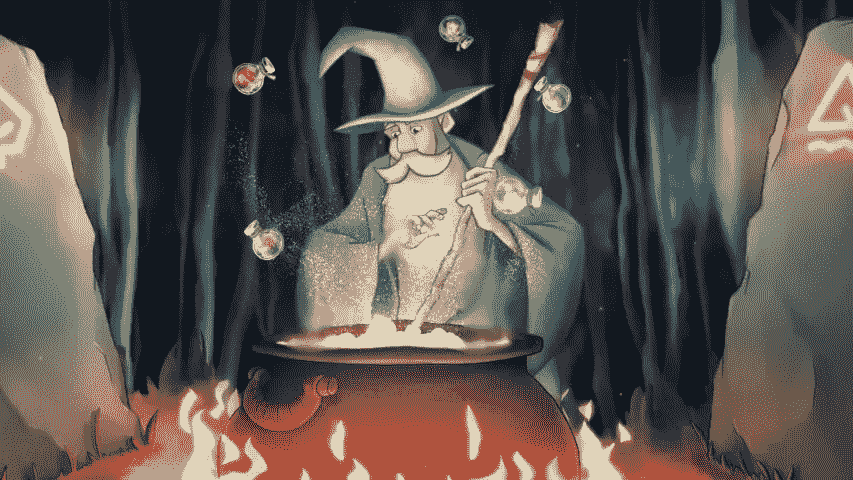

# 作为巫术的编码:JavaScript 中的药剂和对象组合

> 原文：<https://medium.com/geekculture/coding-is-sorcery-potions-object-composition-in-javascript-245310cfb405?source=collection_archive---------52----------------------->

如果编码是巫术(确实如此)，那么编码中的不同概念与来自幻想小说、神话和黑暗艺术历史的各种魔法系统相比如何？

这一次，我将着眼于面向对象的 Javascript，特别是**对象组合**类似于调制药水的方式。

在我的上一篇文章中，我将 Ruby 中的类继承比作真实名字的魔法，这是一个贯穿魔法和神话历史的魔法特征，从古代埃及到 Ursula Le Guin 的地海系列或者 Patrick Rothfuss 的风的名字。在 Ruby 中，例如，如果我们知道*地海巫师*中 Ged 的船`lookfar`是类`Boat`的一个实例，那么我们也知道关于`lookfar`的一堆信息和一堆我们可以调用它的方法:

```
$ lookfar.sails 
# => mainsail
```


Fanart by [Ffaunax](https://www.deviantart.com/ffaunax/art/Lookfar-at-the-world-s-end-880089346) of Ged and Vetch in the boat Lookfar from Le Guin’s “A Wizard of Earthsea”

此外，如果我们知道`Boat`作为一个类继承自`WaterCraft`，那么我们对它的了解会更多，因为`Boat`继承自`WaterCraft`的方法。

# 原型继承与类继承

然而，JavaScript 并不像 Ruby 那样使用类继承。在 Ruby 中，对象是一个类的实例，它从其他类继承方法和数据。从 ES6 开始，JavaScript 包含了关键字`class`，但是它是一个语法上的糖，代表一个通过*原型继承将两个对象链接在一起的构造函数。*

```
class MyClass {}
typeof MyClass
*#=> function*
```

有什么区别？JavaScript 中的几乎所有东西都是对象，每个对象都有一个私有属性将它链接到另一个对象，它的*原型、*一直追溯到全局对象、[对象](https://developer.mozilla.org/en-US/docs/Web/JavaScript/Reference/Global_Objects)(不要与更通用的术语 [*全局对象*](https://developer.mozilla.org/en-US/docs/Web/JavaScript/Reference/Global_Objects) *、*混淆，后者表示标准的内置对象或全局范围内的对象)。

关于哪种系统更好有很多争论。

Of course there’s a lot of debate. This is coding.

我不打算深入讨论。相反，让我们谈谈原型继承允许我们使用的技术之一——通过使用**对象组合**像调制药水一样调制它们来定义对象。

# 什么是物体构成？

JavaScript 的原型继承允许我们定义只继承您真正需要的东西的对象，而不是定义继承父类的所有信息和方法的类。它是这样工作的:

```
const snakeFang = { snakeFang: 6 }
const pocupineQuill = { porcupineQuill: 2 }
const wolfsbaneSprig = { wolfsbaneSprig: 1 }
const valerianRoot = { valerianRoot: 1 }const WideyePotion = (options) => {
  return Object.assign({}, snakeFang, wolfsbaneSprig, options)
}const CureForBoilsPotion = (options) => {
  return Object.assign({}, snakeFang, pocupineQuill, options)
}const DraughtOfPeace = (options) => {
  return Object.assign({}, pocupineQuill, valerianRoot, options)
}
```

(我把这些食谱简化了，但是你懂了。尽管如此，还是不要在家里尝试。)

在这个例子中，我们的配料是所谓的**混合料。**什么是 mixin？名字说明了一切——你把它混合在一起。根据[*JavaScript . info*](https://javascript.info/mixins)

> *一个 [mixin](https://en.wikipedia.org/wiki/Mixin) 是一个包含方法的类，这些方法可以被其他类使用，而不需要从它继承。*

*用混合剂制作一个物品可以让我们在药剂中只包含我们想要的成分。这有什么大不了的？*

# *偏爱合成而非遗传*

> *"优先选择对象组合而不是类继承."~四人帮，“[设计模式:可重用面向对象软件的要素](https://www.amazon.com/gp/product/0201633612?ie=UTF8&camp=213733&creative=393185&creativeASIN=0201633612&linkCode=shr&tag=eejs-20&linkId=WMUILDJNIUXY4NSH)”*

*挑选对象的成分有助于我们避免类继承的一些主要陷阱。它使你的代码变得灵活，而继承层次必然变得灵活，要求你复制代码以便加入你现有代码不能适应的新特性。*

*此外，避免了所谓的类继承的大猩猩/香蕉问题:即使您只需要使用父类中的一个方法，子类仍然可以继承整个 megillah。正如编程语言 [Erlang](https://en.wikipedia.org/wiki/Erlang_(programming_language)) 的创造者[乔·阿姆斯特朗](https://en.wikipedia.org/wiki/Joe_Armstrong_(programmer))所解释的，*

> *面向对象语言的问题是，它们拥有所有这些隐含的环境。你想要一个香蕉，但你得到的是一只大猩猩拿着香蕉和整个丛林。*

**

*There’s a flaw in this metaphor. Gorillas in the wild don’t generally eat bananas because wild bananas are often barely edible and sometimes even toxic. They do love human-engineered bananas if they can get their hands on them, but then you’d be inheriting agriculture, not the entire jungle.*

*在我们的魔药类比中，类继承会要求我们把世界上所有的东西都放入我们的坩埚中，然后以某种方式告诉我们的魔药只能由我们真正想要的东西制成。*

*That’s overdoing it with the ingredients! Stop!*

# *让我知道你的想法！*

*一如既往，我很想知道你对编码和魔术之间的相似和重叠的想法。请在 *Medium* 上给我写一个回复，或者在 [LinkedIn](https://www.linkedin.com/in/alec-magnet/) 上给我留言，让这个对话继续下去！*

**

# *来源*

*Eric Elliot，“[大师访谈:类&原型继承有什么不同？](/javascript-scene/master-the-javascript-interview-what-s-the-difference-between-class-prototypal-inheritance-e4cd0a7562e9#.h96dymht1)*

*——,“[3 种不同的原型继承:ES6+版本](/javascript-scene/3-different-kinds-of-prototypal-inheritance-es6-edition-32d777fa16c9)”*

*Alex Jover Morales，“JavaScript 中的[类组合](https://alligator.io/js/class-composition/#:~:text=A%20common%20composition%20pattern%20in,have%20an%20Animal%20and%20FlyingAnimal%20.)”*