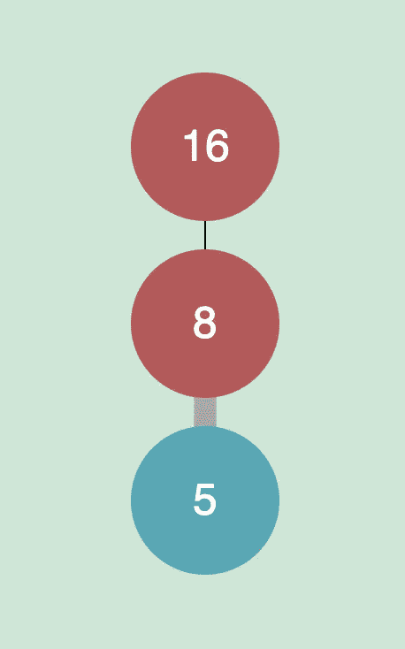
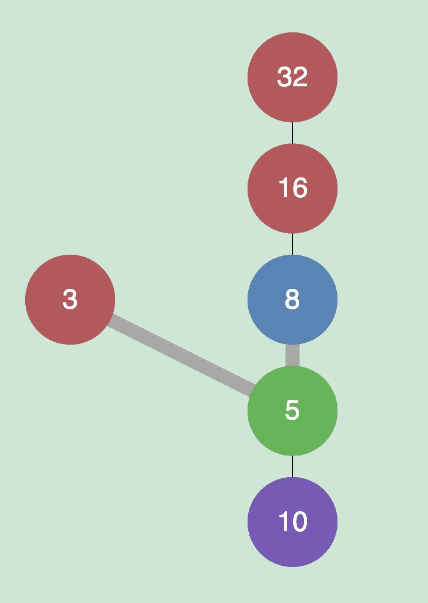

# 编码故事:玩模式

> 原文：<https://medium.com/geekculture/coding-stories-playing-with-patterns-9bbc524ff086?source=collection_archive---------41----------------------->

找到一个将艺术美与有意义的计算相结合的想法可能是一个挑战。一些想法会产生引人入胜的视觉效果，但缺乏对学习和发现的清晰叙述。其他想法在概念上是有意义的，但似乎不适合艺术表达。找到这种联系通常是为了探索一种有趣的模式。我认为是这样的，因为强大的编程需要注意模式，对于成功的艺术作品也是如此。

几周前，一名学生来到我的办公室，询问报名参加我的高级计算机科学课程的事宜。我问他是什么激发了他的兴趣。他告诉我他在数学课上做的一个关于柯拉茨猜想的研究项目。他说他用编程来“证明”这个猜想，他想通过上我的课做更多这样的工作。我说这听起来像是参加课程的一个很好的理由，并进一步询问了这个问题。原来，柯拉茨猜想涉及到遵循一个简单规则产生的一系列数字。

```
If n is even n->n/2
If n is odd  n->3*n+1
```

这个猜想的名字来自洛萨·柯拉茨，他声称不管你从什么数字开始，如果你遵循这个序列，它最终会产生 1。不幸的是，它还没有被数学证明。事实上，保罗 ready 谈到柯拉茨猜想时说:“数学可能还没有准备好解决这样的问题。”至少根据维基百科的页面是这样的。为了让你更好地理解这个顺序，这里有一个例子:

```
18, 9, 28, 14, 7, 22, 11, 34, 17, 52, 26, 13, 40, 20, 10, 5, 16, 8, 4, 2, 1, (4, 2, 1) repeating
```

我开始在网上搜索这个问题，并意识到它包含在一组我非常喜欢的问题中，叫做欧拉项目。它被列为问题#14。在这个版本的问题中，它要求你找出从 1 到 100 万之间的一个整数开始的最长序列。

我决定这将是我的计算机科学课的一个好作业。学生们能够开发一种算法来为一百万个起始数字中的每一个构建序列。我们称这种方法为蛮力，因为计算机每秒可以完成数万亿次计算，因此起初看起来很繁重的任务突然变得非常可行。但是要让计算机为你做这项工作，它需要用一种计算机能理解的语言来编写。这是我们使用的 Python 代码。

```
def collatz_len(n):
 count=1
 while n!=1:
 n = n//2 if n%2 == 0 else n*3+1
 count+=1
 return countmax(collatz_len(n) for n in range (1,10**6))
```

使用暴力解决问题有时感觉像作弊，因为计算机正在做所有的工作。然而，作为程序员，你需要弄清楚如何设置，以便计算机可以完成这项工作。函数 collatz_len()遍历 collatz 序列中的每个数字，并返回步数。解决这样的挑战有助于你提高计算机语言的流畅性。组织代码最终需要清晰的思维。它也让你以新的方式看待问题。在课堂上，我们就这条线进行了辩论

```
n = n//2 if n%2 == 0 else n*3+1
```

我认为这样写可能更清楚

```
if n%2 == 0: n=n//2
else: n=n*3+1
```

但是学生们投票决定将代码保留在一行。有许多不同的方法来编码相同的算法。但与英语不同的是，只有一种正确的解释可以解释它在你的电脑上会做什么。计算机代码是一种非常精确的交流形式，因为你可以用它的输出来测试你的解释。我发现计算机编程特别吸引人的一点是，这种不断尝试错误并测试你的想法的能力。

我经常让学生参与关于语法的辩论，以促使他们更敏锐地观察和深入思考算法设计。例如，我很欣赏学生们使用 max()函数来识别最长的序列，但是正如所写的，你不知道起始值是多少。然而，这很容易解决，如下所示

```
max((collatz_len(n),n) for n in range (1,10**6))
```

代码确实找到了问题的正确答案

```
(525, 837799)
```

实际上，837，799 在给定的范围内产生最长的 Collatz 序列。这个程序的问题是，当你在 Google Colab 上运行它时，它需要 19 到 28 秒的时间。这并不意味着这种方法无效，但我不禁想到，我们可以提高算法的效率。

所以我们开始考虑捷径。这是计算问题解决中我最喜欢的部分。大多数算法都可以改进，关键的一步是寻找模式。一个学生想出了一个聪明的主意，打印出一些序列来看看是否有模式。所以我们修改了代码来输出更多的信息。

```
def collatz(n):
 while n!=1:
 print(n,end=”, “)
 n = n//2 if n%2 == 0 else n*3+1
 print(n)for i in range(1,10): collatz(i)OUTPUT:1
2, 1
3, 10, 5, 16, 8, 4, 2, 1
4, 2, 1
5, 16, 8, 4, 2, 1
6, 3, 10, 5, 16, 8, 4, 2, 1
7, 22, 11, 34, 17, 52, 26, 13, 40, 20, 10, 5, 16, 8, 4, 2, 1
8, 4, 2, 1
9, 28, 14, 7, 22, 11, 34, 17, 52, 26, 13, 40, 20, 10, 5, 16, 8, 4, 2, 1
```

我们注意到这个序列经常重复。例如 6 -> 3。之前已经计算了 3 的序列，6 的序列重复相同的数字串。类似地，上面已经计算过的 9 -> 7。事实上，9 序列包含了上面列出的大多数数字

```
9, 28, 14, 7, 22, 11, 34, 17, 52, 26, 13, 40, 20, 10, 5, 16, 8, 4, 2, 1
```

例外是 6 序列中的前 2 个数字

```
6, 3, 10 … (same as 9 sequence starting at 10)
```

在黑板上，我们开始用图表来玩这个想法。图是节点的集合，节点之间的连接称为边。这是上面所有序列的可视化图表。我用一个叫做 networkx 的 python 包创建了这个视觉效果，这个包在 Google Colab 中非常好用。我不知道如何防止图形自身重叠，但你明白了。

为了改进我们的算法，我们可以利用已经计算过的先前计算。事实证明，重复是编程世界中非常常见的事情，有一种经典的方法可以利用这一点。一旦我们计算出一个 Collatz 序列的长度，我们就可以存储这个值以备后用。这就是所谓的缓存。我们决定将序列长度存储在一个列表中，其中列表的索引是序列的起始值。这就是我们初始化列表的方式。

```
cache = [0]*10**6
```

现在，当我们计算一个新的序列时，我们可以检查每一步，看看这个数字是否已经在我们的缓存中。然后当它被计算时，它可以被放置在列表中。以下是我们对代码所做的更改。通过这种优化，问题的答案可以在 1 秒钟内计算出来。

```
def collatz_len(num):
 n=num
 count=1
 while n!=1: 
 if n<len(cache) and cache[n]: # check if n is in the cache
 count += cache[n] — 1 # compute count based on cache
 break
 n = n//2 if n%2 == 0 else n*3+1
 count+=1
 cache[num] = count # add the current calculation to the cache
 return countmax((collatz_len(n),n) for n in range (1,10**6))
```

这个小小的改变大大提高了我们算法的速度，给全班留下了深刻的印象。我很兴奋地分享如此重要的算法设计思想，甚至没有计划这样做。我建议做更多的项目欧拉问题，因为每一个都有一个重要的教训要教。我对我们创建的 Python 程序感到满意，但感觉还有更多需要探索。我在维基百科上看到了这个序列的一些鼓舞人心的可视化。我还发现了序列的简化。当奇数映射到 3n+1 时，结果总是偶数。所以规则可以跳过一个步骤直接跳到(3n+1) / 2

随着我对这个问题思考得越来越多，我想知道我是否可以采取一种完全不同的方法来解决它。在当前的实现中，我从不同的数字开始，并按照顺序执行，直到数字 1。解决计算问题的另一种常见方法是将问题分解成子问题。这些子问题可以重新组合成解决方案。这有时是通过逆向求解来实现的。这种方法被称为动态编程。在这种情况下，我将反向应用 Collatz 规则来确定哪些数字将落在序列中下一个当前数字上。因为每次到 1 的旅行都必须经过数字 8，所以我将从那里开始。

从数字 8 开始往回算，你知道数字 16 会被 2 除，然后落在 8 上。所以本质上我是把当前的数字乘以 2。类似地，(5*3+1)/2 得到 8。换句话说，16 和 5 都将数字 8 作为序列中的下一个数字。



从这两个数字我可以展开。10 和 3 都以 5 作为序列中的下一个数字，同样，32 也是 16。



图表从这里开始展开。通过逆向解决这个问题，我对序列有了非常不同的看法。使用 Javascript，我编写了这个问题的动态编程方法的如下动画。现在，我找到了一种美学的方式来表现这个问题，这种方式尊重解决方案的缓存，以建立新的途径。我加入了一个动画，让编号的圆盘滑动到位。我还决定调整出现的双倍数光线的角度。一个数字离中心的距离表示到达该数字所需的步数。

编写动画是一项有趣的挑战，因为它促使我理清自己的思路，思考如何将问题可视化，以及我需要什么样的计算结构来实现这个目标。在这种情况下，我用. show()和。update()方法。该对象还存储了它所链接的节点，这样我就可以画线了。我决定一次增加一层图案，这样我可以在一个圆的周围均匀地分布最外面的节点。

可视化的神奇之处在于，它们能让你对问题有重要的见解。在序列中向后移动，每个数字可以生成一个数字或最多两个数字。在许多分支中，它在生成 2 个数字和 1 个数字之间交替。在能被 3 整除的分支中，只有一个分支产生一行数字。图案的美不仅赏心悦目，还能告诉你图案的本质，也许还有数字本身的本质。

我花了相当多的时间观察这种模式的发展。我甚至试着从不同的数字开始。例如，如果你从数字 5252 开始，它离 8 有 19 步远，你会得到一个非常相似的数字模式

柯拉茨猜想是一个让我们深入思考数学的大问题。原来，我学校的许多老师已经在他们 4 到 12 年级的数学课上介绍了这个想法。计算是一种可以用来探索数学思想的工具。我觉得这是一个令人信服的。尝试为一个计算性想法编程的过程拓展了我在新的有趣方向上的思维。也许通过计算和编程，我们可以用数学思想扩大每个人的爱和兴奋。

