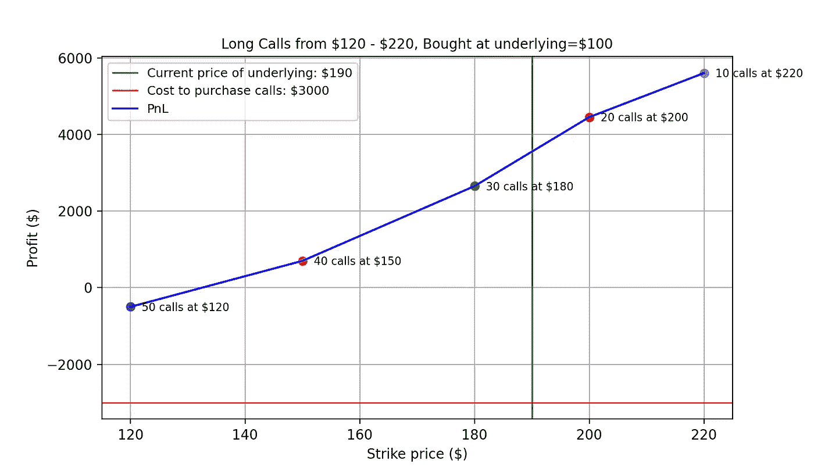

# 编写你自己的期权收益图

> 原文：<https://medium.com/geekculture/coding-your-own-option-payoff-plot-be1024c9fc9f?source=collection_archive---------11----------------------->

## 金融

## 只是比普通股票多了几个步骤，真的

最近免佣金交易应用的兴起推动了期权交易的兴起。很容易明白为什么，真的。世界各国都在提供刺激方案，向经济注入资金。这些国家仍在从封锁中挣扎。随着大量的流动性四处流动，而花掉它们的渠道却很少，许多散户投资者谨慎地决定将其投资于股市。

## 对泡沫的担忧

 [## 股市不断创出新高。这对你来说意味着什么

### 标准普尔 500、道琼斯工业平均指数和…

time.com](https://time.com/nextadvisor/investing/sp500-dow-record-breaking-days/) 

随着所有这些额外的现金进入市场，这是许多投资者心中的一个相关问题: ***我们正在走向泡沫吗？***

随着市场持续上涨，表达犹豫是合理的。

然而，当你看到资产价格上涨并保持不变时，一个可以说更强的反应是 FOMO。

## 气泡保护

幸运的是，有一种方法可以摆脱这种困境。事实证明，价格不确定性一直存在。由于飓风和作物枯萎病等不可预见的情况，农民们一直在使用期权来对冲谷物和小麦等产品的意外上涨。类似地，重工业如**航运和航空**购买期权来对冲**柴油和煤油**价格的突然上涨。精明的投资者明白了这一点，并加入了期权热潮。

 [## 期权交易有望取代股票市场

### 在各种巧妙的交易应用和社交媒体炒作的推动下，自……之间的竞争以来，零售交易大幅飙升

qz.com](https://qz.com/2092197/options-trading-is-poised-to-overtake-the-stock-market/) 

## 呼叫选项

虽然存在对冲双向价格变化的选项，但为了便于解释，本文中我们将坚持使用**调用**。*看涨期权是一种工具，它赋予以* ***指定的*** *价格购买资产的权利，而非义务。记住这个的一个简单方法是想象“从别人那里把它叫回来”。*

这有两个好处:

1.  潜在的无限上升空间

通过拥有以特定价格购买的权利，你的利润率会随着基础价格的上涨而增加。

2.小损失

如果标的从未超过执行价格，期权到期未执行。与拥有基础资产相比，遭受的损失非常小。

## 工作示例

为了说明这一点，让我们举一个不同看涨期权的例子来说明。

假设我们有一个 100 美元的基础资产。

为了对冲上涨，我们将以 120 美元、150 美元、180 美元、200 美元、220 美元的各种执行价格购买看涨期权。

每个执行价的溢价相应地为**30 美元、20 美元、15 美元、10 美元、5 美元。**

我们将购买相应数量的 **50、40、30、20、10。**

随着基础价格的上涨，我们的看涨期权逐渐得到回报，购买基础资产节省的资金也在增加。

下图展示了通过买入期权锁定购买价格，我们可以获利(节省)多少。

绿色垂直线表示当前价格，当它向右移动时，我们打开了另一部分储蓄。

当然，这些输入值是任意的，用户可以随意更改。

必要的代码包括如下: