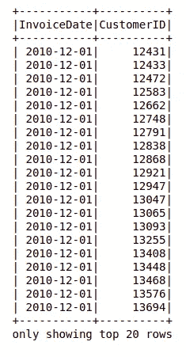
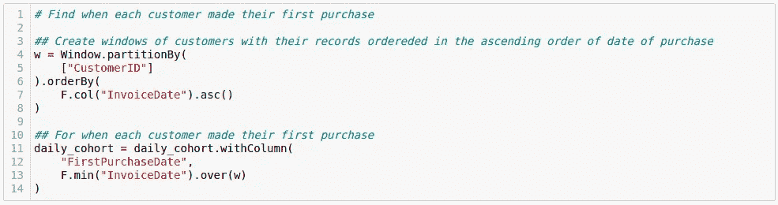
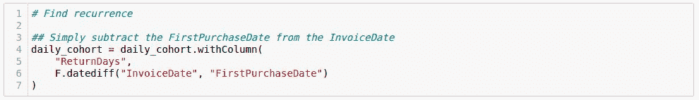
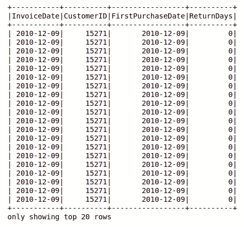
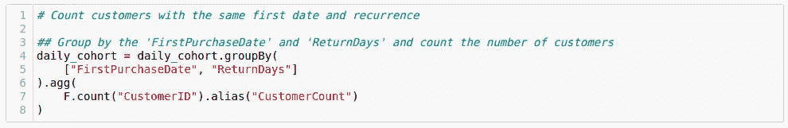
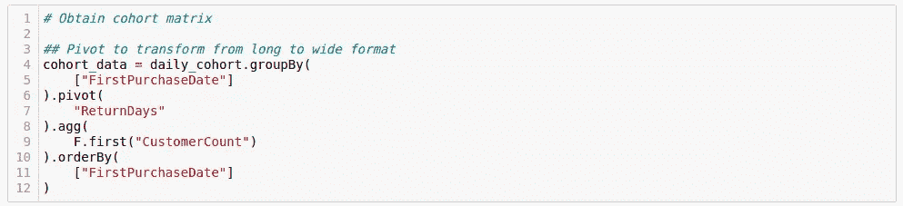
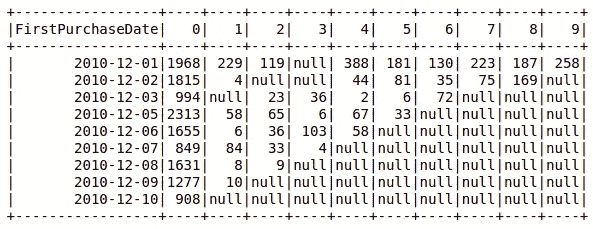
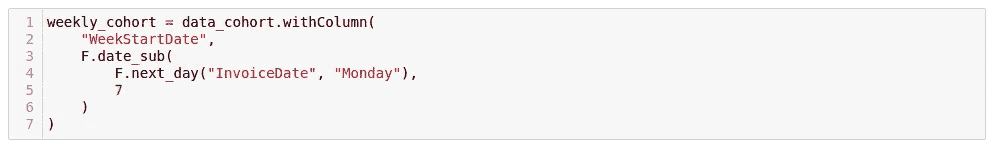
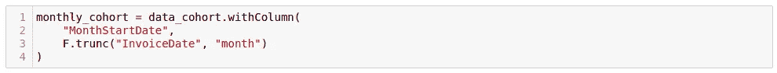
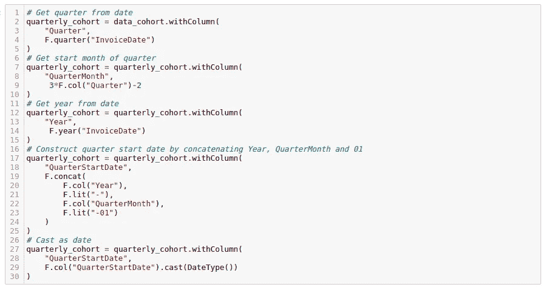

# PySpark 队列分析

> 原文：<https://medium.com/geekculture/cohort-analysis-with-pyspark-90b557685e72?source=collection_archive---------12----------------------->

> 比以往任何时候都更接近您的客户。近到在他们自己意识到之前，你就告诉他们需要什么。
> —史蒂夫·乔布斯

# 介绍

客户分析对任何企业的生存都很重要。如果没有对客户的痴迷，苹果和亚马逊等成功的科技公司不可能走到今天这一步。今天，几乎所有的公司都在转向以客户为中心，并采取策略来留住客户。虽然有许多定量和定性的方法，但一种非常流行的评估客户保持率的方法是*群组分析*。

## 断代分析

什么是队列？简单来说，就是一群有着共同特点的人。例如，一群出生于 1998 年 3 月 2 日的人。

那么什么是队列分析呢？根据维基百科:

> [**群组分析**](https://en.wikipedia.org/wiki/Cohort_analysis) 是一种[行为分析](https://en.wikipedia.org/wiki/Behavioral_analytics)在分析之前将一个数据集中的数据分成相关的群组。

通常，它被用来研究客户保持力，因此被命名为*保持力分析*。假设你刚刚推出了一款新产品。自然，你会希望你的用户在第一次之后继续回来。群组分析是一种探索重复用户的流行方法。电子商务、游戏和医疗保健网站一直都在使用它。如果你用过谷歌分析，你一定很熟悉它。

## PySpark API

像谷歌和亚马逊这样的公司从客户和他们的产品的互动中收集了数 Pb 的数据。虽然数据科学和分析领域流行的编程语言(如 R 和 Python)能够很好地处理千兆字节，但当处理大数据时，它们的局限性就变得很明显了。

PySpark 是为配合 Spark 框架使用 Python 而编写的 API。前者提供了简单性，后者提供了速度。因此，PySpark 使我们能够编写可伸缩的程序。理想情况下，程序在机器集群上执行，比如 AWS EC2 实例或 Google Cloud 虚拟机。AWS**E**lastic**M**AP**R**educe(EMR)是一个托管服务，有助于轻松运行 PySpark 脚本。数据是在一个集群上分发和处理的，而不是在一台可能不适合它的机器上。

值得注意的是，可伸缩性和性能是 Pandas 或其他基于 Python 的工具不适合生产工作负载的主要原因。

这篇博客介绍了一种使用 PySpark 进行队列分析的方法。以下是概要:

*   **前提条件** —需要了解的基本概念。
*   **数据角力** —分析在行动。
*   **特殊情况** —队列分析中的特殊情况。
*   **结论** —客户分析和群组分析的总结。

# 先决条件

本节涵盖了分析前需要理解的先决条件。下面是 PySpark 的 SQL 模块提供的工具，您必须熟悉这些工具:

1.  **GroupBy** :对列进行分组并执行聚合。
2.  **Join** :合并两个表。
3.  **窗口功能**:对数据进行分区并执行操作。
4.  **WithColumn** :根据某种操作引入一个新列。
5.  **SQL 函数**:执行常用操作的工具。

别担心，你不必成为专家。随着你的阅读，你可能会更好地理解它们。

# 数据争论

好的，让我们看看我们的数据。同样的情况也可以在[卡勾](https://www.kaggle.com/jihyeseo/online-retail-data-set-from-uci-ml-repo)上找到。它被描述为:

> 一个跨国数据集，包含 2010 年 1 月 12 日和 2011 年 9 月 12 日之间发生的英国注册无店铺在线零售的所有交易。

总共有 10 列。然而，我们只对*发票日期*和*客户 ID* 感兴趣。

首先，使用 PySpark 读入数据集。然后只选择感兴趣的列。InvoiceDate 和 CustomerID 分别是 DateType 和 StringType。

太好了！我们将每天、每周、每月、每季度和每年进行队列分析。

## 每日队列

数据集跨度超过一年。为了简单起见，让我们考虑从 2010 年 12 月 1 日开始到 2010 年 12 月 10 日结束的前 10 天。

**第一步:**找出每位顾客第一次购物的时间

首先按客户对数据进行分区，并按交易的升序对每个客户分区进行排序。然后选择每个客户的第一个交易日期。我们把这个专栏叫做 *FirstPurchaseDate 吧。*

**第二步:**寻找复发

重现告诉我们多少天后每个顾客被再次观察。这可以通过从 InvoiceDate 中减去 FirstPurchaseDate 得到。让我们把这个专栏叫做 *ReturnDays* 。

到目前为止，我们的数据集看起来像这样:

**第三步:**统计第一次日期和重复周期相同的客户

具有相同首次购买日期和返回日期的客户组成一个群组。根据您的使用情况，您可能希望使用 *F.count* 来统计所有(包括同一客户的多次出现)或 *F.countDistinct* 来统计唯一用户。

**第四步:**获取队列矩阵

上一步中的聚合数据集是长格式。我们希望它是*宽格式*，以便更好地观察随时间推移的队列。为此，请透视数据集。

因此，我们获得了一个队列矩阵，让我们探索客户随时间的重复。

Cohort matrix

每行代表所需范围内的一个日期，每列代表该日期之后的天数。让我们按照列从左到右的递增顺序来研究第一行。

*   日期后 0 天(即 2010 年 12 月 1 日)，观察了 1968 名顾客。
*   一天后(即 2010 年 12 月 2 日)，1968 名顾客中的 229 名被观察到
*   2 天后(即 2010 年 12 月 3 日)，1968 名顾客中的 119 名被观察到，以此类推。

类似地，我们可以研究每一行，以了解在给定日期来的客户中有多少人在随后的日期也来了。几个模式可能会变得明显。例如，我们可能会在每个周末或每 5 天发现一个高峰，并据此锁定目标客户或制定策略。

很多时候，群组矩阵中的绝对值被替换为增长百分比。这可以通过将每列除以相应的 0 列值并乘以 100 来实现。例如，在 2010 年 12 月 1 日观察到的所有客户中，(229/1968)x100 = 11.63%也是在 2010 年 12 月 2 日观察到的。

这让我们对模式一目了然。

如果您的群组矩阵不太大，您可以将其转换为熊猫数据框架，并可视化热图。

## 每周一组

如果我们想每周研究一次群体呢？在这种情况下，首先构建一个列，指示每个 InvoiceDate 属于哪一周。这里有一个使用 PySpark 的好方法。

基本上就是找到下一个周一，减去 7 天。遗憾的是，我们无法直接找到最后一个星期一。称之为*周开始日期*。使用它代替 InvoiceDate 进行分析。

## 每月一组

类似地，对于每月分析，找出给定日期所在月份的第一天。

## 季度队列

在这种情况下，这种方法有点冗长。

## 年度队列

就像上面一样，通过将" *Year"* "与"--*01–01 "*"连接起来，构造*years startdate*。

通过适当分组，我们也可以分析 2 年队列。PySpark 提供了一些漂亮的函数来完成其他困难的任务。

# 特殊情况

*   例如，脸书想要分析在特定日期访问脸书并在随后几天访问 Instagram 的人群。在这种情况下，问题不是直接的。首先，我们必须只选择那些第一次访问脸书的用户，然后对他们进行分析，以了解后续的 Instagram 访问。
*   对于某些应用，我们可能不得不在分析中忽略周六和周日或公共假日。例如，其他都一样，在周五被观察的人中，有多少在周一又被观察了？在这种情况下，几乎总是可以简单地删除所有星期六和星期天。

# 结论

客户分析是一个很好的方式来更好地了解你的客户。它回答了一些重要的问题——他们喜欢你的产品吗？他们最喜欢产品的哪一部分？你产品的哪些特性收到的负面反馈最多？你应该继续提供产品吗？你应该改变策略吗？许多这样的问题可以通过简单地建立一个群体矩阵来回答。通常情况下，数据很大，PySpark 是您的朋友。

# **参考文献**

 [## 群组分析-维基百科

### 群组分析是一种行为分析，它将数据集中的数据分成相关的组，然后…

en.wikipedia.org](https://en.wikipedia.org/wiki/Cohort_analysis)  [## 通过群组分析计算你每月的回头客

### 解释如何使用 python 数据分析计算您企业的重复客户。

towardsdatascience.com](https://towardsdatascience.com/calculate-your-monthly-recurring-customer-by-cohort-analysis-3d39473482b7) 

我是 Searce 数据科学和机器学习团队的一名软件工程师，在那里我与 AWS/GCP 一起开发数据产品。我是 TensorFlow 粉丝，Kaggle 专家，热爱篮球。在 [LinkedIn](https://www.linkedin.com/in/akshit-bhalla/) 上与我联系。