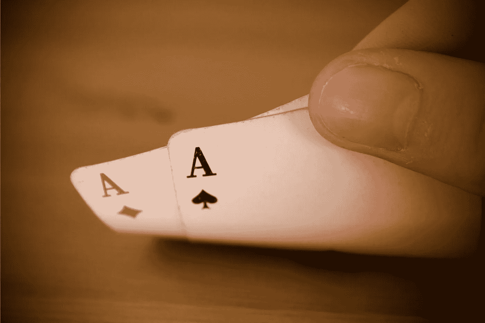

# 硬币配对变得容易:加密硬币配对快速指南

> 原文：<https://medium.com/geekculture/coin-pairing-made-easy-a-quick-guide-to-crypto-coin-pairs-61c19a57e5ca?source=collection_archive---------3----------------------->

## 我知道你已经询问硬币配对有一段时间了，虽然花了一些时间，但我们还是找到了。

Image courtesy of [Canva](https://canva.com)

因此，硬币配对就像将两种货币配对，这样你就可以看到它们的价值。毕竟，如果我们不拿东西和其他东西比较，我们就不知道任何东西值多少钱，我们就像用割草机换兰博基尼。例如，我们在书中找到了最古老的配对:黄金和美元。我们知道一盎司黄金现在价值超过 1700 美元，因为我们已经确定了它们相对于彼此的价值。随着时代的变化，它们的相对价值也在变化。现在我们有了加密货币，我们可以在这个领域做同样的事情。

所以我不浪费你的时间；我想深入了解硬币对的本质，这样当你离开谈话时就能完全理解了。因此，我们将更多地讨论硬币对，为什么交易所提供它们，除了便于交易和比较价值之外，它们还有什么其他用途。

剧透:是的，他们有。

让我们得到它。

# 硬币对

硬币对由基础硬币和报价硬币组成。基础硬币就是你手里的东西，比方说一块钱。而报价币就是你要买的。所以，你用你的基础硬币购买报价硬币。很简单。例如，你以当前汇率交易 41，395.30 美元，购买一个比特币。现在，你可以整天这样做:用美元(法定货币)购买不同的硬币，但如果你想灵活交易，你需要一个比 BTC/美元更好的货币对。因此，你可以买到所谓的稳定硬币。

# 稳定的硬币

Stablecoins 是与美元挂钩的加密货币(也有一些与黄金挂钩),通过在交易所进行加密交易的灵活性，为您提供美元的稳定性。一个流行的硬币配对是 BTC/USDT。USDT 被称为联系汇率，与美元挂钩。所以，你用你的美元买了 USDT，现在你有了一个安全的操作基础，你可以从中出局，做一些好的交易来获得好的收益。有几个稳定的硬币产品，但我用 USDT，因为它被认为是最受欢迎的。此外，还有像 PAX 这样的硬币，这是一种黄金支持的稳定硬币。好的，所以你在和你的稳定币进行交易(把稳定币想象成类似于传统市场中的债券和黄金的价值储存手段)。现在，根据交易所，您可以看到哪些硬币对可供您使用。

# 交换

大多数大型交易所提供大量(如果不是全部)硬币对。比特币基地，光宗耀祖，还有币安，不一而足。然而，并不是所有的交易所都这样做，比如 Bithumb，所以很明显，你会想对不同的交易所做一些研究，看看哪一个给你最大的灵活性。例如，在他们网站的首页上写着，“任何东西都可以。”但是，总是做更多的挖掘，因为每个人都喜欢自吹自擂。所以，要小心。不过，当你使用我上面提到的其中一个的时候，你会很安全。现在，对大多数人来说，这将是故事的结尾。你知道什么是硬币对，为什么它们存在，以及如何看一个交易所是否有你想要的配对，但还有另一个层面，只有有经验的交易者应该探索，那就是套利交易。

# 套利交易

套利交易是指你可以在另一个交易所用你的基础硬币换一个报价硬币，或者在同一个交易所进行三角交易。你会想这样做，因为不同交易所的报价硬币价格可能不同，或者通过巧妙的预测，你可以在结束时用更多的原始货币进行多次买卖。

假设你没有 BTC，在 USDT 有 1000 美元。你看到 BTC 股市下跌，你设置了买入指令，买了 0.1 BTC。接下来，当 BTC 开始攀升时，你就下单卖出。当你完成后，如果你把它交易回 USDT，你最终会得到 0.2 BTC 或者 2000 美元。

很好。

这就是简单交易的方式，但是假设你更有冒险精神。你为了 BTC 卖掉了你的 USDT。然后，卖掉你的 BTC，换回 BTC，这样你就能获利。是的，你需要交易忍术来处理这些角度。那是三角交易。

跨交易所交易也是同样的前提。你在通过差价交易寻找利润。通常，这些差异可能不会持续很久，所以你需要知道你在做什么，并像有袋动物一样快速行动。

# 结论

就是这样。这是硬币对的基础。这是每个进入加密交易的人都需要知道的事情。但是，你不需要知道这些，除非你正在接受成为巫师的训练，哈利。现在你知道什么是硬币对了，它们提供相对价值，使硬币交易更容易，并且包含一个叫做套利的交易小游戏。

有比其他更好的硬币配对，你可以在你的选择交换中研究一下。所以，记住我提到的那些或者自己找一个有信誉的来源，但是要小心。骗局无处不在。

哦，还有一件事，如果你想直接**支持我的写作**，你可以通过我的链接**报名参加 Medium** [**。当你这么做的时候，你的部分订阅会归我。另外，**](https://tcgunterwriter.medium.com/membership) **[**多阅读**](https://tcgunterwriter.medium.com) 对我的工作也有帮助。谢谢你。**