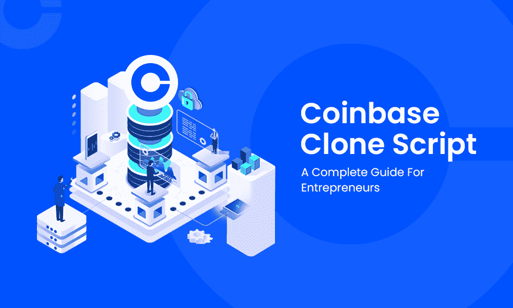

# 比特币基地克隆脚本——创业者完全指南

> 原文：<https://medium.com/geekculture/coinbase-clone-script-a-complete-guide-for-entrepreneurs-bfd6ffeec19?source=collection_archive---------12----------------------->

加密货币是最近一段时间的热门话题，因为其金融市场具有很高的标准水平。随着业务的增长，企业家们正计划推出他们自己的加密交换平台，以获得高投资回报率的商业模式。

Coinbase Clone Script

当创业公司计划建立一个交流平台时，他们确实有很多问题和困惑

这篇文章是写给那些计划像比特币基地一样进行交易所交易，但对商业发展感到困惑的企业家们的

如果你是他们中的一员，计划推出一个像比特币基地一样的交易所，那么比特币基地克隆脚本是明智的选择，我将分享关于这个比特币基地克隆脚本的完整指南

让我们深入挖掘这篇文章！！！

# 比特币基地克隆脚本:

[**比特币基地克隆脚本**](https://www.alwin.io/coinbase-clone-script) 是一个现成的加密货币交易平台，内置了原比特币基地平台的所有功能和插件。这个克隆脚本提供了一个 100%可定制的选项，您可以在其中定制徽标、功能、选项、主题等..根据你的商业理念。像最初的平台一样，这些克隆脚本支持所有主要的加密货币，如比特币、以太坊、卡尔达诺等

毫无疑问，你的梦想工程将会实现。该克隆脚本采用开创性技术设计，提供了高级安全选项和用户友好的仪表板，因此您的用户将体验到无障碍交易。

# 什么是比特币基地？

比特币基地被认为是最著名的中央加密货币交易平台之一。比特币基地于 2013 年诞生。最初，比特币基地用作存储和接收密码的加密钱包。后来，它成为最大的加密交易平台，拥有数百万活跃用户。

目前，比特币基地密码交易所遍布全球 55+个国家，但欧洲国家居首位。管理员监控你的每一笔交易，并保持记录。

# 为什么选择比特币基地这样的交易所？

比特币基地被认为是最好的用户对管理员的交流平台。此外，这个交易所有很多创收的功能，可以在很长一段时间内赚取巨额利润。此外，该交易所拥有所有先进的交易设施和令人惊叹的 UI/UX 设计，拥有数百万活跃用户。因此，建立一个像比特币基地这样的交易所可以吸引全世界的观众。

# 比特币基地克隆脚本，像比特币基地一样推出交易所？

如前所述，比特币基地克隆脚本是有效开展加密交易业务的最佳方式。你可以用其他方式开发你的加密交换，比如从开源代码或者从头开始构建。但是这些方法是不可取的，因为开源开发是不安全的，容易被黑客攻击。从头开始开发需要大约六个月以上的时间，成本也很高。

# 比特币基地克隆剧本的交易特征

交易功能是用户首先注意到的事情，这些功能决定了你的密码业务的成功。所以，不要错过集成人们搜索的高级功能。以下是比特币基地克隆脚本的一些趋势特征。

*   即时买卖
*   加密钱包集成
*   用户友好的界面
*   动态管理面板
*   交易机器人
*   实时交易更新
*   KYC/反洗钱验证
*   HTTPS 认证
*   多种支付方式
*   多语言
*   支付网关集成
*   原子互换
*   反网络钓鱼软件
*   转诊系统

上面提到的是比特币基地克隆脚本的一些独有特征，这些特征可能有助于创业公司在短时间内吸引观众和获得用户。

# 比特币基地克隆软件的附加优势:

*   高级用户友好仪表板
*   高级技术堆栈
*   快速部署
*   百分百定制
*   性价比高
*   高投资回报
*   消耗更少的时间

上面提到的是独家比特币基地克隆脚本的一些额外好处，这可能是一个优势

# 比特币基地克隆的工作机制

比特币基地克隆软件的工作流程与最初的比特币基地交易所相同。我们来看看工作机制涉及到的一步一步的流程。

1.  首先，用户需要使用各自的 Gmail id 注册账户。注册完成后，验证链接将发送到您各自的邮箱。
2.  激活完成后，您就完成了注册过程，可以自由登录帐户。
3.  登录后，用户应通过提供基本信息和一些政府身份证明来完成 KYC 验证。这是管理部门批准的。
4.  这是一个集中的密码交换克隆脚本，所以用户可以从交易所的管理员交易密码。
5.  链接您的银行账户或信用卡/借记卡，这样您就可以基于加密市场轻松买卖比特币。
6.  可以选择任意法币，分别交易比特币。成功完成交易后，比特币会自动转入您的加密钱包。

# 比特币基地克隆剧本的成本

这个话题被认为是企业家最关心的话题，每个创业的人都会考虑发展的成本。同样，一个比特币基地克隆脚本的成本约为 5000 美元，包括交换的基本功能。如果您根据自己的业务计划定制这些功能，费用可能会有所不同。

当你计划开展加密交易业务时，你必须有稳定的财务状况。所以根据你的经济支持来计划。

# 哪里可以得到最好的比特币基地克隆脚本为您的加密交换业务？

到目前为止，上述主题是大多数企业家寻找的比特币基地克隆脚本的一些主要方面。

现在，到了开发公司，全球有许多解决方案提供商提供克隆脚本。但是并不是每个人都提供安全可靠的克隆脚本。因此，寻找能满足你需求的最佳解决方案提供商。如果你发现他们中的任何一个符合你的商业期望，研究他们公司过去的项目、评论和声誉。与他们握手言和，进行利润丰厚的密码交易。