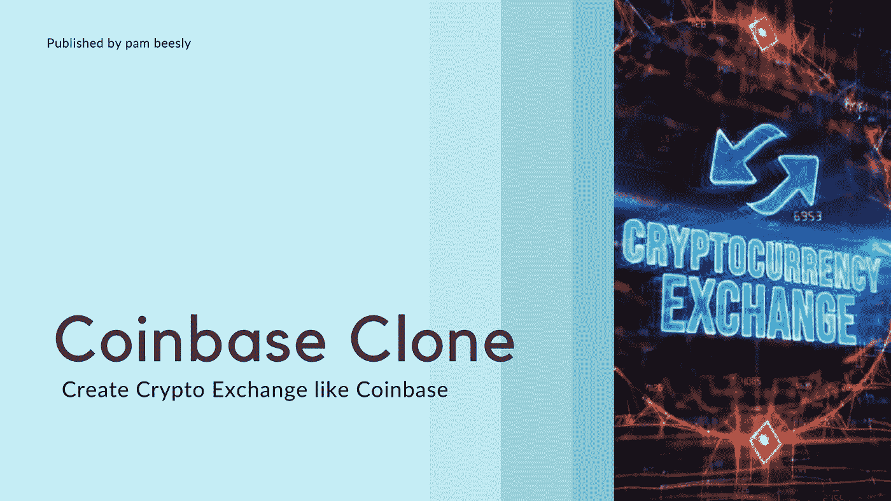

# 比特币基地克隆脚本|创建一个像比特币基地一样的加密交换

> 原文：<https://medium.com/geekculture/coinbase-clone-script-create-a-crypto-exchange-like-coinbase-261284dcde40?source=collection_archive---------4----------------------->

## 想知道像比特币基地一样开始一个密码交换吗？博客是给你的！

Get started now!

在这个数字加密时代，开展加密货币交易业务是最好的主意。对于密码创业者来说，密码交换平台是值得注意的，开始自己的密码交换平台。加密世界中最受欢迎的加密交换平台之一是比特币基地。比特币基地加密货币交易平台在对等管理模块中运行。在这里，像以太币、比特币和莱特币这样的流行硬币可以买卖。

初创公司和企业家都渴望了解比特币基地是如何赚钱的，以及如何创造出最好的收入模式。事实是，由于其可持续的商业模式，比特币基地每个季度都在创造数百万美元的收入。这些策略是构建像比特币基地这样的交易模式的主要原因。

## 如何创建一个像比特币基地一样的加密交易所？

创建一个像比特币基地加密交易所这样的加密交易平台有两种不同的方式。从零开始，耗时长，投资也大。你必须根据你的标准来寻找开发者。

**从零开始创造** —工作将会是一个迷宫，如果你没有发现任何微小的漏洞，它将会给你带来巨大的安全混乱。他们还需要大量的资金和长时间的发展。企业家和初创公司不想把时间花在线框设计、用户界面设计架构、前端和后端数据库管理上。

他们只专注于构建一个像比特币基地一样的加密交换平台，并立即推出。适应性强的唯一解决方案是比特币基地克隆脚本。 ***任何创业公司或创业者都可以像比特币基地一样，通过使用*** [***【比特币基地】克隆脚本***](https://www.firebeetechnoservices.com/coinbase-clone-script) ***来启动自己的交流平台。*** 由专业开发人员开发的最安全、安全、无缺陷、预测试的产品可确保在市场上即时部署。可以做相应修改，7 个工作日内即可上线。

让我们更深入地挖掘一下，比特币基地的克隆剧本到底是什么？

# **比特币基地克隆脚本|是什么？**

比特币基地克隆脚本是一个现成的克隆脚本，由专门的开发人员开发和设计，他们必须启用比特币基地加密交换平台的所有特性和功能。您甚至可以根据您的业务偏好修改该特性，并且您的克隆脚本可以根据您的所有要求在几周内立即部署。

比特币基地克隆软件将为您提供与比特币基地加密交换平台相同的标准和质量设计。最好的克隆脚本提供商可以将你与比特币基地脚本整合到你现有的网站中，甚至可以构建新的克隆脚本来快速节省你的时间。这样你就可以创建和部署一个像比特币基地这样的加密交换平台。

## **比特币基地克隆剧本的显著特征**

在比特币基地设置的特性和功能正是在比特币基地克隆脚本中开发和交付的，以便

*   高交易速度
*   集成加密钱包
*   贸易匹配引擎
*   交易机器人
*   多种法定货币支持
*   多语言支持
*   智能合同
*   IEO/发射台
*   场外交易
*   地塞米松
*   期货期权交易
*   ERC-20 以太币和 TRX 币支持
*   原子交换/奖励功能
*   用户友好的 CMS/管理面板

## **比特币基地克隆脚本的安全特性**

*   双因素认证
*   HTTPS 认证
*   加密私钥
*   反网络钓鱼软件
*   跨站点请求伪造(CSRP)保护
*   集成安全钱包
*   数据加密
*   服务器端请求伪造(SSRF)
*   SQL 注入预防
*   防 DDoS 保护

## **比特币基地克隆脚本是如何工作的？**

1.  比特币基地克隆脚本——一个即将推出的加密交易平台，旨在让用户无障碍地访问不同范围的加密货币，并拥有他们的加密资产。
2.  比特币基地克隆将允许其用户像比特币基地一样出售、购买、交易或提取任何加密货币。他们还保护每一种货币，直到用户撤回、出售或交易他们的密码。
3.  为了在平台上购买任何加密货币，用户只需连接他们的银行账户或支付卡进行购买。比特币基地克隆将保持资产冷藏，直到你决定出售或交易或提取密码到你的钱包。

## 建造一个像比特币基地这样的加密交易所的成本/资金

开发一个像比特币基地这样的加密交换平台的成本无法准确估计。根据您的业务需求，根据您想要对其特性和功能进行的修改，开发成本会有所不同。成本将根据专用软件开发人员开发和部署您的比特币基地克隆脚本的特性、功能和时间来估算。大约要花费 **5 到 1.2 万美元**。成本因业务需求而异。

## **结论**

比特币基地是最优秀的知名加密货币交换软件之一，在加密领域有很长的历史。他们维持着 30 多种加密货币，这是世界上最大的加密货币交易或交换平台之一。总而言之，由于其最新的安全特性，比特币基地是交易、管理和存储加密货币的最佳平台。

作为回报，它在交易费和提现费方面获得了巨大的投资回报。确保联系您选择的最佳克隆脚本提供商经验丰富，并有专门的软件开发人员提供最佳的 UI/UX，支持多种加密货币和所有功能，以便您可以推出一个成功的 [**比特币基地克隆脚本**](https://www.firebeetechnoservices.com/coinbase-clone-script?utm_source=coinbase&utm_medium=geek&utm_campaign=kabi) 加密交换平台。