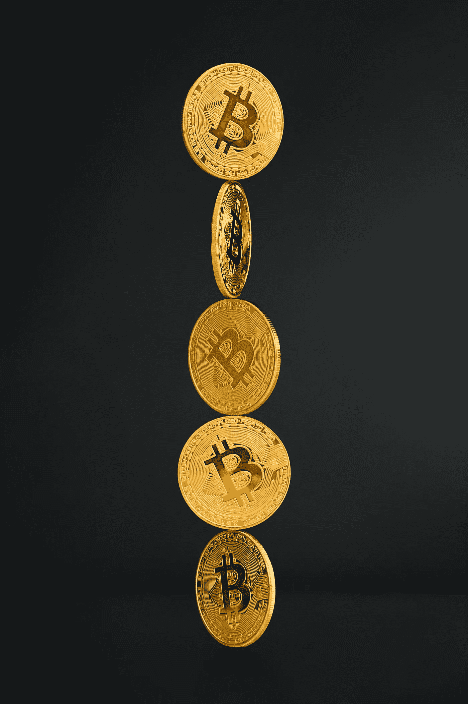

# Coinlayer API 与 CoinMarketCap。哪个加密交换 API 比较好

> 原文：<https://medium.com/geekculture/coinlayer-api-vs-coinmarketcap-which-crypto-exchange-api-is-better-50ba8e04ef45?source=collection_archive---------10----------------------->

Photo by [Jeremy Bezanger](https://unsplash.com/@jeremybezanger?utm_source=unsplash&utm_medium=referral&utm_content=creditCopyText) on [Unsplash](https://unsplash.com/s/photos/crypto-exchange?utm_source=unsplash&utm_medium=referral&utm_content=creditCopyText)

随着世界最近经历了加密货币价值增长的新一轮爆炸，今天，区块链生态系统可能比以往任何时候都更加活跃。

对 cryptos 的兴趣和对各种密码相关信息的需求空前高涨，这也推动了对可靠且易于集成的加密 API 的需求，这些 API 可提供实时数据并支持多种应用。

这种需求正在得到满足，因为现在有几十种不同的加密 API 可供使用。

这篇文章将回顾和比较两个最受欢迎和信任的加密货币交换 API:coin layer 和 CoinMarketCap。

这两种 API 都是必需的，我们将仔细研究每一种 API，以确定它们的优点、缺点以及最适合它们的应用程序。

# 什么是加密交换 API？

加密货币交换 API 使开发者和公司能够将项目连接到加密货币交换接口。它们可以为用户提供对准确的加密相关数据的访问，并允许他们执行各种活动，如进行交易或查看他们钱包中的内容。

加密货币市场数据 API 可能是当今最受欢迎的加密 API，因为加密的疯狂波动推动了市场对各种硬币之间价格上涨和汇率的实时信息的需求。

# Coinlayer API

[**Coinlayer**](https://coinlayer.com/?utm_source=Medium&utm_medium=Leads%20Acquisition&utm_content=WhichCryptoExchangeAPIisBetter&utm_campaign=WhichCryptoExchangeAPIisBetter) 是一个强大的一站式 API，专注于提供从全球超过 25 个最重要的加密货币交易所收集的准确的硬币汇率数据。

Coinlayer API 涵盖超过 385 种加密货币，并声称为超过 25，000 名注册用户提供服务。使用 HTTP GET 方法请求数据，并以易读的 JSON 格式返回。

# Coinlayer API 的特性

以下是 Coinlayer API 的一些最显著的特性。

*   **实时加密交换数据。**

Coinlayer API 提供对超过 385 种不同硬币的实时加密货币汇率和附加数据的访问。

*   **历史汇率。**

该 API 还允许用户访问大量可追溯到 2001 年的历史加密数据。

*   **加密硬币和法定货币之间的转换。**

Coinlayer 的转换端点支持 385+支持的加密货币和所有法定货币之间的任何金额的转换。

*   **可靠的数据来源。**

该 API 从超过 25 个可靠的加密交换提供商那里收集信息，这使它能够提供高水平的准确性。

*   **安全。**

行业标准的 256 位 HTTPS 加密应用于所有发送到和来自 Coinlayer 的数据，是该 API 的另一个重要特性。

# 定价

Coinlayer 有一个免费版本，每月限量 500 次，每小时更新一次。

有四种主要的付费订阅计划:基本(每月 9.99 美元)、专业(每月 39.99 美元)、专业增强(每月 79.99 美元)和企业(根据请求量定制价格)。

# Coinlayer API 的利与弊

现在，让我们简单看看 Coinlayer API 相对于其他加密交换 API，特别是 CoinMarketCap(我们今天讨论的第二个 API)的主要优点和缺点。

**coin layer API 的优点**

*   **有据可查，易于成立。**

Coinlayer API 拥有清晰且结构良好的[文档](https://coinlayer.com/documentation?utm_source=Medium&utm_medium=Leads%20Acquisition&utm_content=WhichCryptoExchangeAPIisBetter&utm_campaign=WhichCryptoExchangeAPIisBetter)，让你很容易理解它是如何工作的，并在你的应用或网站中实现它。

*   **实时更新。**

这个 API 的另一个显著优点是它的响应性和快速、可靠的更新。Coinlayer 无延迟地传送数据。

*   **有益的客户支持。**

与许多其他加密交换 API 不同，Coinlayer 拥有响应迅速的客户支持，可在您需要时提供帮助。

*   **使用方便。**

这个 API 也非常用户友好和易于使用，即使只有最少的编码知识。

*   **免费版。**

尽管被限制为每月 500 个请求，免费的 API 版本仍然可用。

**coin layer API 的缺点**

*   **免费版过于局限。**

由于每月 500 个请求的限制和其他限制，免费版本对于测试来说是最好的。

*   **基本订阅中的每小时更新。**

最实惠的付费订阅计划 Basic 仍然只支持每小时更新，更昂贵的订阅计划的用户可以使用 10 分钟更新。

# CoinMarketCap API

[**CoinMarketCap**](https://coinmarketcap.com/api/)是一个用于加密货币数据用途的加密 API，从商业到个人和学术。

CoinMarketCap API 包含一套高性能 RESTful JSON 端点，旨在满足 web 和应用程序开发人员、企业业务平台、数据科学家和其他潜在用户的特定需求。

该套件为用户提供对最新加密货币的访问，并以各种形式交换市场数据，如市值排名、图表等。也有历史数据的支持。

# CoinMarketCap API 的特性

*   **大量市场数据端点。**

CoinMarketCap 的完整版本包括超过 22 个市场数据端点，如加密和法定货币转换、最新加密排名和市场报价、全球市值、交易所排名等。

*   **集成超过 300 个密码交换机。**

就集成加密货币交易所的数量而言，CoinMarketCap 是领导者之一。现在，它在全世界拥有超过 300 个对话。

*   **快速更新。**

这个 API 的特点是 1 分钟更新一次。

*   **历史资料。**

CoinMarketCap API 向其企业计划的用户提供历史数据，数据从 2013 年开始。

# 定价

CoinMarketCap API 有一个供个人使用的免费基本订阅计划，每月仅限 9 个市场数据端点和 10，000 个呼叫积分。

此外，还有一些旨在满足不同用户群需求的付费订阅计划:业余爱好者(每月 29 美元)、初创企业(每月 79 美元)、标准(每月 299 美元)、专业(每月 699 美元)和企业(定制价格)。

# CoinMarketCap API 的利与弊

与 Coinlayer 和其他类似的加密 API 相比，CoinMarketCap sure 有自己的一套显著优势和相当大的弱点。

**CoinMarketCap API 的优点**

*   **功能免费版。**

基本订阅计划包括九个主要市场数据端点，这些端点有助于满足简单需求。

*   **灵活性。**

CoinMarketCap API 拥有 22 个市场数据端点，用途广泛，可用于各种项目和任务。

*   **多样的信息来源。**

CoinMarketCap API 可以提供来自各种来源的大量数据，集成了 300 多个交易所。

**CoinMarketCap API 的缺点**

*   **价格相对较高。**

与其他选项相比，访问完整数量的市场数据端点和其他 API 功能相对昂贵。

*   **有限的客户支持。**

CoinMarketCap 的客户支持只提供给企业订阅用户，即使对他们来说，也仅限于电子邮件。

*   采用这种方法很有挑战性。

部分由于其较高的复杂性，该 API 比 Coinlayer API 更难采用。CoinMarketCap 的文档也可以更广泛，结构更好。

# 结论

综上所述，Coinlayer 和 CoinMarketCap 都是强大的加密货币交换 API，为用户提供快速可靠的数据。

CoinMarketCap 是一个更复杂、更昂贵的工具，它可能是大型企业或特定用例的最佳选择，在这些情况下，其市场数据端点的多样性是适用的。

另一方面，Coinlayer 是一个更简单、更容易使用的 API，易于开始使用，这使它成为中小型企业的绝佳选择。