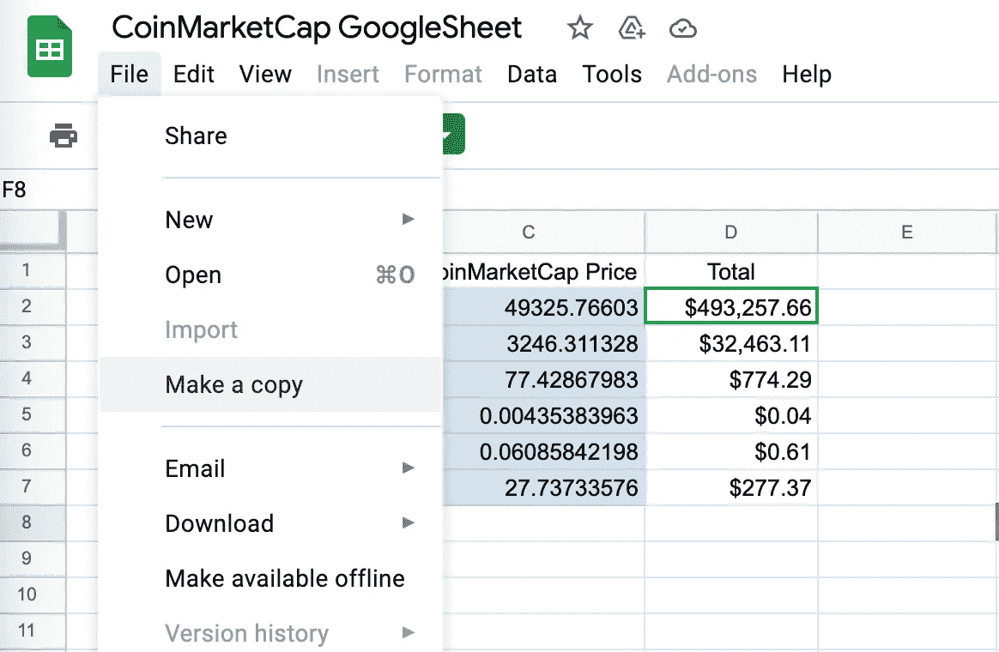
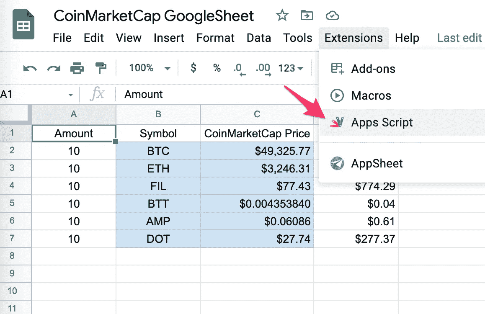
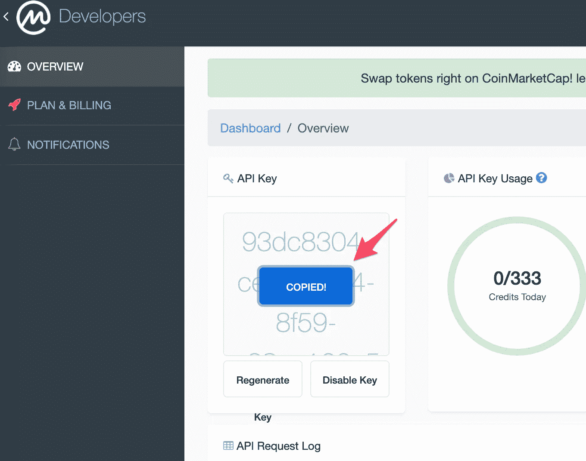
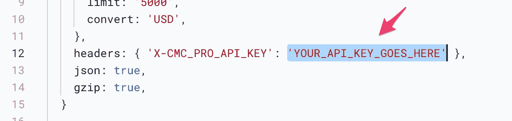
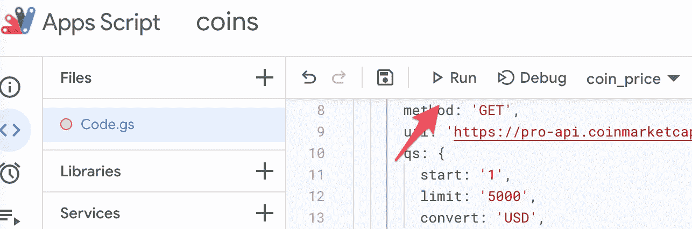
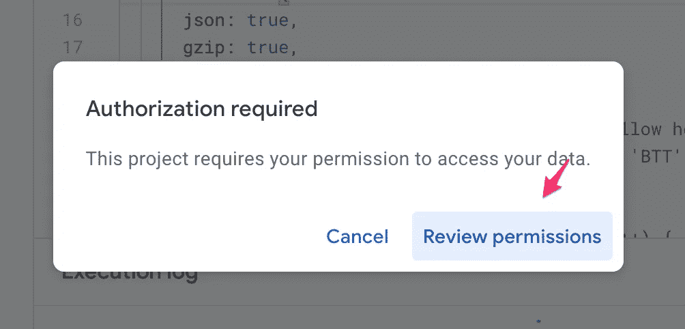
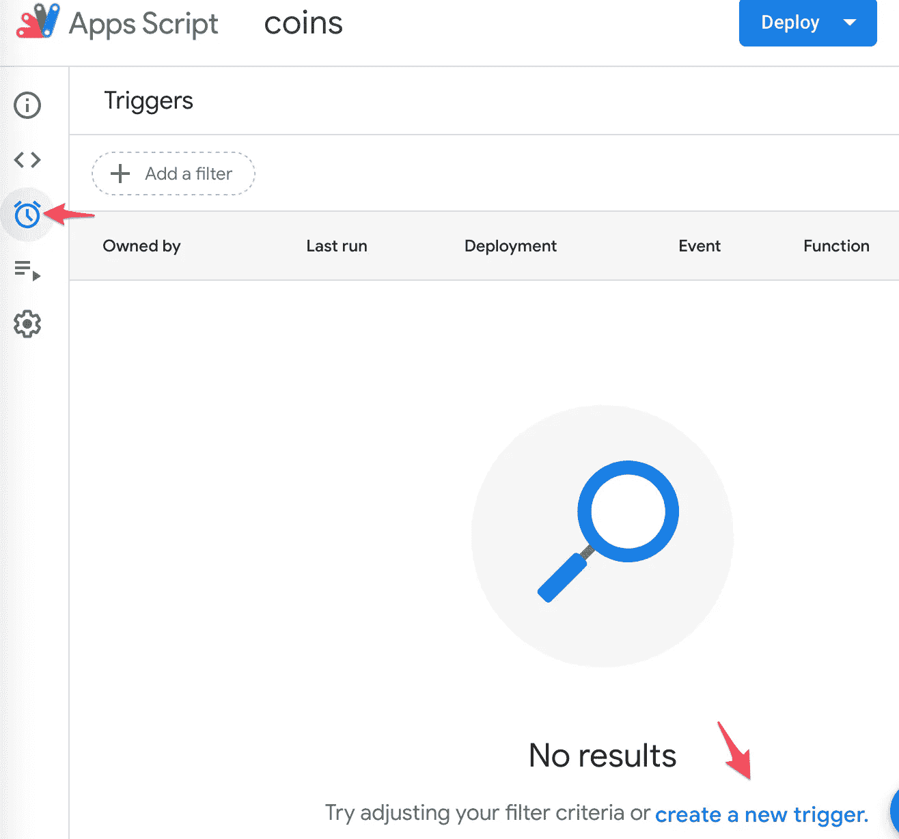

# CoinMarketCap API 和 Google Sheets

> 原文：<https://medium.com/geekculture/coinmarketcap-api-and-google-sheets-eb6c62aeae46?source=collection_archive---------2----------------------->

一个将硬币价格导入电子表格的加密手表。

A crypto adventure

几天前，我用来追踪投资组合的谷歌表单中的 Cryptowatch API 对我不起作用了。当我去他们的网站时，我发现他们不再允许你在免费计划下将加密货币的价格导入到 Google Sheets 中。因此，我没有沮丧，而是上网寻找一个替代的免费解决方案。

得到我需要的东西花费了一些时间和挫折，但最终我用 CoinMarketCap API 实现了这个简单的实现。如果你也想这样做，遵循这些简单的步骤，尽情享受吧！

*   转到 [CoinMarketCap](https://coinmarketcap.com/) 账户并注册或登录。
*   去 https://coinmarketcap.com/api[创建一个免费的 API 密匙。](https://coinmarketcap.com/api)
*   单击显示“立即获取 API 密钥”的按钮。
*   填写注册 API 表单。
*   去你的邮箱。应该会有 CoinMarketCap API 团队的邮件。单击电子邮件中的验证按钮:
*   点击后，您将被转到您的 [API 仪表板](https://pro.coinmarketcap.com/account)。让控制面板在浏览器选项卡中保持打开状态，稍后您将需要复制密钥。
*   在一个新标签中，转到我创建的这个 [Google Sheet](https://docs.google.com/spreadsheets/d/1Bc2zLCV-sLrlO3wCYW4fKpBmifBnhnUWqBaH_5vxqbI/edit?usp=sharing) 并复制一份。

Make a copy

*   转到扩展>应用程序脚本。应用程序脚本将在新标签中打开。

Apps Script

*   使用 [CoinMarketCap API 仪表板](https://pro.coinmarketcap.com/account)返回到您的选项卡，并复制您的 API 密钥。

Copy your key

*   将您的 API 密钥粘贴到 Apps 脚本的第 12 行，此处显示 YOUR _ API _ KEY _ GOES _ HERE。

Enter your API key here

*   单击运行。

Click Run

*   第一次运行时，将弹出一个权限窗口。单击查看权限。

Review permissions

*   选择您的帐户。
*   单击高级。
*   如果你信任我写的代码，就允许访问。如果你不知道，你可以[在这里](https://gist.github.com/craigtockman/d74c3b6cf075ae85776575c451634b5d)得到代码，然后回顾它，或者重写它，或者其他什么……只要确保你得到了疫苗并且戴上了口罩。
*   嘣！完成了。现在回到谷歌表单，根据需要进行品味和编辑。
*   用你想关注的硬币行情指示器更新 B 列。
*   奖金！如果您希望每次选中小复选框或进行编辑时都更新价格。转到应用程序脚本中的触发器并创建一个新的触发器。将事件类型设置为“更改时”。

Create a new trigger.

*   最后，把小费发到我的钱包里。冷静点。

> **发送 BTC 提示至:BC 1 QJ 3n 3 TPP at 8 JT ugl 950 l 37s 0 l 2k 6 ufj 39 wn 2 ah 5
> 发送 ETH 提示至:0 xbd 984 b 05d 00 b 27372 BCF 9 f 74013711455239 Abe 1**