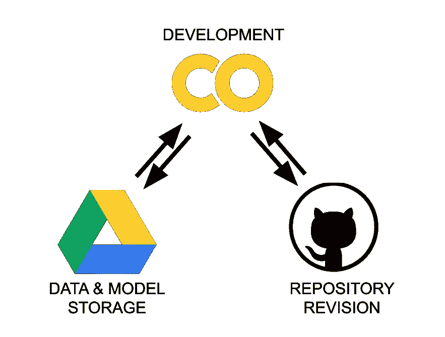
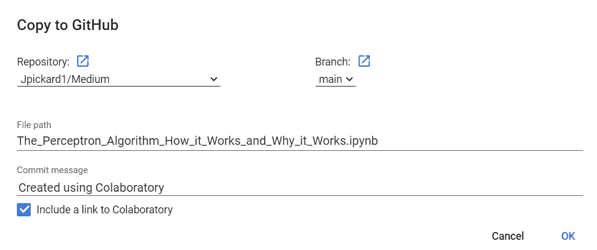
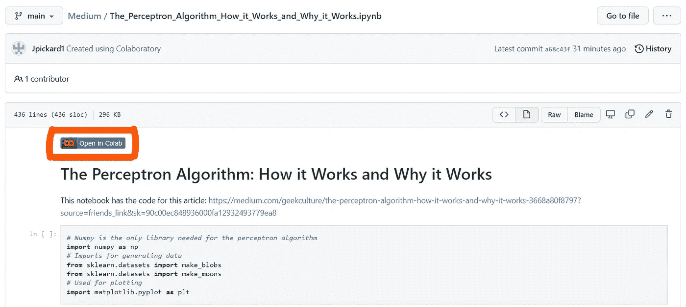

# Colab 和 Github

> 原文：<https://medium.com/geekculture/colab-and-github-201c734e9ac3?source=collection_archive---------17----------------------->

Google 对 Jupyter 笔记本的改编，Colab 是一个让 Python 工作变得非常容易的环境。Colab 自动处理安装几乎所有可能的库，并在谷歌的云服务器上运行您的代码，这些服务器都配有 GPU，这两者都可以让您免除真正的头痛。我最近了解到如何在 github 中存储 Colab 文件。

Image by Oleg Zero on Towards Data Science

我使用 github 来组织我的代码、存储数据和管理我的项目。由于我的大部分代码现在都是用 Colab 编写的，所以将这两个系统合并起来非常有帮助。

Google drive 和 github 都是文件和数据存储平台，Colab 是我实际工作的地方。当您创建一个新的 Colab 笔记本时，它会自动保存在您的 Google Drive 中。

要在 github 中保存额外的副本，在文件下的下拉菜单中，点击菜单底部的`Save a Copy in Github`。您需要登录您的 github 帐户。将出现以下弹出窗口:

在这个弹出窗口中，您可以选择想要保存 Colab 文件的存储库。文件路径行给出了文件在存储库中的保存名称，可用于保存在存储库的特定子目录中。

一个重要的选择框是`Include a link to Colaboratory`。这确保了保存在存储库中的文件将链接到保存在 Google Drive 中的文件。此链接在下面用红色圈出。

一旦您点击`ok`，Colab 将创建文件并提交到您的存储库中。下面你可以看到我从 Colab 保存到 github 的一个文件，以及它应该是什么样子。下面的笔记本来自一篇关于机器学习的感知机算法的[文章](/geekculture/the-perceptron-algorithm-how-it-works-and-why-it-works-3668a80f8797?source=friends_link&sk=90c00ec848936000fa12932493779ea8)，你应该看看！

## 更新文件

一旦你将 Colab 文件保存在 github 中，这个文件会被保存在两个地方，你需要注意如何更新它。在 Colab 中处理文件时，更改会自动保存到 Google drive 中，但是您需要重复上述过程，以使文件在您的存储库中保持最新。