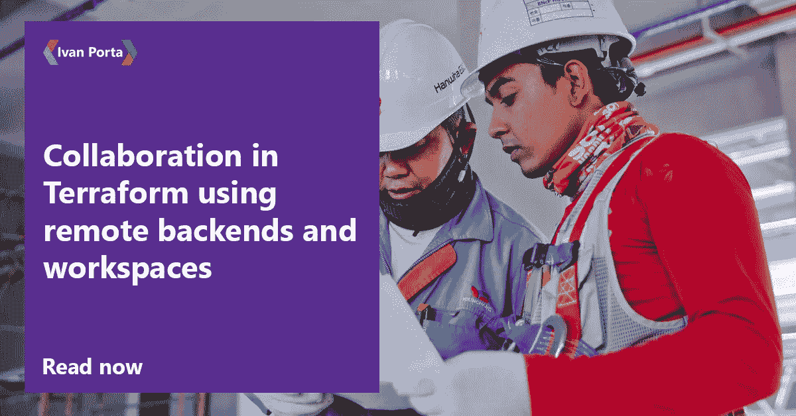

# 使用远程后端和工作区在 Terraform 中进行协作

> 原文：<https://medium.com/geekculture/collaboration-in-terraform-using-remote-backends-and-workspaces-ccec0cacec4f?source=collection_archive---------4----------------------->

团队协作在软件开发中至关重要。然而，尽管团队协作提高了开发速度和质量，但它可能会给自动化带来一些挑战。本文将讨论 Terraform 中可用的两个特性，它们将帮助您的团队避免这些挑战，同时更高效、更安全地工作。