# 单项和多项评估论文收集和总结

> 原文：<https://medium.com/geekculture/collection-and-summary-of-singlepose-and-multipose-estimation-papers-bb807613c32a?source=collection_archive---------72----------------------->

在这篇文章中，我将分享关于人体姿态估计的优秀论文的摘要。本文主要关注单姿态和多姿态估计。希望你会发现它内容丰富。

**单姿态估计**

**1。DeepPose:通过深度神经网络进行人体姿态估计** : Toshev et。艾尔。还有赛格迪等人。艾尔。将 DeepPose 表示为用于人体姿势估计的应用深度学习方法之一。本文将姿态估计方法设计为基于 CNN 的回归模型，用于估计人体关节的关键点。这里使用基于级联 CNN 的回归方法来重新调整身体关节的关键点。基于 CNN 的回归模型被有效地使用，因为它也可以估计某些隐藏的身体关节。

***模型* :** 深度姿态模型的功能分别如图 5 和图 6 所示。图 5 示出了使用 CNN 的第一阶段回归模型。图 6 示出了使用 CNN 的第二阶段回归模型。该模型的一个重要特征是，它使用级联回归和反馈系统来提炼关键点。在模型的第一阶段，特定的关键点被估计为粗调。关键点估计图像在预测关节周围被裁剪，并作为下一阶段的输入给出，该下一阶段用于估计姿态的微调。

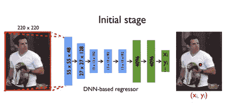

**Fig. 1.** First Stage Regression Model using CNN

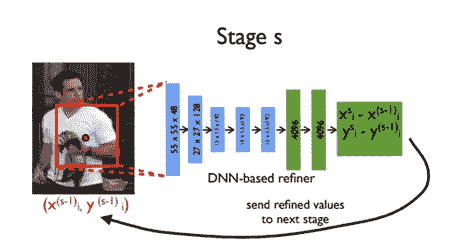

**Fig. 2.** Second Stage Regression Model using CNN

***评价参数* :** 正确零件百分比(PCP)作为评价参数。

***使用的数据集* :** LSP 和 FLIC

***测试结果讨论* :** 三级深蹲给出了上臂和下臂正确部位的百分比分别达到 0.56 和 0.38。最大 PCP 在上下支腿分别达到 0.78 和& 0.71。平均正确率达到 0.61%。

**2。具有迭代误差反馈的人体姿态估计:** Joao 等，Pulkit 等。艾尔。、卡特琳娜等人。艾尔。和 Jitendra 等人。艾尔。表示这种 ConvNet 迭代误差反馈模型。卷积网络(ConvNets)已经被用于使用前馈处理顺序地提取其特征用于多样化的分类任务。多层层次用于通过 ConvNets 表示图像。为输入和输出的结构 2D 建模提供了遗传框架。使用自上而下的反馈方法。网络不会直接预测结果，而是首先估计误差，并通过迭代的方式重新训练误差，直到达到预期的阈值。该模型已标注了 17 个关键点。

***模型的功能* :** 迭代反馈模型及其机制如图 7 和图 8 所示。当图像 I 被输入网络时，它将估计 2D 点集中的一些关键点 y0。根据将函数 f 视为 ConvNet 的图表，该模型对几个方程起作用。函数 g 将把每个关键点位置转换成一个高斯热图。该模型可以学习身体关节空间配置和图像。

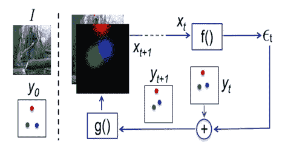

**Fig. 3.** An implementation of Iterative Error Feedback

ConvNet 架构在 ImageNet 上进行了预训练。过滤器被修改为第一 conv 层的 17 个关键点。Conv-1 层具有 20 个不同的输入通道，其中 3 个是具有预训练权重的 ImageNet，而剩余的 17 个通道由方差为 0.1 的高斯噪声初始化。该模型在遮挡图像和可见图像上进行训练。为了获得遮挡点，反向传播梯度为零。然后，通过 ConvNet 和高斯滤波器，这些点变得可见。

***评估参数*** :正确关键点百分比(PCKh)作为评估参数。

***使用的数据集* :** LSP 和 MP-II

***测试结果讨论:*** IEF 在头部检测和肩部检测中达到最大准确度 95.5 和 91.6，上身和全身预测分别为 81.9 和 81.3。

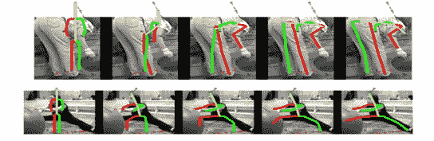

**Fig. 4.** Result of Iterative Error Feedback

**3。用于人体姿态估计的堆叠沙漏网络。艾尔。、余凯等人。艾尔。还有简等人。艾尔。代表这种独特的模型，它是一种扩展的跳网，称为堆栈沙漏网络。单个沙漏形网络由多个沙漏形网络首尾相连地连续放置而成。自上而下和自下而上的方法同时应用。在与完全连接的 CNN 和其他设计层紧密堆叠之前，该模块处理各种尺度的空间信息，以进行密集预测。**

***型号*的功能:**单管道与跳过层一起使用，以在每个单一分辨率下保存空间信息。通过 Conv 层和最大池，当特征达到最低分辨率时，网络开始自上而下的方法，这是一系列上采样和不同尺度下特征的不同组合。当标准卷积层应用大型过滤器时，网络性能有所提高。

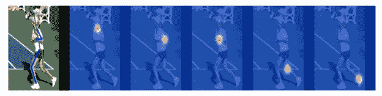

**Fig. 5.** Stack Hourglass key point annotations using heatmap

***评价参数*** :正确关键点百分比(PCKh)作为评价参数。

***数据集使用了* :** FLIC 和 MP-II

***测试结果讨论:*** 该模型对头部和肩部的预测率最高，分别为 98.2 和 96.3，对脚踝的预测率最低，在 MP-II 人体姿态下为 83.6。在 FLIC 数据集上，肘部和手腕的准确率分别达到了 99%和 97%。

**4。人体姿态估计和跟踪的简单基线:** Bin et。艾尔。、平海等人。艾尔。和陈一等人。艾尔。表示一个模型，它是一个网络，末端有 ResNet 和几个反卷积层。均方差用作预测和目标热图之间的损失。使用 2D 高斯滤波器生成目标热图。他们的模型结合了去卷积层中的上采样和卷积参数，而没有使用跳过层连接。

***型号*功能:**该网络参照沙漏型和级联金字塔型网络构成。正常的卷积发生在起始层，当压缩到一定程度的数据通过反卷积进行采样处理时，与密度较低的架构相比，反卷积听起来更有效。

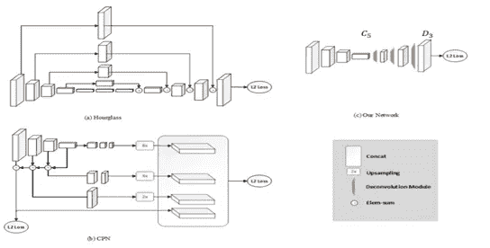

**Fig. 6.** Comparison of different architectures

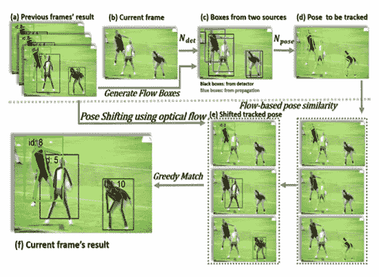

**Fig. 7.** Training of ResNet + DeConv layers

***评估参数*** :平均精度(AP)作为评估参数。

***使用的数据集* :** COCO

***测试结果讨论:*** 用 ResNet-152 架构训练的 COCO 测试开发上 AP 为 73.7，AP50 为 91.9。

**5。用于人体姿态估计的深度高分辨率表示学习:**孙克等。艾尔。、斌等人。艾尔。、董等人。艾尔。还有京东等。艾尔。表示基于自上而下方法的从高到低的分辨率网络，一个接一个地并行步进。它不使用中间热图监督。热图通过 MSE 损失进行分析。

***模型的功能* :** 该网络并联连接高到低分辨率的子网络，以获得更精确的空间热图。它在整个过程中保持高分辨率，多分辨率表示有助于通过热图进行图像分割和关键点注释。

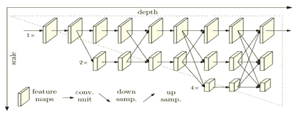

**Fig. 8.** HRNet

***评价参数*** :平均精度(AP)作为评价参数。

***使用的数据集* :** COCO 和 MP-II

***测试结果讨论:*** 用 HRNet-W48 架构训练的 AP 为 75.5，AP50 为 92.5。用 HRNet-W48 +额外数据架构训练的 AP 是 77.0，AP50 是 92.7。

Photo by [Jonathan Chng](https://unsplash.com/@jon_chng?utm_source=medium&utm_medium=referral) on [Unsplash](https://unsplash.com?utm_source=medium&utm_medium=referral)

**多状态估计**

**1。OpenPose:使用局部亲和场的实时多人 2D 姿态估计。艾尔。、吉内斯等人。艾尔。、托马斯等人。艾尔。，施恩等人。艾尔。和亚塞尔等人。艾尔。提出了一种实时的多人 2D 姿态估计方法，该方法使用了局部相似场，使得网络可以学习每幅图像上的身体部位。**

***模型的功能* :** 该模型基于如图 13 所示的相似性方法工作。每一部分都应用了相似度模型和置信度图方法。在这个网络中，感受野被保留，计算量减少。对图像的每个像素点进行局部相似性滤波，以获得正确的关键点方向。

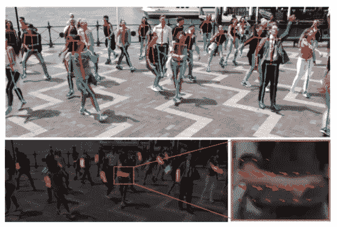

**Fig. 9.** Multi pose estimation and part affinity fields

***评价参数*** :正确关键点百分比(PCKh)作为评价参数。

***使用的数据集* :** COCO、MP-II 和 COCO + Foot

***测试结果讨论:***MP-II 的测试结果是头部最高，为 91.2，脚踝最低，为 61.7。

**2。DeepCut:用于多人姿势估计的联合子集划分和标记。艾尔。、埃尔达等人。艾尔。、于斯等人。艾尔。、Bjoern 等人、Mykhaylo 等人。艾尔。、彼得等人。艾尔。还有 Bernt 等人。艾尔。表示多尺度下的关节姿态估计方法。它能够调整被遮挡的图像。基于 CNN 的部分检测器用于分割和标记身体部分集合的形成。**

***模型的功能* :** 用于身体部位探测器快速 R-CNN 方法。采用了基于 VGG 模型的密集 CNN 模型。该公式提出了联合子集划分和标记问题。

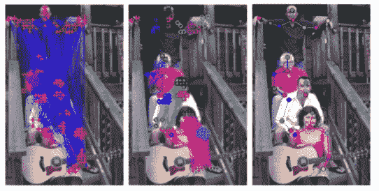

**Fig. 10.** DeepCut keypoint procedure

***评价参数*** :正确关键点和零件的百分比(PCKh)和(PCP)作为评价参数。

***数据集使用了* :** LSP(单姿态)和 We Are Family (WAF-多姿态)

***测试结果讨论:***LSP 上的姿态估计是基于 PCP 标度的，在 AFR CNN 和 Dense CNN 上躯干最大，分别为 92.9 和 96.0，前臂最小，分别为 64.2 和 71.7。

**3。RMPE:区域多人姿态估计:**郝舒等。艾尔。、秦书等人。艾尔。、余荣等人。艾尔。、吴策等人。艾尔。表示自顶向下的多姿态估计方法。对称空间变换网络用于从不合适的包围盒中提取高质量的单人区域。单人姿态估计器用于预测人体姿态骨架的调整区域。对于重映射，使用空间去变换器网络来将人体姿态映射到实际的图像坐标系。为了处理冗余姿态推导的问题，使用了参数化姿态非最大值抑制方法。

***模型的功能* :** 该方法使用基于 VGG 的 SSD-512 作为人体检测器，因为它对于基于识别的方法是有效的。堆栈沙漏网络也用于单人姿势估计。对于 STN，使用了 ResNet-18。基于 ResNet — 152 的快速 RCNN 用于姿态估计，用 PyraNet 代替姿态网络。

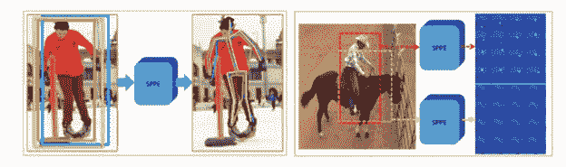

**Fig. 11.** RMPE keypoint procedure

***评估参数*** :平均精度(AP)作为评估参数。

使用的 ***数据集* :** MP-II 和 MSCOCO

***测试结果讨论:***MP-II 上的平均准确率为 72 mAP。当网络使用基于更快 RCNN 的 ResNet 时，观察到最大准确度，头部为 91.3，手腕最低为 76.4。

**4。面具 R-CNN:** 明凯等人。艾尔。、乔治亚等人。艾尔。彼得·多乐等人。艾尔。还有罗斯等人。艾尔。表示用于执行语义和实例分段的 lionize 架构。它是扩展的快速 RCNN 模型。在需要提取数据或特征的情况下，将图像调整到掩模尺寸。

***模型的功能* :** 基本架构首先使用 CNN 从图像中提取特征图。这也是一种在目标图像上生成蒙版的自顶向下的方法。ResNeXt 用于训练图像。

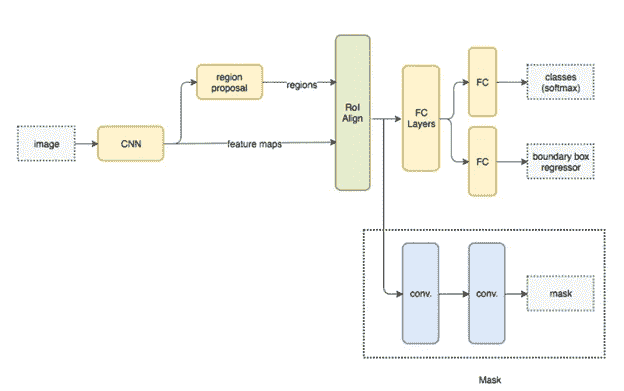

**Fig. 12.** Mask RCNN architecture flowchart

***评价参数*** :正确关键点百分比(PCKh)作为评价参数。

***数据集使用了* :** COCO

***测试结果讨论:*** 使用 ResNeXt-50-FPN 的结果对于净深度特征是 36.7 AP 和 59.5 AP 50。